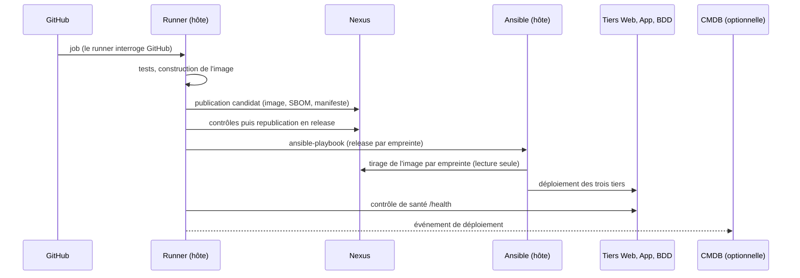
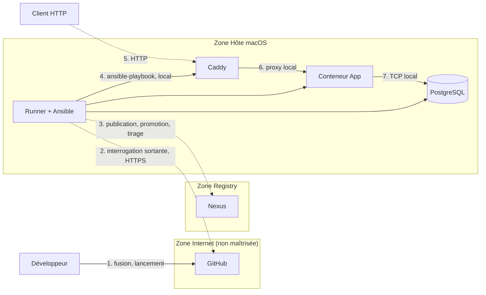

# Flux et réseau

Ce document décrit les flux réels de factice, tels que les met en œuvre `.github/workflows/ci.yml`. Les zones de sécurité sont détaillées dans [zones-securite.md](zones-securite.md).

## Trois domaines

1. **CI/CD (GitHub Actions)** : déclenche le workflow (poussée sur `main`, demande de fusion, lancement manuel).
2. **Registry (Nexus)** : stocke les images (`docker-candidat`, `docker-release`), SBOM et manifestes.
3. **Hôte macOS** : exécute le runner GitHub, Ansible et les trois tiers (Web, App, BDD).

Il n'y a **pas de webhook entrant** : le runner auto-hébergé est installé sur l'hôte et interroge GitHub en sortie (HTTPS). GitHub n'ouvre aucune connexion vers l'hôte. Ansible est lancé par le workflow, sur le runner, vers l'hôte lui-même (pas de SSH distant).

## Flux de livraison

| Étape | Déclencheur | Compte Nexus | Environnement |
|---|---|---|---|
| `build` : tests, image, candidat | tout push et toute demande de fusion (la publication est ignorée sur une demande de fusion) | `svc-build-factice-app` | — |
| `promote` : contrôles, release | push sur `main` | `svc-promotion` | — |
| `deploy-integration` | push sur `main`, ou lancement manuel | `svc-deploiement` (lecture seule) | intégration |
| `deploy-production` | lancement manuel uniquement | `svc-deploiement` (lecture seule) | `production` (protégé par GitHub) |

La promotion est **automatique** sur `main` : la décision humaine intervient avant la fusion (revue de la demande de fusion) et avant la production (lancement manuel). Voir [pipeline-build-promotion.md](../2-pipeline-livraison/ci-cd/pipeline-build-promotion.md).

## Flux réseau

| De | Vers | Protocole | Objet |
|---|---|---|---|
| Runner | GitHub | HTTPS (sortant) | récupération des jobs, du code, retour des statuts |
| Runner | Nexus | HTTP(S) selon `NEXUS_URL` | publication candidat, promotion, tirage par empreinte |
| Ansible | Hôte | local | déploiement, sans SSH distant |
| Client | Caddy | HTTP | `:8080` intégration, `:9080` production |
| Caddy | Conteneur App | HTTP, local | reverse proxy (`:3000` intégration, `:3001` production) |
| Conteneur App | PostgreSQL | TCP, local | `:5432` intégration, `:5433` production |
| Runner | Caddy | HTTP, local | contrôle de santé `/health` après déploiement |
| Runner | CMDB | HTTPS, optionnel | événement de déploiement, uniquement si `CMDB_EVENT_URL` est défini |

## Différences entre les environnements

| | Intégration | Production |
|---|---|---|
| Déclenchement | automatique après promotion | manuel, environnement GitHub protégé |
| Image | release promue, tirée par empreinte | idem |
| Ports | Caddy 8080, App 3000, BDD 5432 | Caddy 9080, App 3001, BDD 5433 |
| Données | base et utilisateur `factice_integration` | base et utilisateur `factice_production` |

Les deux environnements coexistent sur le même hôte : ports, bases, utilisateurs, répertoires et secrets sont distincts.

## Diagramme de flux de données et frontières de confiance

Les frontières (lignes pointillées dans le diagramme) sont les points où appliquer une vérification. Les menaces associées sont analysées dans [modele-menaces.md](modele-menaces.md).

| N° | Flux | Frontière franchie | Protection actuelle |
|---|---|---|---|
| 1 | Développeur vers GitHub | oui | authentification GitHub, revue de la demande de fusion |
| 2 | Runner vers GitHub | oui | connexion sortante HTTPS ; aucun port ouvert |
| 3 | Runner vers Nexus | oui | trois comptes cloisonnés ; `NEXUS_URL` peut être en HTTP selon la configuration |
| 4 | Ansible vers les tiers | non | même hôte, pas de SSH |
| 5 | Client vers Caddy | oui | HTTP, pas de TLS ; Caddy écoute sur toutes les interfaces (voir [isolation-et-reseau.md](../4-securite/isolation-et-reseau.md)) |
| 6 | Caddy vers App | non | local |
| 7 | App vers PostgreSQL | non | local, authentification par mot de passe |

## Chiffrement en transit

| Flux | Chiffré aujourd'hui | Remarque |
|---|---|---|
| Runner vers GitHub | oui (HTTPS) | |
| Runner vers Nexus | selon `NEXUS_URL` | vérifier que l'adresse est en HTTPS, ou que le registre est sur un réseau de confiance |
| Client vers Caddy | non | `auto_https off` |
| Caddy vers App, App vers PostgreSQL | non | flux locaux à l'hôte |

## Secrets en transit

- Les mots de passe des comptes Nexus sont des secrets GitHub, passés au script par variable d'environnement, jamais en argument de commande.
- Les secrets de l'hôte (base de données, etc.) viennent du coffre Ansible (`inventory/group_vars/local/vault.yml`), déchiffré avec `~/.factice-vault-pass`.
- PostgreSQL n'est pas exposé hors de l'hôte.
