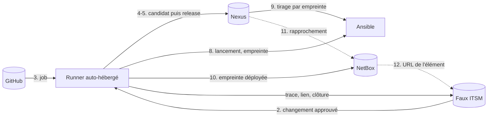

# Flux entre les outils : mise en œuvre dans factice

[flux-outils.md](flux-outils.md) décrit la chaîne **cible**. Ce document dit ce que factice en met réellement en œuvre, avec quels outils, et ce qui reste un écart. Le périmètre est le seul projet factice.

## Correspondance des outils

| Outil cible | Dans factice | Nature | Où |
|---|---|---|---|
| Référentiel d'exigences | `Docs/exigences/` dans Git | Référentiel | [exigences/README.md](../exigences/README.md) |
| ITSM | **Faux ITSM** (service REST local) derrière l'adaptateur `scripts/itsm/itsm.sh` | Référentiel | `itsm-mock/`, port 8095 |
| GitLab | GitHub (dépôt, environnement protégé `production`) | Référentiel | `logo-solutions/factice` |
| Runner | Runner GitHub Actions auto-hébergé sur le Mac Mini | Exécutant | `.github/workflows/ci.yml` |
| Registry | Nexus (candidat et release) | Référentiel | [registry/](../2-pipeline-livraison/registry/README.md) |
| Workflows Ansible | Playbooks `deploy-factice-*.yml` | Exécutant | racine du dépôt |
| CMDB | **NetBox** (vraie CMDB) derrière l'adaptateur `scripts/cmdb/cmdb.sh` | Référentiel | `netbox/`, port 8096 |
| Documentation produit | `Docs/` dans Git, lue sur github.com | Référentiel | [INDEX.md](../INDEX.md) |
| Base de connaissances | fiches `KB-NNN` dans [kb.md](../kb.md), lues sur github.com | Référentiel | `Docs/kb.md` |

**Règle d'adaptateur.** Le pipeline ne parle jamais directement à l'ITSM ni à la CMDB : il appelle un script qui porte le contrat. Passer à un vrai ITSM (GLPI, GitLab, ServiceNow) ou à une autre CMDB se fait en réécrivant l'adaptateur, sans toucher à `ci.yml`.

## État des flux

| N° | Flux | État | Réalisation |
|---|---|---|---|
| 1 | Exigences → dépôt | **Fait** | job `req-check` : un commit `feat`/`fix` cite une exigence de `Docs/exigences/` (`ACC-04`…) ou déclare `Exigence: non-applicable` ; règle valable après le commit de `scripts/req/depuis` |
| 2 | ITSM → pipeline | **Fait** | job `change-gate` : exige un changement approuvé avant la production |
| 3 | Dépôt → Runner | **Fait** | jobs sur le runner auto-hébergé |
| 4 | Runner → Registry (candidat) | **Fait** | `scripts/nexus/publish-candidate.sh` |
| 5 | Runner → Registry (promotion) | **Fait** | `scripts/nexus/promote.sh`, même empreinte |
| 6 | Runner → exigences (preuves) | **Fait** (périmètre limité) | `scripts/req/evidence.js` : les tests dont le nom cite une exigence produisent `preuves-exigences.md` (artefact du run). Aujourd'hui : ACC-04 et ACC-07 seulement |
| 7 | Runner → documentation (notes de version) | **Fait** | `scripts/release/notes.sh` à la promotion : changements, exigences citées, fiches KB ajoutées, preuves ; artefact `notes-de-version` et résumé du run |
| 8 | Runner → Ansible | **Fait** | jobs `deploy-*`, empreinte passée au playbook |
| 9 | Registry → Ansible | **Fait** | tirage par empreinte, compte en lecture seule |
| 10 | Déploiement → CMDB | **Fait** | étape « Inventaire CMDB » après un déploiement réussi |
| 11 | Registry → CMDB (rapprochement) | **Fait** (un sens) | `reconcile.yml`, tous les jours à 05:17 et à la demande ; un écart ouvre un incident. Pas encore le sens inverse (empreintes du registry absentes de la CMDB) |
| 12 | CMDB → ITSM | **Fait** | le changement (au `link`) et l'incident (à la création, `cmdb.sh ci-url`) portent l'URL de l'élément de configuration |
| 13 | Documentation → KB | Partiel | les notes de version listent les fiches KB ajoutées ; les procédures d'exploitation ne sont pas tirées d'une documentation produit (il n'y en a pas) |
| 14 | KB → ITSM | **Fait** pour les incidents de déploiement et de rapprochement | un déploiement en échec ouvre un incident ITSM ; l'incident ne se clôt en succès qu'avec une fiche `KB-NNN` ([kb.md](../kb.md)) ; le job `kb-check` refuse un commit `fix` sans fiche. Reste manuel : rédiger la fiche et rattacher l'incident (`itsm.sh kb`) |

Précision sur le flux 10 : la cible dit « Ansible écrit dans la CMDB ». Ici c'est l'étape qui suit le playbook, dans le même job, qui écrit. Le résultat est le même (un seul propriétaire de l'attribut `empreinte`, écrit à chaque déploiement) et l'écriture est conditionnée à un déploiement réussi, santé vérifiée.



## Cycle d'un déploiement

### Intégration (sur `main`)

1. Le pipeline crée un **changement standard** dans l'ITSM : pré-approuvé, c'est une trace (décision 1).
2. Déploiement, vérification de santé, événement de déploiement (journal local).
3. Si le déploiement a réussi, l'empreinte est écrite dans la CMDB.
4. Le changement est lié à l'empreinte et au run, avec l'URL de l'élément de configuration, puis clos (`succes` ou `echec`).

### Production (lancement manuel, `deploy_env = production`)

1. Premier lancement, sans `change_id` : le pipeline crée un **changement normal** en brouillon et s'arrête en échec, avec le message « Changement CHG-AAAA-NNNN créé, le faire approuver puis relancer avec change_id ». C'est volontaire : aucun déploiement sans changement.
2. Un humain **approuve** le changement dans l'ITSM. L'approbateur doit être différent du demandeur (ACC-04) : le demandeur est le compte du pipeline, l'approbateur un compte humain.
3. Second lancement avec `change_id` : le job `change-gate` vérifie que l'état est `approuve`, puis le job `deploy-production` s'exécute.
4. Le déploiement est soumis à l'approbation de l'environnement protégé `production` de GitHub. C'est le **blocage technique** ; l'ITSM en garde la trace (décision 1, pas de double approbation).
5. Après le déploiement : écriture CMDB, lien et clôture du changement.

Approuver, côté Mac Mini :

```bash
set -a; . .secrets/itsm.env; set +a
ITSM_TOKEN=$ITSM_TOKEN_LOIC scripts/itsm/itsm.sh show CHG-2026-0001
ITSM_TOKEN=$ITSM_TOKEN_LOIC scripts/itsm/itsm.sh approve CHG-2026-0001
```

## Secrets et accès

| Secret | Où | Droits | Usage |
|---|---|---|---|
| `ITSM_TOKEN` | secret du dépôt | `read, create, link, close` : **ne peut pas approuver** | pipeline |
| `ITSM_TOKEN_LOIC` | `.secrets/itsm.env` local | `read, approve` | approbation humaine |
| `CMDB_TOKEN` | secret du dépôt | jeton d'administration NetBox | pipeline |

Les fichiers `.secrets/*.env` ne sont jamais commités. Les adaptateurs passent les jetons à `curl` par l'entrée standard, pas en argument.

## Exploitation

```bash
# ITSM (faux) et CMDB (NetBox) : voir leurs README
cd itsm-mock && docker compose --env-file ../.secrets/itsm.env up -d --build
cd netbox    && docker compose --env-file ../.secrets/netbox.env up -d

# Rapprochement registry / CMDB (flux 11), compte Nexus en lecture seule
NEXUS_USER=... NEXUS_PASSWORD=... CMDB_TOKEN=... scripts/cmdb/reconcile.sh
```

Les deux services doivent tourner sur le Mac Mini, là où s'exécute le runner : leurs ports sont liés à `127.0.0.1`. S'ils sont arrêtés, le pipeline **échoue** (pas de déploiement sans trace) ; c'est le comportement voulu.

### Incident, KB et ITSM (flux 13, 14)

```bash
# 1. le pipeline a ouvert l'incident (avertissement dans le run) : INC-2026-0003
# 2. rédiger la fiche KB-NNN dans Docs/kb.md, avec la ligne « ITSM : INC-2026-0003 »
# 3. rattacher l'incident à la fiche, puis le clore
ITSM_TOKEN=$ITSM_TOKEN_LOIC scripts/itsm/itsm.sh kb INC-2026-0003 KB-005 "https://github.com/logo-solutions/factice/blob/main/Docs/kb.md#kb-005--..."
ITSM_TOKEN=... scripts/itsm/itsm.sh close INC-2026-0003 succes   # refusé (409) sans fiche
```

Un incident clos en `echec` (non résolu) n'exige pas de fiche. L'interface web du faux ITSM affiche les fiches rattachées.

## Écarts et suites

| Écart | Suite |
|---|---|
| Jeton CMDB d'administration | créer un jeton NetBox en écriture limitée au modèle (ACC-07) |
| Rapprochement à sens unique (CMDB vers registry) | ajouter le sens inverse (empreintes déployées absentes de la CMDB) |
| Le faux ITSM n'a ni interface d'approbation, ni TLS, ni authentification forte | acceptable pour un double de test ; remplacer par un vrai ITSM en gardant `itsm.sh` |
| Flux 6 couvre 2 exigences | rattacher des tests aux autres exigences ACC (ACC-01, 02, 03, 08) |
| Flux 13 | non applicable tant qu'il n'y a pas de documentation produit distincte de `Docs/` |
| Le changement approuvé n'est pas rattaché à une empreinte précise avant le déploiement | l'ITSM enregistre l'empreinte au `link` ; contrôler qu'elle correspond à la release prévue |
