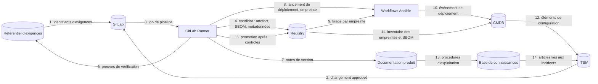
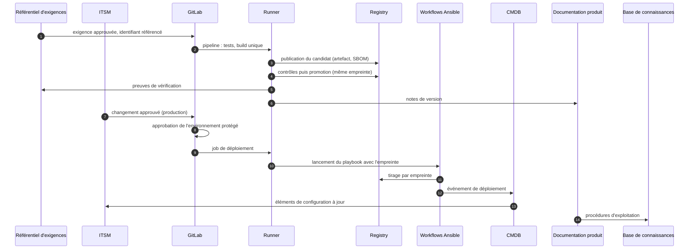
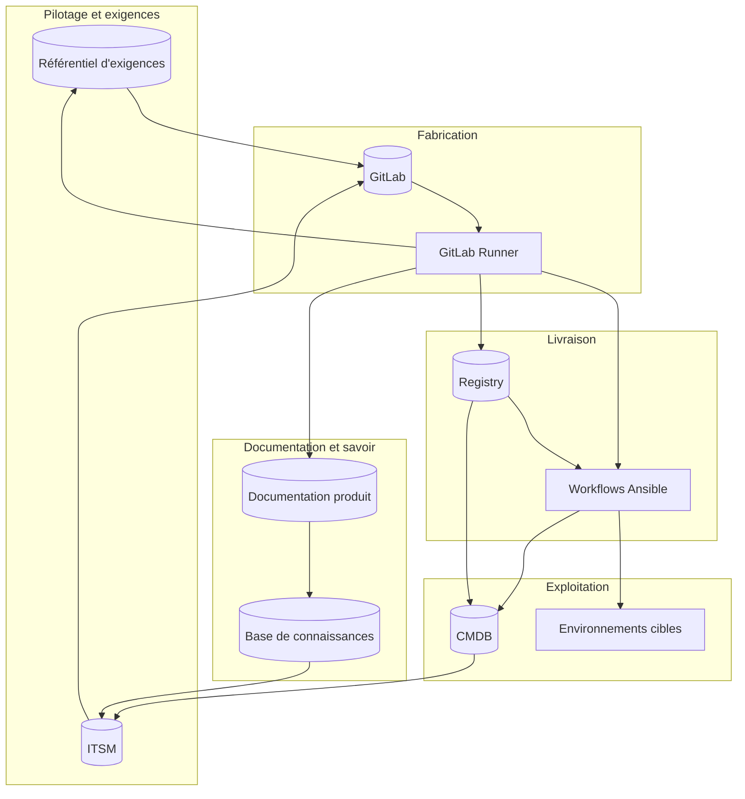

# Flux entre les outils

Ce document montre comment les outils de la chaîne échangent entre eux, sous trois angles : les flux de données, le cycle de vie d'une livraison, les zones. Principe directeur : **build once**. On construit un seul artefact, identifié par son empreinte, et c'est lui qui est promu d'un environnement à l'autre.

Les flux décrits sont la **cible**. Ils sont à valider avec les propriétaires de chaque outil avant implémentation.

## Outils

Les outils sont de deux natures, et les diagrammes les distinguent par la forme :

- **Référentiel** (cylindre) : l'outil **détient des données** et en est la source de vérité (exigences, tickets, code, artefacts, inventaire, documents). Les flux y entrent et en sortent, il ne fait rien de lui-même.
- **Exécutant** (rectangle) : l'outil **fait tourner un traitement** (jobs, playbooks) et ne garde rien en propre.

| Outil | Nature | Rôle dans la chaîne |
|---|---|---|
| Référentiel d'exigences | Référentiel | source des exigences ; reçoit les preuves de vérification |
| ITSM | Référentiel | demandes, changements, incidents ; trace des changements, approbation humaine des changements normaux |
| GitLab | Référentiel | code, demandes de fusion, définition des pipelines ; porte le blocage technique de la production (environnement protégé) |
| GitLab Runner | Exécutant | exécute les jobs du pipeline (build, tests, contrôles, promotion) |
| Registry | Référentiel | stocke les artefacts par empreinte, avec SBOM et métadonnées ; source unique de ce qui est déployable |
| Workflows Ansible | Exécutant | déploient l'artefact promu, référencé par son empreinte |
| CMDB | Référentiel | inventaire de ce qui est réellement déployé ; réconcilié avec le registry |
| Gestion de documentation produit | Référentiel | manuels, notes de version, fiches produit |
| Base de connaissances | Référentiel | procédures d'exploitation, résolutions d'incidents |

GitLab est ici classé comme référentiel : ce qui compte pour la chaîne est ce qu'il détient (code, demandes de fusion, règles de protection). L'exécution des pipelines est assurée par le Runner.

## Vue 1 : flux de données

| N° | Source | Cible | Quoi | Déclencheur |
|---|---|---|---|---|
| 1 | Référentiel d'exigences | GitLab | identifiants d'exigences référencés dans les demandes de fusion et les commits | création d'une demande de fusion |
| 2 | ITSM | GitLab | référence et état du changement (API REST) ; condition d'accès à la production pour les changements normaux | approbation du changement |
| 3 | GitLab | Runner | job de pipeline | poussée de code, demande de fusion, lancement manuel |
| 4 | Runner | Registry | artefact construit une fois, SBOM, métadonnées (version, commit, empreinte) | build réussi |
| 5 | Runner | Registry | promotion du candidat vers la release, sans reconstruction | contrôles passés (CVE, licences, signature) |
| 6 | Runner | Référentiel d'exigences | résultats de tests et rapports liés aux exigences | fin de pipeline |
| 7 | Runner | Documentation produit | notes de version générées | promotion en release |
| 8 | Runner | Workflows Ansible | lancement du playbook avec l'empreinte de la release | job de déploiement : environnement approuvé dans GitLab et, pour un changement normal, changement approuvé dans l'ITSM (flux 2) |
| 9 | Registry | Workflows Ansible | image tirée par empreinte, en lecture seule | exécution du playbook |
| 10 | Workflows Ansible | CMDB | quoi, où, quand : empreinte déployée par environnement | fin de déploiement |
| 11 | Registry | CMDB | inventaire des empreintes et des SBOM, pour réconciliation | périodique, ou à chaque promotion |
| 12 | CMDB | ITSM | éléments de configuration rattachés aux changements et aux incidents | consultation ou création de ticket |
| 13 | Documentation produit | Base de connaissances | procédures d'exploitation tirées de la doc produit | publication d'une version |
| 14 | Base de connaissances | ITSM | articles de résolution liés aux incidents | traitement d'un incident |

## Vue 2 : cycle de vie d'une livraison

Points à retenir :

- l'artefact est **construit une seule fois** (étape 3) ; toutes les étapes suivantes manipulent la même empreinte ;
- la production n'est atteinte qu'après l'approbation de l'environnement protégé dans GitLab et, pour un changement normal, un changement approuvé dans l'ITSM ;
- c'est le **job de déploiement du Runner** qui lance Ansible, avec l'empreinte promue ; Ansible ne se déclenche jamais seul ;
- la CMDB reçoit l'état réel du déploiement, elle ne le décrit pas à la main.

## Vue 3 : zones

Frontières de confiance à contrôler :

1. **Fabrication vers Livraison** : le Runner publie dans le registry avec un compte limité à l'écriture du candidat.
2. **Registry vers Exploitation** : le déploiement tire en lecture seule, par empreinte ; une release est immuable.
3. **Pilotage vers Fabrication** : la production exige l'approbation de l'environnement protégé dans GitLab et, pour un changement normal, un changement approuvé dans l'ITSM.
4. **Exploitation vers CMDB** : la CMDB est alimentée par les événements de déploiement, pas par saisie.

## Décisions

### 1. Approbation de la production : un point de blocage, deux rôles

- **GitLab** applique la règle : environnement `production` protégé, avec une règle d'approbation distincte de celle qui lance le déploiement. Chaque approbation est tracée dans le journal d'audit.
- **L'ITSM** garde la trace du changement.
  - **Changement standard** : pré-approuvé, traité comme une demande de service, sans demande de changement formelle ; le pipeline en crée la trace par l'API REST.
  - **Changement normal ou à risque élevé** : approbation humaine dans l'ITSM ; le pipeline vérifie l'état du changement avant de déployer.
- Pas de double approbation manuelle : elle ajoute de la lenteur sans ajouter de contrôle.

Point de vigilance : aucun connecteur natif entre l'ITSM et GitLab n'a été identifié. Le flux 2 passe donc par l'API REST de l'ITSM, appelée depuis le pipeline. À confirmer auprès de l'éditeur.

### 2. Alimentation de la CMDB : le pipeline écrit, le registry contrôle

- **Le pipeline écrit** (flux 10) : à chaque déploiement, quoi, où, quand, avec l'empreinte.
- **Le registry contrôle** (flux 11) : rapprochement périodique pour détecter les écarts ; c'est l'indicateur de rapprochement registry / CMDB.
- Un seul propriétaire par attribut, pour éviter les conflits d'écriture.

### 3. SBOM : le registry fait foi, un outil d'analyse les exploite

- **Registry** : source de vérité. Le SBOM est signé et rattaché à l'empreinte de l'artefact (attestation OCI, format CycloneDX).
- **Dependency-Track** : analyse continue, corrélation quotidienne avec les nouvelles failles, VEX. C'est lui qui répond à « qui utilise tel composant ? ».
- **CMDB** : stocke l'empreinte et le lien, jamais le SBOM ni la liste des composants.

**COTS.** Les éditeurs ne fournissent pas de SBOM aujourd'hui : l'exiger au contrat dès le départ.

| Exigence contractuelle | Contenu |
|---|---|
| Format | CycloneDX ou SPDX |
| Fréquence | à chaque version livrée |
| Intégrité | signé par l'éditeur, ou empreinte du SBOM fournie avec la livraison |
| Délai | mise à jour sous un délai fixé en cas de faille critique |
| Repli | si l'éditeur ne fournit rien, SBOM reconstitué par analyse, marqué avec un niveau de confiance plus faible |

Un COTS n'est pas une image : son SBOM est déposé dans un dépôt brut, nommé par l'empreinte de l'artefact.

### 4. Documentation produit : Git comme source unique, deux modes d'écriture

La documentation est écrite par des développeurs et par des rédacteurs non techniques. Le Git reste la source unique, pour que la doc d'une version soit celle de son tag.

- **Développeurs** : Markdown dans le dépôt, revue par demande de fusion, publication par le pipeline.
- **Rédacteurs non techniques** : éditeur visuel synchronisé avec Git (famille GitBook), pour qu'ils n'aient pas à manipuler Git. Le choix de l'outil reste à évaluer.
- **Notes de version** : générées par le pipeline (flux 7).
- **Base de connaissances** : outil séparé, orienté exploitation et incidents, alimenté par la publication (flux 13).

## Questions encore ouvertes

- L'éditeur confirme-t-il l'API REST pour créer et lire un changement depuis un pipeline GitLab ?
- Quel éditeur visuel pour les rédacteurs non techniques, avec synchronisation Git ?
- Quel délai de mise à jour du SBOM en cas de faille critique faut-il imposer aux éditeurs ?
