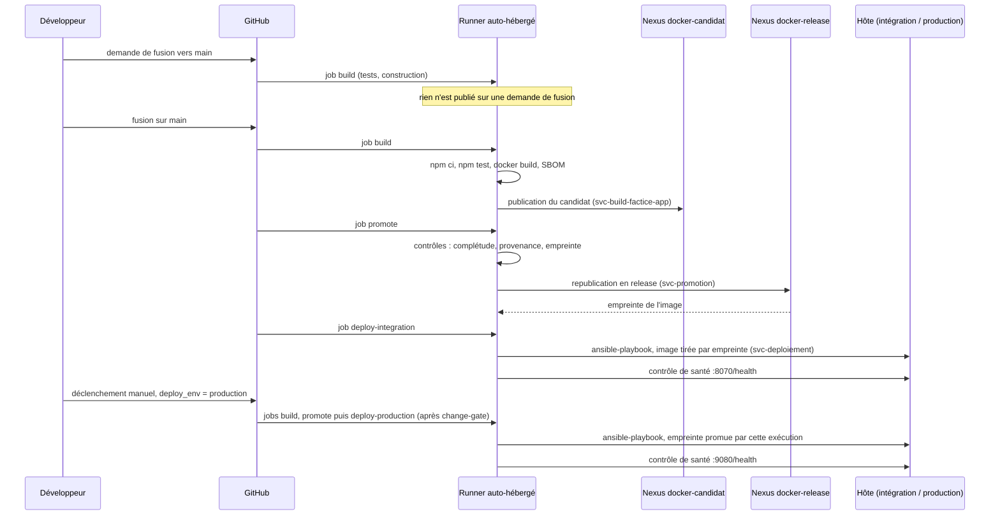
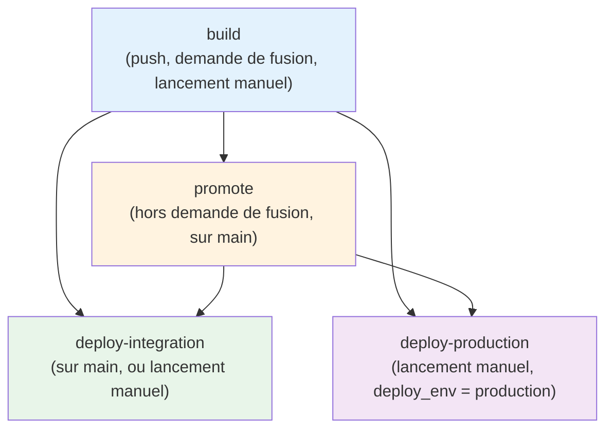

# Pipeline CI/CD : du code à la production

Le workflow `.github/workflows/ci.yml` s'exécute sur le runner auto-hébergé. Il applique le *trunk-based development* décrit dans [trunk-based.md](../../trunk-based.md) et la gouvernance Nexus décrite dans [registry/README.md](../registry/README.md).

## Vue d'ensemble



## Les quatre étapes

| Étape | Déclenchement | Compte Nexus | Effet |
|---|---|---|---|
| `build` | push ou demande de fusion sur `main` | `svc-build-factice-app` | tests bloquants, construction de l'image, SBOM ; publication dans `docker-candidat` sauf sur une demande de fusion |
| `promote` | push sur `main` uniquement | `svc-promotion` | contrôles puis republication dans `docker-release` avec le manifeste et le SBOM |
| `deploy-integration` | push sur `main`, ou déclenchement manuel | `svc-deploiement` (lecture seule) | déploiement de la release par empreinte, contrôle de santé sur le port 8070, événement de déploiement |
| `deploy-production` | déclenchement manuel (`deploy_env = production`) | `svc-deploiement` (lecture seule) | même déploiement sur le port 9080, environnement `production` ; dépend de `build` et `promote` |

Les comptes sont cloisonnés : celui qui construit ne peut pas écrire en release, celui qui déploie ne fait que lire.

## Dépendances entre les étapes



**Points clés :**

- `build` s'exécute sur les demandes de fusion (tests et construction, rien n'est publié), sur les poussées vers `main` et sur les lancements manuels.
- `promote` s'exécute uniquement quand la référence est `main` et que l'événement n'est pas une demande de fusion.
- `deploy-integration` dépend de `build` et de `promote`. Il s'exécute sur `main` (poussée ou lancement manuel) : un lancement manuel depuis `main` avec `deploy_env = none` ou `production` déploie donc aussi l'intégration.
- `deploy-production` dépend aussi de `build` et de `promote`. Il n'est **pas** indépendant : un lancement manuel de production reconstruit, republie et promeut le commit courant de `main`, puis déploie **l'empreinte qui vient d'être promue**, pas nécessairement celle validée en intégration. Voir les écarts plus bas.

## Étape `build`

1. Récupération du code, installation de Node.js 20.
2. `npm ci` puis `npm test` : un test en échec arrête la chaîne.
3. `docker build` de l'image `factice:<commit>`.
4. Hors demande de fusion, `scripts/nexus/publish-candidate.sh` publie l'image, le SBOM et le manifeste dans `docker-candidat` (port 5001).

## Étape `promote`

`scripts/nexus/promote.sh` refuse la promotion si l'un des contrôles échoue :

- **complétude** : l'image, le SBOM et le manifeste du candidat sont présents ;
- **provenance** : le commit du candidat appartient à `origin/main` ;
- **empreinte** : l'image republiée garde exactement l'empreinte du candidat.

Il republie ensuite l'image dans `docker-release` (port 5002). Une release est immuable et n'a pas d'étiquette `latest`. L'empreinte est transmise aux étapes de déploiement.

## Étapes `deploy-*`

```bash
ansible-playbook deploy-factice-<environnement>.yml \
  --vault-password-file ~/.factice-vault-pass \
  -e "factice_release_image=<hôte release>/factice.app/factice@<empreinte>"
```

L'image est tirée par empreinte : ce qui tourne est exactement ce qui a été promu. Le déploiement est suivi d'un contrôle de santé (`/health`) puis, quoi qu'il arrive, de l'envoi d'un événement de déploiement (`scripts/nexus/deployment-event.sh`). L'orchestration est détaillée dans [workflow-ansible.md](../orchestration/workflow-ansible.md).

## Stratégie de déploiement : automatique vs. manuel

| Environnement | Intégration | Production |
|---|---|---|
| **Port HTTP** | 8070 | 9080 |
| **Base de données** | 5432 | 5432 (même cluster, autre base) |
| **Déploiement** | Automatique à chaque poussée sur `main` | Manuel via `workflow_dispatch` |
| **Rôle** | Validation rapide du candidat en conditions réalistes | Décision humaine, avant mise en service réelle |
| **Sur le même hôte macOS ?** | Oui | Oui |
| **Isolement** | Oui : ports, DB, utilisateurs distincts | Oui : ports, DB, utilisateurs distincts |

**Pourquoi deux environnements sur le même hôte ?**

1. Valider en intégration après chaque poussée sur `main`
2. Garder une réplique du code et de la config avant le déploiement manuel en production
3. Économiser l'infrastructure (un seul hôte)
4. Les deux peuvent coexister sans conflit (ports ≠, BDD ≠, users ≠)

## Retour arrière et rollback

Le workflow n'a **pas d'entrée « empreinte »** : il ne sait pas redéployer une ancienne release. Le retour arrière est donc une opération **manuelle** sur l'hôte, qui relance le playbook avec l'empreinte voulue.

| Opération | Définition | Quand | Effet |
|---|---|---|---|
| **Redéploiement** | même playbook, **même empreinte** | configuration modifiée, secret renouvelé | `changed=0` si rien n'a changé, sinon redémarrage des services concernés |
| **Idempotence** | même playbook, même image | relance accidentelle, test | aucun changement |
| **Retour arrière** | playbook relancé avec une **ancienne empreinte** | incident : retour à la version précédente | tirage de l'ancienne image, redéploiement des trois tiers |

```bash
# Retrouver l'ancienne empreinte : liste des composants de docker-release
#   https://<nexus-url>/service/rest/v1/components?repository=docker-release
# ou le journal du job promote d'une exécution antérieure.

ansible-playbook deploy-factice-production.yml \
  --vault-password-file ~/.factice-vault-pass \
  -e "factice_release_image=<hôte release>/factice.app/factice@<ancienne-empreinte>"
```

Aucune reconstruction n'a lieu : l'image est déjà promue et immuable. Le compte de déploiement doit pouvoir lire la release, pas l'écrire.

Le retour arrière n'annule pas les migrations de base de données. Une migration destructive doit suivre le schéma *expand / contract* (ajouter, basculer, puis supprimer dans une release ultérieure) pour que l'ancienne image reste compatible avec la base. Voir [bonnes-pratiques-ansible.md](../orchestration/bonnes-pratiques-ansible.md).

## Artefacts du workflow

**Où vivent les playbooks ?** Dans le dépôt, côté code :

```
factice/
├── deploy-factice-integration.yml     # Appelé par job deploy-integration
├── deploy-factice-production.yml      # Appelé par job deploy-production
├── provision-nexus.yml                # Provisionné à part, avant les livraisons
├── inventory/                         # Inventaire local
├── roles/                             # Rôles Ansible (compose_deploy, factice, nexus, github_runner)
└── app/                               # Application Node.js
```

Le runner clone le dépôt au début du job → tous les playbooks et rôles sont disponibles. **Pas d'artifact externe, pas de provisioning préalable.** Tout est versionné avec le code.

**Durées.** Aucune mesure n'est consignée dans le dépôt. Elles se lisent dans l'historique des exécutions GitHub Actions ; ce sont aussi les entrées du délai de livraison suivi par les mesures DORA (voir [securite-pipeline.md](securite-pipeline.md), section 11).

## Configuration du dépôt

| Type | Nom | Rôle |
|---|---|---|
| Variable | `NEXUS_URL` | adresse de l'API Nexus |
| Variable | `NEXUS_DOCKER_CANDIDAT`, `NEXUS_DOCKER_RELEASE` | adresses des dépôts Docker (ports 5001 et 5002) |
| Variable | `CMDB_EVENT_URL` | destinataire de l'événement de déploiement (facultatif) |
| Secret | `NEXUS_BUILD_PASSWORD`, `NEXUS_PROMOTION_PASSWORD`, `NEXUS_DEPLOY_PASSWORD` | mots de passe des comptes de service |
| Secret | `CMDB_TOKEN` | jeton de l'événement de déploiement (facultatif) |

Aucun secret n'est passé en argument de commande. Le mot de passe du coffre Ansible est lu dans `~/.factice-vault-pass` sur le runner.

## Écarts connus

| Écart | Constat dans le workflow | Conséquence | Cible |
|---|---|---|---|
| Production non indépendante | `deploy-production` a `needs: [build, promote]` | un lancement manuel reconstruit et republie ; la production reçoit l'empreinte de cette exécution, pas celle testée en intégration | déployer en production une empreinte existante, fournie en entrée du workflow, ce qui permet aussi le retour arrière par le workflow |
| Intégration relancée par un lancement manuel | `deploy-integration` s'exécute dès que la référence est `main` | un lancement manuel destiné à la production redéploie aussi l'intégration | conditionner l'intégration à l'événement `push` ou à `deploy_env = integration` |
| Confirmation interactive en production | le playbook contenait une tâche `pause` | une saisie clavier est impossible sur un runner (KB-008) | remplacée par l'exigence d'un `change_id` ; la confirmation humaine est l'approbation ITSM (décision 16) |
| Contrôles de qualité | seul `npm test` est exécuté ; le script `lint` existe mais l'analyseur n'est pas une dépendance du projet | pas de contrôle de style ni de type en CI, contrairement à ce que laisse entendre [trunk-based.md](../../trunk-based.md) | ajouter l'analyseur et l'étape de lint |
| Sécurité du pipeline | pas de `permissions`, de `concurrency`, de délai maximal, d'analyse ni de signature | voir [securite-pipeline.md](securite-pipeline.md) | plan d'adoption de ce document |

## Références

- [securite-pipeline.md](securite-pipeline.md) : durcissement, analyse, signature
- [trunk-based.md](../../trunk-based.md) : modèle de branches
- [registry/README.md](../registry/README.md) : gouvernance des artefacts
- [orchestration/workflow-ansible.md](../orchestration/workflow-ansible.md) : exécution des déploiements
- GitHub, [Deployments and environments](https://docs.github.com/en/actions/reference/workflows-and-actions/deployments-and-environments)
