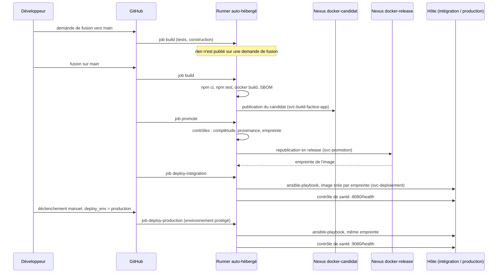
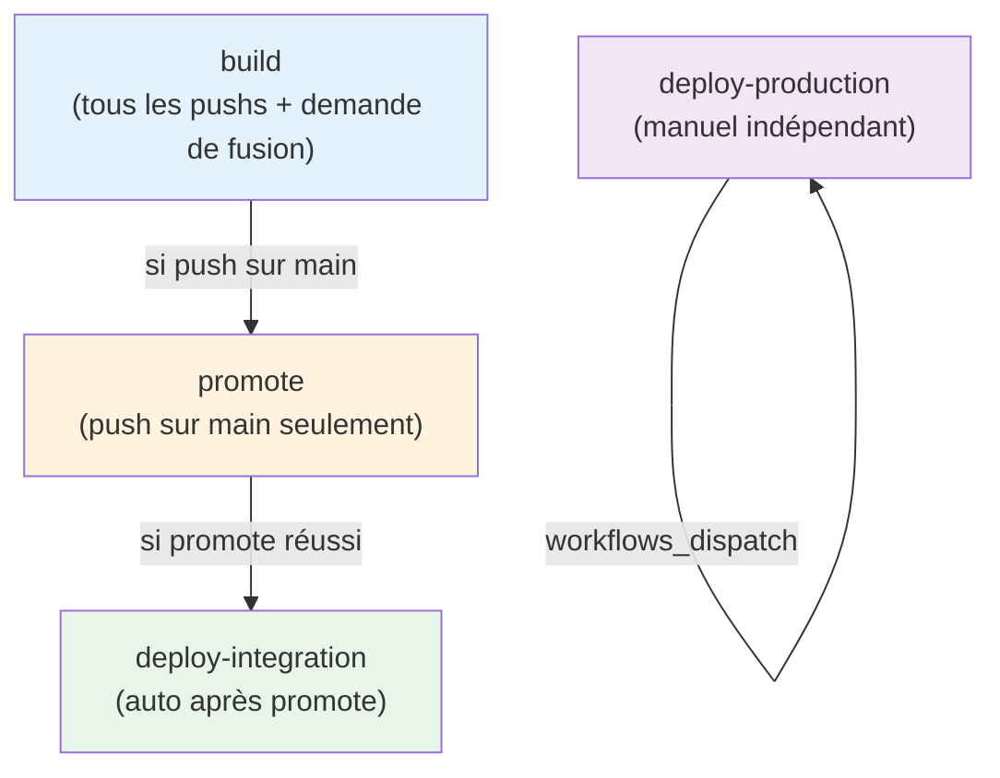

# Pipeline CI/CD : du code à la production

Le workflow `.github/workflows/ci.yml` s'exécute sur le runner auto-hébergé. Il applique le *trunk-based development* décrit dans [trunk-based.md](../../../trunk-based.md) et la gouvernance Nexus décrite dans [registry/README.md](../registry/README.md).

## Vue d'ensemble



## Les quatre étapes

| Étape | Déclenchement | Compte Nexus | Effet |
|---|---|---|---|
| `build` | push ou demande de fusion sur `main` | `svc-build-factice-app` | tests bloquants, construction de l'image, SBOM ; publication dans `docker-candidat` sauf sur une demande de fusion |
| `promote` | push sur `main` uniquement | `svc-promotion` | contrôles puis republication dans `docker-release` avec le manifeste et le SBOM |
| `deploy-integration` | push sur `main`, ou déclenchement manuel | `svc-deploiement` (lecture seule) | déploiement de la release par empreinte, contrôle de santé sur le port 8080, événement de déploiement |
| `deploy-production` | déclenchement manuel (`deploy_env = production`) | `svc-deploiement` (lecture seule) | même déploiement sur le port 9080, environnement protégé |

Les comptes sont cloisonnés : celui qui construit ne peut pas écrire en release, celui qui déploie ne fait que lire.

## Dépendances entre les étapes



**Points clés :**
- **build** exécute sur les demandes de fusion (tests seulement) et les pushs sur main
- **promote** n'exécute qu'après un build sur main, et ne s'exécute pas sur une demande de fusion
- **deploy-integration** s'exécute automatiquement après promote
- **deploy-production** est manuel et indépendant : il n'attend pas build/promote, ce qui permet un rollback sans reconstruction

## Étape `build`

1. Récupération du code, installation de Node.js 20.
2. `npm ci` puis `npm test` : un test en échec arrête la chaîne.
3. `docker build` de l'image `factice:<commit>`.
4. Hors demande de fusion, `scripts/nexus/publish-candidate.sh` publie l'image, le SBOM et le manifeste dans `docker-candidat` (port 5001).

## Étape `promote`

`scripts/nexus/promote.sh` refuse la promotion si l'un des contrôles échoue :

- **complétude** : l'image, le SBOM et le manifeste du candidat sont présents ;
- **provenance** : le commit du candidat appartient à `origin/main` ;
- **empreinte** : l'image republiée garde exactement l'empreinte du candidat.

Il republie ensuite l'image dans `docker-release` (port 5002). Une release est immuable et n'a pas d'étiquette `latest`. L'empreinte est transmise aux étapes de déploiement.

## Étapes `deploy-*`

```bash
ansible-playbook deploy-factice-<environnement>.yml \
  --vault-password-file ~/.factice-vault-pass \
  -e "factice_release_image=<hôte release>/factice.app/factice@<empreinte>"
```

L'image est tirée par empreinte : ce qui tourne est exactement ce qui a été promu. Le déploiement est suivi d'un contrôle de santé (`/health`) puis, quoi qu'il arrive, de l'envoi d'un événement de déploiement (`scripts/nexus/deployment-event.sh`). L'orchestration est détaillée dans [workflow-ansible.md](../orchestration/workflow-ansible.md).

## Stratégie de déploiement : automatique vs. manuel

| Environnement | Intégration | Production |
|---|---|---|
| **Port HTTP** | 8080 | 9080 |
| **Base de données** | 5432 | 5433 |
| **Déploiement** | Automatique à chaque push sur `main` | Manuel via `workflow_dispatch` |
| **Rôle** | Validation rapide du candidat en conditions réalistes | Décision humaine, avant mise en service réelle |
| **Sur le même Mac Mini ?** | Oui | Oui |
| **Isolement** | Oui : ports, DB, utilisateurs distincts | Oui : ports, DB, utilisateurs distincts |

**Pourquoi deux environnements sur le même hôte ?**

1. Valider en intégration après chaque push (feedback < 5 min)
2. Garder une réplique du code et de la config avant le déploiement manuel en production
3. Économiser l'infrastructure (un seul hôte)
4. Les deux peuvent coexister sans conflit (ports ≠, BDD ≠, users ≠)

## Retour arrière et rollback

**Trois opérations, même mécanisme :**

| Opération | Définition | Quand ? | Effet |
|---|---|---|---|
| **Redéploiement** | Relancer ansible avec la **même empreinte** | Configuration change (playbook modifié, secret renouvelé) | `changed=0` si rien de nouveau, sinon redémarrage léger des services |
| **Idempotence** | Même playbook, même image → pas de changement | Relance accidentelle ou test | Sûr, aucun redémarrage |
| **Rollback** | Relancer ansible avec une **ancienne empreinte** | Incident : retour à la version précédente | Tirage de l'ancienne image, redéploiement complet des trois tiers |

Tous s'exécutent via le même `ansible-playbook` :

```bash
# Retrouver l'ancienne empreinte : voir l'historique Nexus
# https://<nexus-url>/service/rest/v1/repositories/docker-release/components?sort=-lastModified
# ou dans GitHub Actions history, logs du job promote

ansible-playbook deploy-factice-production.yml \
  --vault-password-file ~/.factice-vault-pass \
  -e "factice_release_image=<hôte>/factice.app/factice@<ancienne-empreinte>"
```

Aucune reconstruction n'a lieu : on tire une image déjà promue et immuable.

## Artefacts du workflow

**Où vivent les playbooks ?** Dans le dépôt, côté code :

```
factice/
├── deploy-factice-integration.yml     # Appelé par job deploy-integration
├── deploy-factice-production.yml      # Appelé par job deploy-production
├── provision-nexus.yml                # Provisionné à part, avant les livraisons
├── inventory/                         # Inventaire local
├── roles/                             # Rôles Ansible (deploy_stack, factice, nexus, github_runner)
└── app/                               # Application Node.js
```

Le runner clone le dépôt au début du job → tous les playbooks et rôles sont disponibles. **Pas d'artifact externe, pas de provisioning préalable.** Tout est versionnée avec le code.

**Temporalité :**
- Job `build` : ~3 min (npm ci, npm test, docker build)
- Job `promote` : ~30 s (API Nexus)
- Job `deploy-integration` : ~5 min (Ansible orchestration)
- Job `deploy-production` : ~5 min (Ansible orchestration)

## Configuration du dépôt

| Type | Nom | Rôle |
|---|---|---|
| Variable | `NEXUS_URL` | adresse de l'API Nexus |
| Variable | `NEXUS_DOCKER_CANDIDAT`, `NEXUS_DOCKER_RELEASE` | adresses des dépôts Docker (ports 5001 et 5002) |
| Variable | `CMDB_EVENT_URL` | destinataire de l'événement de déploiement (facultatif) |
| Secret | `NEXUS_BUILD_PASSWORD`, `NEXUS_PROMOTION_PASSWORD`, `NEXUS_DEPLOY_PASSWORD` | mots de passe des comptes de service |
| Secret | `CMDB_TOKEN` | jeton de l'événement de déploiement (facultatif) |

Aucun secret n'est passé en argument de commande. Le mot de passe du coffre Ansible est lu dans `~/.factice-vault-pass` sur le runner.
