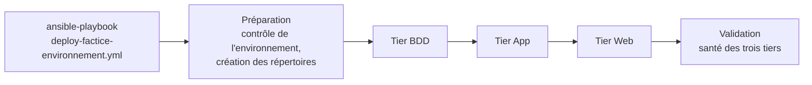
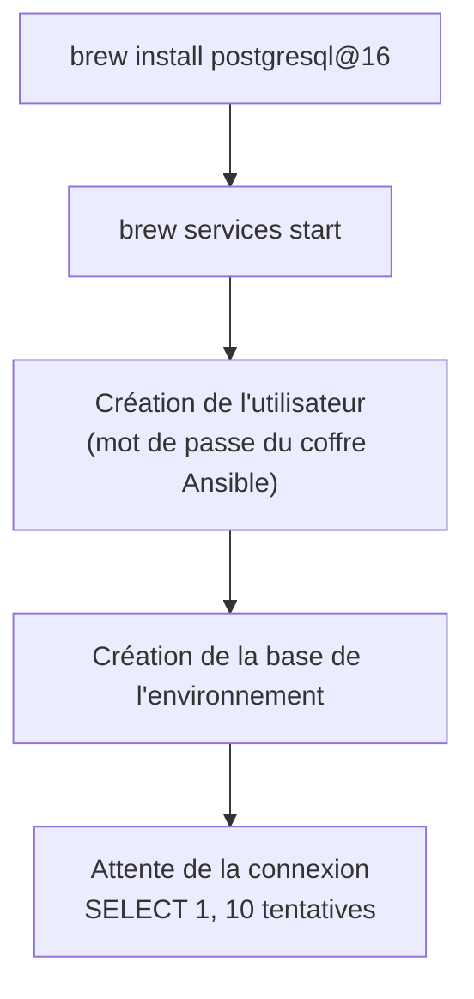
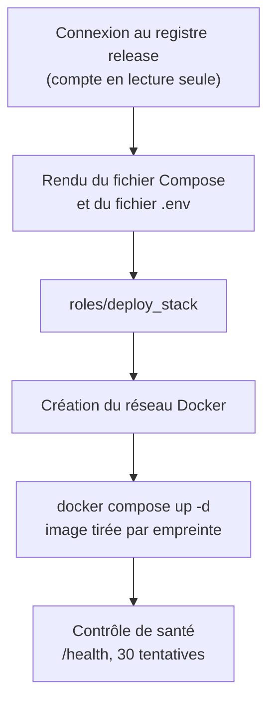
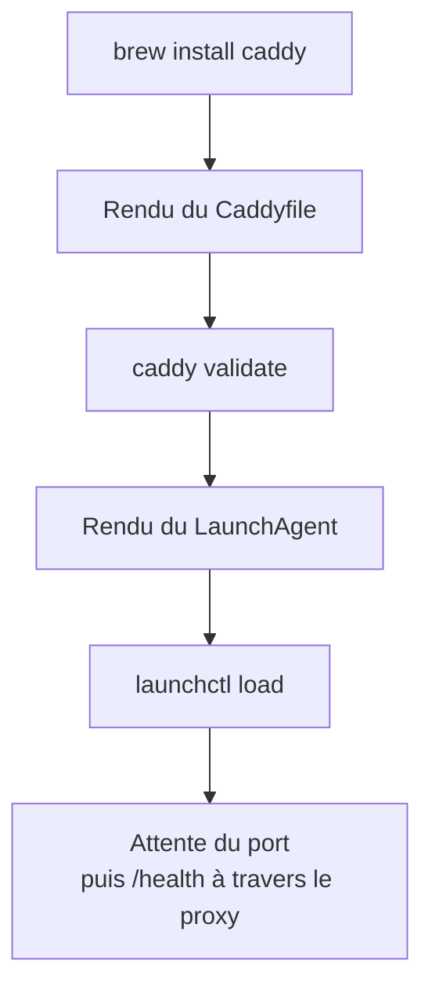

# Workflow Ansible : orchestration et déploiement

## Contexte d'exécution

**Où ?** Le runner auto-hébergé exécute localement `ansible-playbook` :

```bash
# Sur le runner (= sur le même hôte)
ansible-playbook deploy-factice-<environnement>.yml \
  --vault-password-file ~/.factice-vault-pass \
  -e "factice_release_image=..."
```

**Pas de SSH distant.** Ansible s'exécute sur localhost. Les tiers (PostgreSQL natif, Caddy natif, conteneur Docker) sont tous déployés sur le **même hôte** qu'Ansible.

**Durée.** Elle dépend de l'état de l'hôte : le premier passage installe PostgreSQL et Caddy, les suivants ne font que converger.

## Orchestration

Le playbook de l'environnement appelle `roles/factice`, qui enchaîne la préparation, les trois tiers puis la validation. Un graphe d'ensemble est suivi d'un graphe par tier.

### 1. Vue d'ensemble



### 2. Tier BDD



### 3. Tier App



### 4. Tier Web



## Ordre et dépendances

| Ordre | Tier | Dépend de | Pourquoi |
|---|---|---|---|
| 1 | BDD | rien | le conteneur applicatif a besoin de la base au démarrage |
| 2 | App | BDD, Registry | tire l'image release, se connecte à la base via `host.docker.internal` |
| 3 | Web | App | le reverse proxy a besoin d'une cible qui répond |
| 4 | Validation | les trois | santé de chaque tier |

Registry et le runner sont provisionnés à part, avant la première livraison.

## Détail par rôle

### `roles/factice`

Les valeurs propres à un environnement (ports, répertoires, noms de base, étiquette du LaunchAgent) sont dérivées de `factice_environment` (`integration` ou `production`).

| | Intégration | Production |
|---|---|---|
| Répertoire | `~/factice/integration` | `~/factice/production` |
| Web | 8070 | 9080 |
| App | 3000 | 3001 |
| BDD | 5432 | 5433 |
| LaunchAgent | `com.factice.web.integration` | `com.factice.web.production` |

- **Tier App** : le conteneur joint la base native par `host.docker.internal` (déclaré par `extra_hosts` dans le fichier Compose). L'image est soit la release passée en `factice_release_image`, soit une image Node générique en développement.
- **Tier Web** : le Caddyfile est validé par `caddy validate` avant d'être mis en service ; l'interface d'administration de Caddy est désactivée afin que les deux environnements puissent coexister.
- **Tier BDD** : création conditionnelle de l'utilisateur et de la base.

### `roles/deploy_stack`

Rôle générique, sans gabarit propre : l'appelant fournit `docker-compose.yml` et `.env`. Le rôle crée le répertoire et le réseau Docker, lance `community.docker.docker_compose_v2`, attend les URL de santé, puis affiche le résultat. Contrat : [deploy-stack-contract.md](deploy-stack-contract.md).

## Contrôles de santé

| Tier | Contrôle | Tentatives | Rôle |
|---|---|---|---|
| **BDD** | `SELECT 1` via psql (Ansible `postgresql_query`) | 10 | PostgreSQL répond → base accessible |
| **App** | GET `http://localhost:3000/health` ou `:3001/health` | 30 | Conteneur Docker répond, applicatif sain |
| **Web** | 1. Écoute du port (8070 ou 9080) → launchctl load réussi<br/>2. GET `/health` via proxy (Caddy → App) | 5 chacun | Caddy démarre → proxy atteint l'App → tous les trois tiers up |

**Chaîne de validation :**
1. BDD up (base accessible) → l'App peut démarrer
2. App up (healthcheck directe) → le conteneur est sain
3. Web up (healthcheck via proxy) → les trois tiers répondent de bout en bout

L'ordre est important : on valide chaque dépendance avant d'utiliser le tier suivant.

## Variables et secrets

| Variable | Origine |
|---|---|
| `factice_environment` | positionnée par le playbook de l'environnement |
| `factice_release_image` | passée par la CI (`-e`), par empreinte |
| mots de passe `vault_*` | `inventory/group_vars/local/vault.yml` |
| `NEXUS_DEPLOY_PASSWORD` | variable d'environnement du job, jamais en argument |

## Flux des secrets (Ansible Vault)

La chaîne de déverrouillage, **telle qu'elle est conçue** :

```
~/.factice-vault-pass (sur le runner, mode 600)
    ↓ clé de déverrouillage
inventory/group_vars/local/vault.yml (dans le dépôt, destiné à être chiffré par Ansible Vault)
    ↓ contient
vault_factice_db_password, vault_factice_db_user_password, ...
    ↓ référencés par
roles/factice/defaults/main.yml
    factice_db_password: "{{ vault_factice_db_password }}"
    ↓ rendus dans
.env (fichier écrit par le template, mode 600, jamais logué)
    ↓ lu par
Conteneur Docker / Ansible tasks
```

**Jamais de secret en argument de commande** (`-e`, `-E`). Tous passent par le fichier `.env` ou les variables Ansible.

**État actuel.** Le fichier `vault.yml` versionné contient des valeurs de substitution (`changeme-*`) **en clair** : il n'est pas chiffré. Tant que ce n'est pas corrigé, il ne doit contenir aucune valeur réelle. La cible est soit de le chiffrer (`ansible-vault encrypt`, avec un identifiant de coffre par environnement), soit de ne plus stocker de secret dans le dépôt et de les lire dans un gestionnaire externe au moment de l'exécution. Voir [bonnes-pratiques-ansible.md](bonnes-pratiques-ansible.md).

## Idempotence

Un second passage d'un playbook doit rendre `changed=0` : les gabarits identiques ne changent rien, `docker compose up -d` ne recrée un conteneur que si l'image ou la configuration change, et la création de la base est conditionnelle.

## Événement de déploiement

L'événement n'est **pas émis par Ansible** : c'est l'étape `Deployment event` du workflow (exécutée même en cas d'échec, `if: always()`) qui appelle `scripts/nexus/deployment-event.sh`, avec le résultat `reussi` ou `echoue`. Le script exige aussi `retour-arriere`, qu'aucune étape du workflow n'utilise aujourd'hui (le retour arrière est manuel).

```json
{
  "application": "factice.app",
  "environnement": "integration",
  "release": {
    "composant": "factice",
    "version": "1.2.3",
    "empreinte": "sha256:abc123..."
  },
  "imagesDorees": [],
  "date": "2026-10-02T15:32:00Z",
  "resultat": "reussi"
}
```

**Journal local.** Chaque événement est ajouté à `deploy-events.jsonl` (variable `EVENT_LOG`), dans le répertoire de travail du job : le journal vit dans l'espace de travail du runner, il n'est donc pas une trace durable.

**Transmission.** Si `CMDB_EVENT_URL` est défini, l'événement est envoyé en POST (jeton `CMDB_TOKEN` en en-tête `Authorization`). Une erreur de transmission fait échouer l'étape.

**Rôle.** Tracer quelle release a été déployée où et avec quel résultat ; alimenter les mesures DORA (taux d'échec, temps de restauration).

## Spécificités de la plateforme macOS

Les trois tiers ne se comportent pas comme sur un serveur Linux :

| Sujet | Particularité |
|---|---|
| Paquets | Homebrew (`brew install`), exécuté sous le compte du runner, pas en administrateur |
| Services natifs | PostgreSQL via `brew services`, Caddy via un LaunchAgent (`launchctl`) : ce sont des services de session utilisateur, ils ne démarrent qu'avec la session |
| Conteneur vers hôte | un conteneur atteint la base native par `host.docker.internal`, déclaré dans `extra_hosts` |
| Pare-feu | le pare-feu applicatif de macOS ou `pf`, pas UFW |
| Tests de rôles | les tiers natifs ne se testent pas dans un conteneur Linux, voir [bonnes-pratiques-ansible.md](bonnes-pratiques-ansible.md) |

## Diagnostic

| Symptôme | Piste |
|---|---|
| Tirage de l'image refusé (401) | `NEXUS_DEPLOY_PASSWORD` absent ou compte `svc-deploiement` mal configuré |
| 502 sur le port 8070 ou 9080 | conteneur applicatif arrêté : `docker logs <conteneur>` |
| Conteneur sain mais base inaccessible | PostgreSQL arrêté (`brew services list`) ou port de l'environnement incorrect |
| Caddy ne démarre pas | `caddy validate --config <répertoire>/Caddyfile`, journaux dans `<répertoire>/logs` |
| Runner hors ligne | Settings, Actions, Runners ; `launchctl list` sur l'hôte |
| Événement de déploiement non reçu | `CMDB_EVENT_URL` ou `CMDB_TOKEN` mal configurés |

## Références

- [bonnes-pratiques-ansible.md](bonnes-pratiques-ansible.md) : qualité, tests, secrets, déploiement
- [deploy-stack-contract.md](deploy-stack-contract.md) : contrat du rôle générique
- [../ci-cd/pipeline-build-promotion.md](../ci-cd/pipeline-build-promotion.md) : appel depuis le workflow
