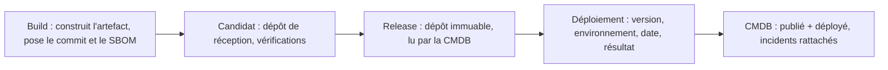
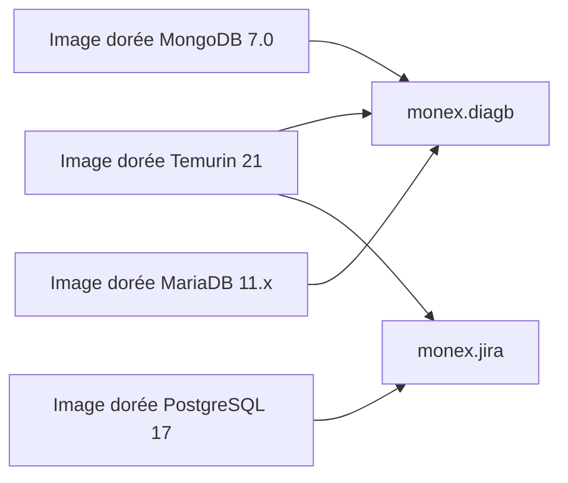

# Gouvernance des artefacts avec Nexus Repository

*Un catalogue unique, tracé du code source jusqu'au déploiement. Décision d'architecture, 30 septembre 2026.*

Présentation en 10 slides pour un directeur. Chaque section correspond à une slide, avec son message clé, son contenu et des notes pour l'orateur. Le détail se trouve dans le [dossier d'architecture](nexus-architecture.md).

## Plan

| # | Slide | Message clé |
|---|---|---|
| 1 | Titre | Un catalogue unique, de la source au déploiement |
| 2 | Pourquoi agir maintenant | Les règles reposent sur des conventions fragiles |
| 3 | La décision proposée | Nexus Pro au centre, politiques natives |
| 4 | Comment cela fonctionne | Un chemin par artefact, une source par donnée |
| 5 | Traçabilité et immutabilité | Deux identifiants, deux questions |
| 6 | Composants tiers et images dorées | Aller vite sans ouvrir de brèche |
| 7 | Exemple concret | monex.diagb et monex.jira |
| 8 | Deux options étudiées | A l'emporte sur le blocage et la simplicité |
| 9 | Ce que l'on gagne | Les quatre indicateurs DORA deviennent calculables |
| 10 | Risques et décision attendue | Valider l'option A |

---

## Slide 1 : Titre

**Gouvernance des artefacts avec Nexus Repository**

Un catalogue unique, tracé du code source jusqu'au déploiement

> **Notes orateur** : annoncer l'objet (une décision d'architecture à valider), la durée et l'issue attendue en fin de présentation : valider l'option A.

---

## Slide 2 : Pourquoi agir maintenant

*Environ 60 applications, des règles qui reposent sur des conventions fragiles.*

- **Tracer chaque livraison** : savoir de quel code vient chaque artefact, et pouvoir prouver qu'il n'a pas changé.
- **Maîtriser les composants tiers** : aujourd'hui 1 à 3 jours ouvrés d'attente, les équipes sont tentées de contourner.
- **Une CMDB fiable** : refléter le publié et le déployé sans double saisie.
- **Retrouver ce qui appartient à quoi** : parmi 60 applications, accéder aux artefacts d'une application par son identifiant.

> **Notes orateur** : insister sur le lien entre délai d'attente et contournement. Un circuit trop lent pousse les équipes à télécharger hors circuit, donc hors contrôle.

---

## Slide 3 : La décision proposée

**Retenir l'option A : Nexus Repository Pro au centre, avec des politiques natives de la plateforme.**

- **Immuable** : une release publiée ne change plus. C'est un réglage, pas une convention.
- **Contrôlé** : les composants tiers sont vérifiés automatiquement à l'entrée.
- **Relié à la CMDB** : le publié vient de Nexus, le déployé vient du pipeline.

> **Notes orateur** : la décision porte sur le lieu où vivent les règles. Elles passent des conventions de chemin aux réglages de la plateforme, donc elles ne dépendent plus de la bonne volonté de chaque équipe.

---

## Slide 4 : Comment cela fonctionne

*Un seul chemin pour chaque artefact, une seule source pour chaque donnée.*

| Build | Candidat | Release | Déploiement | CMDB |
|---|---|---|---|---|
| Construit l'artefact, pose le commit et le SBOM | Dépôt de réception, vérifications | Dépôt immuable, lu par la CMDB | Pipeline : version, environnement, date, résultat | Publié + déployé, incidents rattachés |

- Nexus est la source du publié (ce qui existe et a été validé).
- Le pipeline est la source du déployé (ce qui tourne, où, avec quel résultat).
- Aucune saisie manuelle dans la CMDB : toute correction se fait à la source.

> **Notes orateur** : une donnée, une source. Les écarts entre deux mécanismes qui alimentent la même information disparaissent.

---

## Slide 5 : Traçabilité et immutabilité

*Deux identifiants, deux questions.*

| Identifiant | Question | Origine |
|---|---|---|
| Hash de commit | De quel code source vient cet artefact ? | Posé par la chaîne de build, vérifié à la promotion, porté en métadonnée et dans le SBOM |
| Empreinte de contenu | Ce binaire est-il celui qui a été publié ? | Calculée par Nexus |

Les deux sont conservés : aucun ne suffit seul.

Un nouveau build du même commit crée un nouveau candidat, jamais un remplacement de la release. Pour un composant éditeur (sans commit), l'identité est le nom d'origine, la version et l'empreinte de l'éditeur.

> **Notes orateur** : le hash n'est ni une version ni une preuve de reproductibilité. C'est une métadonnée d'audit. La provenance attestée et signée est écartée pour l'instant, à réévaluer sur exigence d'audit externe.

---

## Slide 6 : Composants tiers et images dorées

*Aller vite sans ouvrir de brèche.*

- **Composants tiers** : un seul point d'entrée, le proxy Nexus. Contrôle automatique des licences et des vulnérabilités. Un composant courant est disponible en minutes. La SSI tranche seule les cas bloqués, sous 1 jour ouvré.
- **Images dorées mutualisées** : socles partagés Temurin 21, MongoDB 7.0, MariaDB 11.x, PostgreSQL 17. Construites en interne, stockées dans Nexus, avec leur SBOM et le commit de construction.

**Une mise à jour d'image dorée touche plusieurs applications : la CMDB dit lesquelles.**

> **Notes orateur** : un décideur unique et un délai court évitent de recréer le goulot d'un comité. Le contrôle est moins fin sur le format raw : c'est un point à confirmer avec l'éditeur de l'outil.

---

## Slide 7 : Exemple concret, deux applications

*Chaque application a un identifiant stable, en tête de chemin.*

| monex.diagb | monex.jira |
|---|---|
| diagb 1.2 (livrable éditeur) | Jira Data Center 11.3 (livrable éditeur) |
| Image dorée Temurin 21 | Image dorée Temurin 21 |
| Image dorée MongoDB 7.0 | Image dorée PostgreSQL 17 (conteneur) |
| Image dorée MariaDB 11.x | |

- Retrouver une application parmi 60 : son identifiant ouvre le chemin dans chaque dépôt.
- Ce qui est partagé (les images dorées) est rangé sous « mutualise ».
- Le domaine et l'équipe passent par des étiquettes ; la CMDB donne la vue complète.

> **Notes orateur** : l'image Temurin 21 est commune aux deux applications. Une mise à jour la concerne ; la CMDB liste les applications touchées.

---

## Slide 8 : Deux options étudiées

*L'option A l'emporte sur le blocage à l'entrée et la simplicité.*

| Critère | Option A : Nexus au centre | Option B : gouvernance découplée |
|---|---|---|
| Composants à risque | Bloqués avant usage | Détectés après coup |
| Pièces à exploiter | Nexus, CMDB | Nexus, Dependency-Track, catalogue, CMDB |
| Dépendance à un éditeur | Forte | Faible |
| Coût de licence | Nexus Pro, pare-feu, analyse | Nexus Pro ; le reste ouvert |
| Réversibilité | Moyenne | Bonne, brique par brique |

L'option B reste la réponse adaptée si le découplage des briques prime.

> **Notes orateur** : la dépendance à un éditeur est le vrai prix de l'option A. Le dire d'emblée.

---

## Slide 9 : Ce que l'on gagne, et comment on le mesure

*Les quatre indicateurs de livraison (DORA) deviennent calculables.*

- **Fréquence de déploiement** : déploiements réussis par application.
- **Délai de mise en production** : du commit au déploiement, en deux segments.
- **Taux d'échec des changements** : déploiements suivis d'un incident.
- **Délai de rétablissement** : durée d'un incident lié à une release.

Trois prérequis : le résultat dans l'événement de déploiement, la date du commit en métadonnée, le lien incident vers release dans l'ITSM. Ces indicateurs servent à améliorer la chaîne de livraison, pas à classer des équipes.

> **Notes orateur** : le lien incident vers release relève de l'ITSM, pas de Nexus. Sans lui, deux indicateurs sur quatre ne sont pas mesurables.

---

## Slide 10 : Risques à maîtriser et décision attendue

- **Contournement** : le proxy doit être plus rapide que le téléchargement direct.
- **Point unique de défaillance** : haute disponibilité et sauvegarde dès la conception.
- **Stockage** : règles de rétention dès le départ.
- **Déploiement hors pipeline** : à interdire ou détecter, sinon les indicateurs sont faussés.

**Décision attendue :** valider l'option A (Nexus Repository Pro au centre) et confier à la SSI la décision seule sur les composants tiers bloqués, sous 1 jour ouvré.

> **Notes orateur** : conclure sur les deux décisions demandées. Aucun point ouvert ne subsiste dans le dossier.
