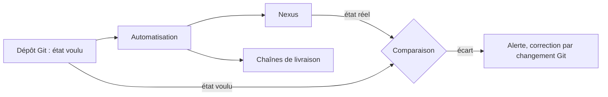
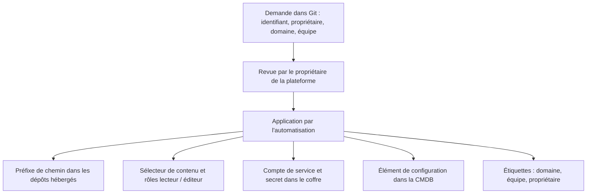
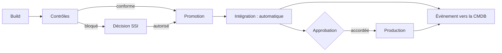
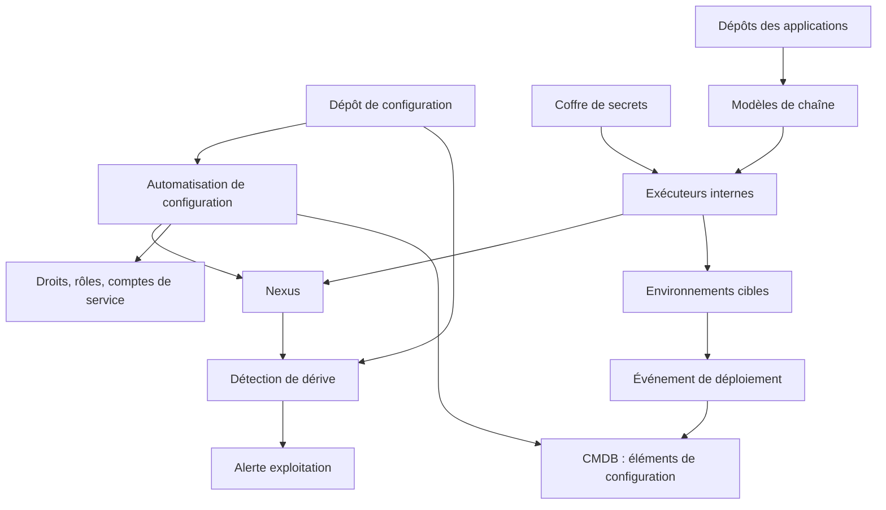
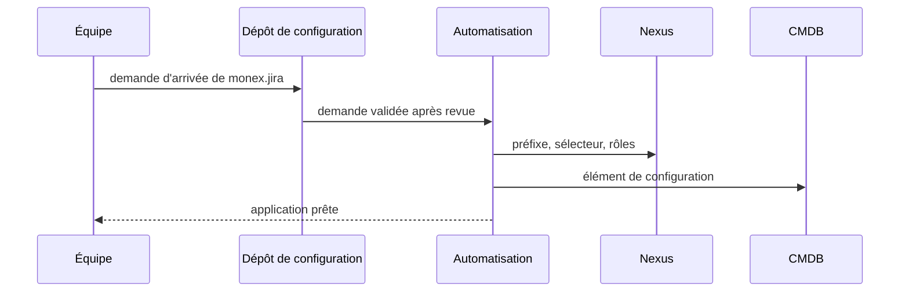

# Dossier d'architecture : automatisation de la chaîne de livraison autour de Nexus

Version 1, 2026-09-30

| Rubrique | Contenu |
|---|---|
| Statut | Proposé |
| Périmètre | Automatisation de la mise en œuvre et de l'exploitation de la gouvernance des artefacts : configuration de Nexus, chaînes de build, de promotion et de déploiement, arrivée d'une nouvelle application, détection des dérives |
| Décision recommandée | Option A : tout en code dans Git, appliqué par une chaîne standard réutilisable et des exécuteurs internes |
| Alternative étudiée | Option B : orchestrateur de livraison dédié, avec déploiement piloté par un contrôleur GitOps |
| Points ouverts | Trois, voir section 9 |
| Documents liés | [Dossier Nexus](../../2-pipeline-livraison/registry/nexus-architecture.md), [Spécification Nexus](../../2-pipeline-livraison/registry/nexus-spec.md), [Présentation directeur](presentation-directeur.md) |

## Sommaire

1. [Synthèse et décision](#1-synthèse-et-décision)
2. [Contexte](#2-contexte)
3. [Postulats et hypothèses](#3-postulats-et-hypothèses)
4. [Décisions de conception](#4-décisions-de-conception)
5. [Architecture cible](#5-architecture-cible)
6. [Options étudiées](#6-options-étudiées)
7. [Comparaison des options](#7-comparaison-des-options)
8. [Décision recommandée, conséquences et risques](#8-décision-recommandée-conséquences-et-risques)
9. [Points ouverts](#9-points-ouverts)
- [Annexe A. Exemple : arrivée de monex.jira et livraison de diagb 1.2](#annexe-a-exemple--arrivée-de-monexjira-et-livraison-de-diagb-12)
- [Annexe B. Glossaire](#annexe-b-glossaire)

## 1. Synthèse et décision

Le dossier Nexus fixe les règles : immutabilité, promotion, contrôle des composants tiers, lien avec la CMDB. Ce dossier décide comment ces règles sont appliquées sans intervention manuelle. La configuration de Nexus, les chaînes de livraison et l'arrivée d'une application sont décrites en code dans Git et appliquées par l'automatisation. Toute modification passe par une revue, et l'état réel est comparé à l'état voulu en continu.

## 2. Contexte

### 2.1 Situation

Le dossier Nexus concerne environ 60 applications. Il exclut volontairement l'outillage et l'automatisation de la mise en œuvre. Sans automatisation, chaque règle (droits par préfixe, dépôts, contrôles de promotion, événement de déploiement) devient une action manuelle répétée soixante fois, avec des écarts inévitables entre applications.

### 2.2 Objectifs

1. La configuration de Nexus est reproductible : elle se reconstruit à l'identique depuis Git.
2. Toute modification de règle est revue, tracée et datée.
3. L'arrivée d'une nouvelle application est une demande unique, sans intervention manuelle sur Nexus, les droits ou la CMDB.
4. Chaque application utilise la même chaîne de build, de promotion et de déploiement, sans pipeline sur mesure.
5. Un écart entre l'état voulu et l'état réel de Nexus est détecté en un jour au plus.
6. Les secrets ne figurent ni dans les dépôts ni dans les journaux.

### 2.3 Périmètre

- **Inclus** : configuration de Nexus en code, chaîne standard (build, contrôles, publication, promotion, déploiement), arrivée d'une application, environnements, comptes de service et secrets, détection des dérives, mesure de l'automatisation.
- **Exclus** : contenu métier des applications, choix de l'outil de supervision, tableau de bord DORA, trajectoire de migration.

### 2.4 Usages par profil

| Profil | Ce que l'automatisation lui apporte | Réf. |
|---|---|---|
| Développeur | Une chaîne prête à l'emploi : il pousse son code, le build, les contrôles et la publication en candidat s'enchaînent sans configuration propre. | A2 |
| Intégrateur (build et livraison) | Maintient les modèles de chaîne à un seul endroit. Une amélioration profite aux 60 applications. Déploie par le pipeline, avec approbation en production. | A2, A4 |
| SSI | Les règles de contrôle et les droits vivent en code et sont relus avant application. Le journal des changements se lit dans l'historique Git. Les secrets sont hors des dépôts. | A1, A6, A7 |
| Exploitant | Reconstruit Nexus depuis Git après un incident. Reçoit une alerte quand l'état réel s'écarte de l'état voulu. | A1, A7 |
| CMDB, ITSM et gouvernance | Chaque nouvelle application crée son élément de configuration sans saisie. L'événement de déploiement est produit par la chaîne, pas par une personne. | A3, A4 |
| Audit, achats et juridique | Toute règle appliquée a une demande de changement, un relecteur et une date. | A1, A7 |

### 2.5 Acquis de la maquette

Une maquette (dépôt factice) a validé les mécanismes de base sur un périmètre réduit :

- Nexus est déployé par un rôle d'automatisation, puis son dépôt Docker est provisionné par son interface de programmation, sans action manuelle.
- Un exécuteur de chaîne installé dans le réseau interne atteint Nexus sans l'exposer à l'extérieur.
- La chaîne enchaîne tests, construction de l'image et publication vers Nexus, et ne publie que si les tests réussissent.
- Deux environnements : intégration déployée automatiquement, production sur déclenchement manuel.
- Les secrets sont conservés dans un coffre chiffré, hors du code.

La maquette ne couvre ni la promotion candidat vers release, ni l'arrivée d'une application, ni la détection des dérives, ni l'événement de déploiement vers la CMDB : ce dossier les ajoute.

## 3. Postulats et hypothèses

### 3.1 Postulats

- Nexus expose une interface de programmation pour créer et modifier dépôts, sélecteurs de contenu, rôles et politiques de nettoyage.
- Un dépôt Git d'entreprise avec revue obligatoire est disponible.
- La chaîne d'intégration et de livraison sait lancer des modèles réutilisables.
- Un coffre d'entreprise conserve les secrets et les délivre aux exécuteurs.

### 3.2 Hypothèses

Ces points restent à confirmer avant de figer l'architecture.

| Sujet | Hypothèse | Si l'hypothèse est fausse |
|---|---|---|
| Couverture de l'interface de Nexus | Tous les réglages de la spécification Nexus se pilotent par l'interface de programmation | Un réglage restant manuel devient une exception documentée, contrôlée par la détection de dérive |
| Exécuteurs internes | Des exécuteurs installés dans le réseau interne atteignent Nexus, la CMDB et les environnements cibles | Il faut exposer Nexus, ce qui change la posture de sécurité (A5) |
| Coffre | Le coffre délivre un secret court à l'exécuteur au moment du job | Les secrets restent stockés dans la chaîne, avec un risque de fuite plus élevé (A6) |
| Déploiement | Les cibles sont déployables par le pipeline sans intervention humaine hors production | Un déploiement manuel échappe à la CMDB et fausse les indicateurs de livraison |
| Identifiant d'application | Chaque application a un identifiant stable de la forme service.projet | L'arrivée automatisée d'une application (A3) ne peut pas dériver préfixe, droits et compte de service |
| CMDB | La CMDB accepte la création d'éléments de configuration par son interface de programmation | La création de l'élément reste une étape manuelle, hors de l'arrivée automatisée |

## 4. Décisions de conception

Les principes du dossier Nexus tiennent. Sept décisions (A1 à A7) fixent comment ils sont appliqués sans action manuelle.

### 4.1 Décisions et alternatives écartées

| Réf. | Décision retenue | Alternative écartée | Justification |
|---|---|---|---|
| A1 | Toute la configuration de Nexus est décrite en code dans Git : dépôts, sélecteurs de contenu, rôles, étiquettes, politiques de nettoyage. Aucun réglage manuel dans la console d'administration | Administration par la console, documentée à part | Une console non tracée dérive, ne se reconstruit pas après incident et ne se relit pas. Le code se revoit, se date et se restaure. |
| A2 | Une chaîne standard réutilisable pour tous : build, contrôles, publication en candidat, promotion. Les applications l'appellent, elles ne la réécrivent pas | Un pipeline sur mesure par application | Soixante pipelines divergent. Un modèle unique se corrige et s'améliore une fois. |
| A3 | L'arrivée d'une application est une demande unique dans Git. L'automatisation en déduit le préfixe, le sélecteur de contenu, les rôles, le compte de service et l'élément de la CMDB | Création manuelle de chaque élément par des équipes différentes | L'identifiant d'application (D3) suffit à tout dériver. Le résultat est identique pour toutes les applications et se fait en minutes. |
| A4 | Le déploiement passe uniquement par le pipeline, avec deux environnements : intégration automatique, production sur approbation. Le pipeline émet l'événement de déploiement (D5) | Déploiement manuel ou script local | Un déploiement hors pipeline échappe à la CMDB et fausse les indicateurs. L'approbation en production garde un point de décision humain. |
| A5 | Les exécuteurs de la chaîne sont installés dans le réseau interne. Nexus n'est pas exposé à l'extérieur | Exécuteurs hébergés chez un fournisseur, avec Nexus exposé ou tunnelé | Exposer Nexus élargit la surface d'attaque d'un composant critique. Un exécuteur interne atteint Nexus sans changer la posture de sécurité. |
| A6 | Les secrets sont dans un coffre, délivrés à l'exécuteur pour la durée d'un job. Un compte de service par application, avec rotation. Aucun secret dans les dépôts ni les journaux | Secrets stockés dans la chaîne ou partagés entre applications | Un compte par application limite les dégâts d'une fuite et permet de révoquer sans tout arrêter. |
| A7 | L'état réel de Nexus est comparé chaque jour à l'état voulu. Un écart déclenche une alerte ; il se corrige par un changement dans Git, jamais par une retouche silencieuse | Correction automatique de tout écart | Une correction silencieuse masque la cause (un accès non autorisé, une erreur de procédure). Corriger par Git garde la trace et l'explication. |

### 4.2 Question de fond : chaîne d'intégration existante ou orchestrateur dédié

L'organisation dispose déjà d'une chaîne d'intégration et d'un outil de gestion de configuration. Un orchestrateur de livraison dédié (contrôleur GitOps, gestion de versions de déploiement) se justifie par le nombre de cibles et la gestion des retours arrière. Avec une seule chaîne existante et des cibles en nombre limité, le coût d'une brique supplémentaire reste à défendre (voir option B, section 6).

### 4.3 Arrivée d'une application

L'identifiant d'application (D3) est l'unique entrée. Tout le reste en découle.

| Élément créé | Dérivé de | Vérification |
|---|---|---|
| Préfixe de chemin | Identifiant d'application | Le préfixe existe dans chaque dépôt hébergé concerné |
| Sélecteur de contenu et rôles | Préfixe | L'éditeur ne publie que sous son préfixe |
| Compte de service | Identifiant | Secret présent dans le coffre, rotation planifiée |
| Étiquettes | Demande | Domaine, équipe et propriétaire renseignés |
| Élément de la CMDB | Identifiant et demande | Élément créé sans saisie |

La demande est revue avant application. Le retrait d'une application suit le chemin inverse : les droits sont révoqués, les releases sont conservées selon leur politique de rétention.

### 4.4 Chaîne de livraison standard

| Étape | Rôle | Sortie | Contrôle |
|---|---|---|---|
| Build | Construit l'artefact, produit le SBOM, pose le hash et la date du commit | Candidat dans Nexus | Tests réussis |
| Contrôles | Empreinte, manifeste, SBOM, licences et vulnérabilités (spécification Nexus, 6.3) | Rapport de contrôle | Aucun blocage, ou décision SSI |
| Promotion | Déplace le candidat vers la release et pose l'étiquette | Release immuable | Commit sur branche ou étiquette protégée (D7) |
| Déploiement intégration | Déploie automatiquement la release | Événement de déploiement | Vérification de santé |
| Déploiement production | Déploie après approbation | Événement de déploiement | Approbation humaine, vérification de santé |

Un échec à une étape arrête la chaîne : rien n'est promu ni déployé. Un retour arrière est un redéploiement de la release précédente, qui produit lui aussi un événement avec le résultat `retour-arriere`.

### 4.5 Mesure de l'automatisation

Cette section décrit les données à produire ; elle n'impose ni tableau de bord ni objectif chiffré.

| Indicateur | Définition | Source |
|---|---|---|
| Délai d'arrivée d'une application | Durée entre la demande validée et la première publication possible | Historique Git, automatisation |
| Part des applications sur la chaîne standard | Applications qui n'utilisent aucun pipeline sur mesure | Dépôts des applications |
| Taux de réussite de la chaîne | Exécutions sans échec technique, par étape | Journal de la chaîne |
| Dérives détectées | Écarts entre l'état voulu et l'état réel, et délai de correction | Détection quotidienne (A7) |
| Actions manuelles restantes | Réglages ou déploiements faits hors code | Détection de dérive, événements |

Ces indicateurs alimentent le suivi des indicateurs de livraison du dossier Nexus (4.4) et servent à améliorer la chaîne, pas à classer des équipes.

## 5. Architecture cible

Architecture commune aux options A et B.

| Composant | Rôle | Flux |
|---|---|---|
| Dépôt de configuration (Git) | Décrit l'état voulu de Nexus, des droits et des applications | Lu par l'automatisation ; modifié par revue |
| Automatisation de configuration | Applique l'état voulu à Nexus, aux droits et à la CMDB | Appelle les interfaces de Nexus, du coffre et de la CMDB |
| Modèles de chaîne | Build, contrôles, publication, promotion, déploiement | Appelés par chaque application |
| Exécuteurs internes | Exécutent les jobs dans le réseau interne | Atteignent Nexus, la CMDB et les cibles |
| Coffre de secrets | Conserve et délivre les secrets | Délivre un secret court à l'exécuteur |
| Nexus | Dépôts, promotion, contrôles (dossier Nexus) | Configuré par l'automatisation, publié par la chaîne |
| Détection de dérive | Compare l'état réel à l'état voulu | Alerte l'exploitation |
| CMDB | Reflète le publié et le déployé | Reçoit les éléments et les événements |

Les modifications de règles passent par le dépôt de configuration. Les applications ne touchent ni à Nexus ni aux droits : elles appellent la chaîne standard. Les options A et B (section 6) diffèrent par l'outil qui exécute les déploiements et par la gestion des retours arrière.

## 6. Options étudiées

Les deux options appliquent les décisions A1 à A7. Elles diffèrent par la manière de déployer et de gérer les versions déployées.

### 6.1 Option A : tout en code dans Git, chaîne standard et exécuteurs internes

La chaîne d'intégration existante et l'outil de gestion de configuration portent l'ensemble.

- **Configuration de Nexus** : rôles d'automatisation qui appliquent l'état voulu, de façon répétable.
- **Chaîne** : modèles réutilisables, appelés par chaque application.
- **Déploiement** : le pipeline déploie sur l'environnement voulu, avec approbation en production.
- **Retour arrière** : redéploiement de la release précédente par le même pipeline.
- **Événement** : émis par le pipeline vers la CMDB.

**Forces** : peu de pièces nouvelles, compétences déjà présentes, cohérent avec la maquette, coût limité.

**Limites** : pas de réconciliation continue des cibles ; le déployé n'est connu que par les événements du pipeline. Un déploiement hors pipeline n'est pas vu sans détection dédiée.

### 6.2 Option B : orchestrateur de livraison dédié, déploiement piloté par un contrôleur GitOps

Un contrôleur compare en continu l'état déclaré dans Git et l'état des cibles, et corrige l'écart.

- **Configuration de Nexus** : identique à l'option A.
- **Déploiement** : le contrôleur tire les versions déclarées dans Git vers les cibles.
- **Retour arrière** : retour à la version précédente déclarée.
- **Événement** : émis par le contrôleur vers la CMDB.

**Forces** : réconciliation continue des cibles, retour arrière natif, détection immédiate d'un déploiement hors circuit.

**Limites** : nouvelle brique à exploiter, compétences à acquérir, adaptée surtout aux cibles de type conteneur. Les composants éditeur installés sur serveur s'y intègrent moins naturellement.

## 7. Comparaison des options

L'option A l'emporte sur la simplicité et la cohérence avec l'existant ; l'option B l'emporte sur la réconciliation continue des cibles.

| Critère | Option A | Option B |
|---|---|---|
| Configuration de Nexus en code | Oui | Oui |
| Chaîne standard réutilisable | Oui | Oui |
| Pièces nouvelles à exploiter | Aucune | Contrôleur de déploiement |
| Compétences requises | Déjà présentes | À acquérir |
| Réconciliation continue des cibles | Non (événements et détection de dérive) | Oui |
| Détection d'un déploiement hors circuit | Par contrôle dédié | Native |
| Cibles de type serveur avec composant éditeur | Bien couvertes | Moins naturelles |
| Coût de mise en œuvre | Faible | Plus élevé |

## 8. Décision recommandée, conséquences et risques

### 8.1 Décision

Retenir l'option A : l'existant couvre le besoin, avec peu de pièces nouvelles et les composants éditeur bien pris en charge. L'option B reste adaptée si la réconciliation continue des cibles devient prioritaire, notamment avec une part croissante de conteneurs.

### 8.2 Conséquences

- Nexus n'est plus administré par la console : toute modification passe par Git.
- Les équipes d'application n'écrivent plus de pipeline : elles appellent la chaîne standard.
- L'arrivée d'une application se réduit à une demande revue.
- Les secrets sont retirés des dépôts et centralisés dans le coffre.
- Le dépôt de configuration devient un composant critique : sa protection (revue obligatoire, droits d'écriture limités) est une exigence de sécurité.

### 8.3 Risques

| Risque | Description | Parade |
|---|---|---|
| Automatisation à sens unique | Une erreur de configuration se propage aux 60 applications | Revue obligatoire, application d'abord sur un environnement de test |
| Contournement par la console | Un administrateur retouche Nexus à la main | Droits d'administration limités, détection de dérive quotidienne (A7) |
| Chaîne unique et blocage | Une panne de la chaîne ou des exécuteurs arrête toutes les livraisons | Plusieurs exécuteurs, supervision, procédure de reprise |
| Exécuteur compromis | Un exécuteur interne détient des accès étendus | Secrets à durée courte, exécuteurs cloisonnés, comptes de service par application |
| Couverture partielle de l'interface de Nexus | Un réglage ne se pilote pas par l'interface | Exception documentée, vérifiée par la détection de dérive |
| Modèles trop rigides | Une application aux besoins particuliers contourne la chaîne | Paramètres prévus dans les modèles ; contournement soumis à revue |
| Déploiement hors pipeline | Non vu par la CMDB, fausse les indicateurs de livraison | Interdire l'accès direct aux cibles ; détecter les écarts de version |
| Dépôt de configuration mal protégé | Une modification non revue donne accès à Nexus | Revue obligatoire, branche protégée, journal des changements |
| Adoption | Les équipes gardent leurs pipelines existants | Propriétaire par application, calendrier de bascule décidé avec elles |

## 9. Points ouverts

| Sujet | Question | Impact |
|---|---|---|
| Couverture de l'interface de Nexus | Quels réglages de la spécification Nexus ne se pilotent pas par l'interface ? | Liste des exceptions manuelles, à contrôler par la détection de dérive |
| Coffre de secrets | Quel coffre d'entreprise, et délivre-t-il des secrets à durée courte ? | Niveau de protection de A6 |
| Approbation en production | Qui approuve, et sous quel délai ? | Délai de mise en production, à cadrer comme la décision SSI (D6) |

## Annexe A. Exemple : arrivée de monex.jira et livraison de diagb 1.2

Cet exemple illustre A3 (arrivée d'une application) et A4 (déploiement par le pipeline) sur les applications du dossier Nexus.

### A.1 Arrivée de monex.jira

1. **Demande** : un changement dans le dépôt de configuration déclare l'identifiant `monex.jira`, son propriétaire, son domaine et son équipe.
2. **Revue** : le propriétaire de la plateforme relit et valide la demande.
3. **Application** : l'automatisation crée le préfixe `monex.jira` dans les dépôts raw et Docker hébergés, le sélecteur de contenu, les rôles lecteur et éditeur, le compte de service, les étiquettes et l'élément de la CMDB.
4. **Contrôle** : la chaîne de recette vérifie que l'éditeur ne publie que sous son préfixe et que le compte de service authentifie bien la chaîne.
5. **Prêt** : l'application peut déposer Jira Data Center 11.3 en raw candidat.

### A.2 Livraison de diagb 1.2

| Étape | Ce que fait l'automatisation | Résultat |
|---|---|---|
| Réception | Dépôt du paquet éditeur en raw candidat, calcul de l'empreinte, comparaison avec celle de l'éditeur | Empreinte conforme |
| Contrôles | Analyse pour reconstituer le SBOM, contrôle des licences et des vulnérabilités | SBOM marqué reconstitué ; cas bloqué remonté à la SSI |
| Promotion | Déplacement en raw release, pose de l'étiquette | Release immuable |
| Intégration | Déploiement automatique, vérification de santé | Événement de déploiement avec résultat |
| Production | Déploiement après approbation, vérification de santé | Événement de déploiement, CMDB à jour avec les versions des images dorées |

## Annexe B. Glossaire

| Terme | Définition |
|---|---|
| Automatisation de configuration | Outil qui applique de façon répétable un état voulu décrit en code |
| État voulu | Configuration décrite dans Git et validée par revue |
| État réel | Configuration effectivement présente dans Nexus |
| Dérive | Écart entre l'état voulu et l'état réel |
| Chaîne standard | Ensemble de modèles réutilisables de build, contrôles, promotion et déploiement |
| Exécuteur | Machine qui exécute les jobs de la chaîne, ici dans le réseau interne |
| Coffre de secrets | Service d'entreprise qui conserve et délivre les mots de passe et jetons |
| Compte de service | Identité technique dédiée à une application, sans usage nominatif |
| GitOps | Pratique où l'état déclaré dans Git pilote les déploiements, avec réconciliation continue |
| Arrivée d'une application | Ensemble des éléments créés pour une nouvelle application : préfixe, droits, compte, étiquettes, élément de CMDB |
| Événement de déploiement | Message émis par le pipeline : application, environnement, release, images dorées, date, résultat |
