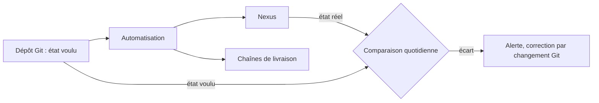
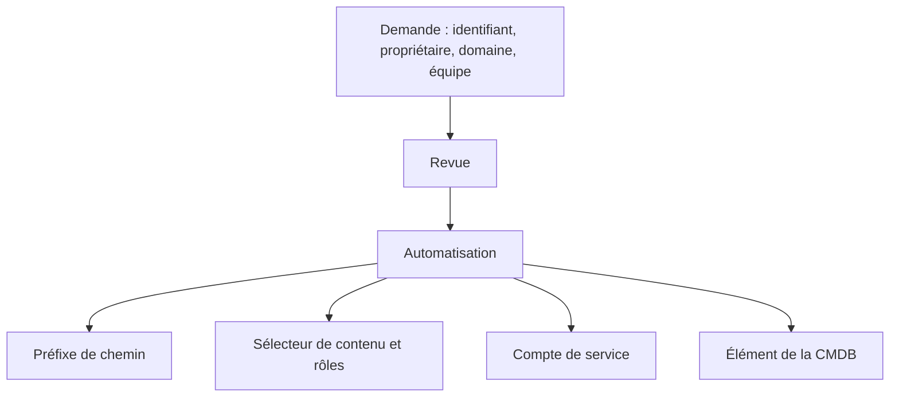

# Automatisation de la chaîne de livraison autour de Nexus

*Tout en code, de la configuration de Nexus au déploiement. Décision d'architecture, 30 septembre 2026.*

Présentation en 10 slides pour un directeur. Chaque section correspond à une slide, avec son message clé, son contenu et des notes pour l'orateur. Le détail se trouve dans le [dossier d'architecture](dossier-architecture-automatisation.md), qui prolonge le [dossier Nexus](../nexus/dossier-architecture-nexus.md).

## Plan

| # | Slide | Message clé |
|---|---|---|
| 1 | Titre | Appliquer les règles Nexus sans action manuelle |
| 2 | Pourquoi agir maintenant | Soixante applications, des règles répétées à la main |
| 3 | La décision proposée | Tout en code dans Git, chaîne standard |
| 4 | Comment cela fonctionne | Une demande revue, une automatisation, un contrôle continu |
| 5 | Arrivée d'une application | Un identifiant, tout le reste en découle |
| 6 | Chaîne de livraison standard | Une chaîne pour tous, jamais de pipeline sur mesure |
| 7 | Sécurité | Secrets au coffre, exécuteurs internes, dérives détectées |
| 8 | Deux options étudiées | A l'emporte sur la simplicité et l'existant |
| 9 | Ce que l'on gagne | Reproductible, tracé, mesuré |
| 10 | Risques et décision attendue | Valider l'option A |

---

## Slide 1 : Titre

**Automatisation de la chaîne de livraison autour de Nexus**

Tout en code, de la configuration de Nexus au déploiement

> **Notes orateur** : ce dossier prolonge la décision Nexus. Là où le premier disait quelles règles appliquer, celui-ci dit comment les appliquer sans intervention manuelle. Issue attendue : valider l'option A.

---

## Slide 2 : Pourquoi agir maintenant

*Sans automatisation, chaque règle devient une action répétée soixante fois.*

- **Reproductibilité** : Nexus doit pouvoir se reconstruire à l'identique après un incident.
- **Traçabilité** : chaque règle appliquée a une demande, un relecteur et une date.
- **Rapidité** : une nouvelle application ne doit pas attendre plusieurs équipes.
- **Cohérence** : soixante pipelines sur mesure divergent et se corrigent un par un.

> **Notes orateur** : l'écart entre applications est le vrai coût de l'approche manuelle. Il ne se voit qu'au premier incident ou au premier audit.

---

## Slide 3 : La décision proposée

**Retenir l'option A : tout en code dans Git, appliqué par une chaîne standard et des exécuteurs internes.**

- **Déclaratif** : la configuration de Nexus vit dans Git, aucun réglage manuel.
- **Standard** : une chaîne réutilisable, jamais de pipeline sur mesure.
- **Contrôlé** : l'état réel est comparé chaque jour à l'état voulu.

> **Notes orateur** : la décision porte sur le lieu où vivent les réglages. Ils passent de la console d'administration à un dépôt revu.

---

## Slide 4 : Comment cela fonctionne

*Une demande revue, une automatisation, un contrôle continu.*

| Étape | Qui | Quoi |
|---|---|---|
| Demande | Équipe | Un changement dans Git |
| Revue | Propriétaire de la plateforme | Validation avant application |
| Application | Automatisation | Nexus, droits et CMDB mis à jour |
| Contrôle | Détection de dérive | Comparaison de l'état réel et de l'état voulu |

> **Notes orateur** : un écart n'est jamais corrigé en silence. On l'alerte, puis on corrige par Git, pour garder la trace et la cause.

---

## Slide 5 : Arrivée d'une application

*Un identifiant, tout le reste en découle.*

- Une seule demande crée tout : préfixe, droits, compte de service, étiquettes, élément de la CMDB.
- Le résultat est identique pour toutes les applications.
- Exemple : monex.jira est prête à recevoir Jira Data Center 11.3 dès la demande validée.

> **Notes orateur** : l'identifiant service.projet est l'entrée unique. Sans lui, rien ne peut être dérivé automatiquement.

---

## Slide 6 : Chaîne de livraison standard

*Une chaîne pour tous, jamais de pipeline sur mesure.*

| Étape | Rôle |
|---|---|
| Build | Construit l'artefact, produit le SBOM, pose le commit |
| Contrôles | Empreinte, SBOM, licences, vulnérabilités |
| Promotion | Candidat vers release immuable |
| Intégration | Déploiement automatique |
| Production | Déploiement après approbation |

Chaque déploiement émet un événement vers la CMDB, avec son résultat. Un échec arrête la chaîne : rien n'est promu ni déployé. Un retour arrière est un redéploiement de la release précédente.

> **Notes orateur** : l'approbation en production garde un point de décision humain. Tout le reste s'enchaîne sans intervention.

---

## Slide 7 : Sécurité

*Ce qui protège la chaîne.*

- **Secrets** : dans un coffre, délivrés pour la durée d'un job. Jamais dans les dépôts ni les journaux.
- **Comptes de service** : un par application, avec rotation. Une fuite se révoque sans tout arrêter.
- **Exécuteurs internes** : Nexus n'est pas exposé à l'extérieur.
- **Dérives** : détectées chaque jour, alertées, corrigées par Git.

> **Notes orateur** : le dépôt de configuration devient un composant critique. Revue obligatoire, branche protégée et droits d'écriture limités sont des exigences.

---

## Slide 8 : Deux options étudiées

*L'option A l'emporte sur la simplicité et l'existant.*

| Critère | Option A : Git + chaîne standard | Option B : orchestrateur dédié |
|---|---|---|
| Pièces nouvelles à exploiter | Aucune | Contrôleur de déploiement |
| Compétences | Déjà présentes | À acquérir |
| Réconciliation continue des cibles | Non | Oui |
| Composants éditeur sur serveur | Bien couverts | Moins naturels |
| Coût de mise en œuvre | Faible | Plus élevé |

L'option B reste adaptée si la réconciliation continue des cibles devient prioritaire, notamment avec davantage de conteneurs.

> **Notes orateur** : la limite de l'option A est qu'un déploiement hors circuit n'est vu que par un contrôle dédié, pas nativement.

---

## Slide 9 : Ce que l'on gagne, et comment on le mesure

*Reproductible, tracé, mesuré.*

- **Délai d'arrivée d'une application** : de la demande validée à la première publication possible.
- **Part sur la chaîne standard** : applications sans pipeline sur mesure.
- **Taux de réussite de la chaîne** : par étape.
- **Dérives détectées** : nombre et délai de correction.
- **Actions manuelles restantes** : réglages ou déploiements faits hors code.

Ces indicateurs servent à améliorer la chaîne, pas à classer des équipes.

> **Notes orateur** : ils complètent les quatre indicateurs de livraison du dossier Nexus. Pas d'objectif chiffré à ce stade.

---

## Slide 10 : Risques à maîtriser et décision attendue

- **Erreur propagée** : une mauvaise configuration touche les 60 applications. Revue obligatoire et test préalable.
- **Chaîne unique** : une panne arrête toutes les livraisons. Plusieurs exécuteurs et supervision.
- **Contournement par la console** : droits d'administration limités et détection de dérive.
- **Déploiement hors pipeline** : à interdire ou détecter, sinon les indicateurs sont faussés.

**Décision attendue :** valider l'option A (tout en code dans Git, chaîne standard, exécuteurs internes) et cadrer les trois points ouverts : couverture de l'interface de Nexus, choix du coffre de secrets, approbation en production.

> **Notes orateur** : conclure sur la décision et les trois points ouverts à instruire, chacun avec son responsable.
