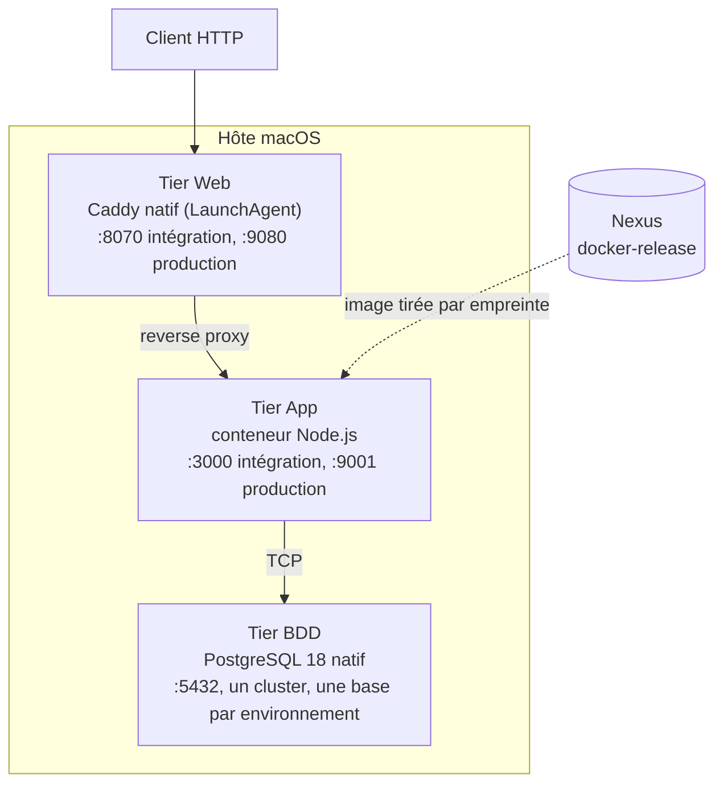
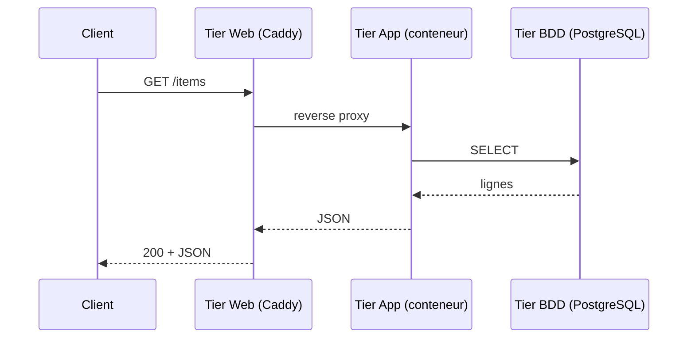

# Architecture : les trois tiers de factice

## Principe

factice sépare une application en trois tiers aux modes d'exécution volontairement différents, afin de montrer comment Ansible orchestre à la fois des conteneurs et des services natifs d'un même hôte (un hôte macOS) :

| Tier | Rôle | Exécution | Gestion |
|---|---|---|---|
| Web | Reverse proxy HTTP | Caddy natif, installé par Homebrew | LaunchAgent macOS |
| App | API Node.js / Express | Conteneur Docker | `roles/deploy_stack`, appelé par `roles/factice` |
| BDD | Persistance | PostgreSQL 18 natif, installé par Homebrew | `brew services` |

Une seule instance par tier et par environnement. Pas de haute disponibilité : ce n'est pas l'objet de la maquette.

## Vue d'ensemble

Le tier App est le seul tier livré par la chaîne CI/CD : son image est promue dans `docker-release` puis déployée par empreinte (voir [pipeline-build-promotion.md](2-pipeline-livraison/ci-cd/pipeline-build-promotion.md) et [registry/README.md](2-pipeline-livraison/registry/README.md)). Les tiers Web et BDD sont des services d'infrastructure, configurés par Ansible mais non reconstruits à chaque livraison.

## Responsabilités par tier

### Tier Web

- Termine les requêtes HTTP et les transmet au tier App.
- Configuration générée depuis `roles/factice/templates/Caddyfile.j2` : en-têtes de sécurité, compression, journaux d'accès en production.
- Exécuté par un LaunchAgent par environnement (`com.factice.web.<environnement>`), généré depuis `com.factice.web.plist.j2`. L'interface d'administration de Caddy est désactivée pour que les deux environnements coexistent.
- Redémarré seulement si la configuration ou le LaunchAgent change.

### Tier App

API applicative de l'exemple :

| Route | Effet |
|---|---|
| `GET /health` | 200 si le service répond ; utilisé par les contrôles de santé |
| `GET /items` | liste les éléments lus en base |
| `POST /items` | crée un élément en base |

- Déployé par `roles/deploy_stack` à partir du template `docker-compose.app.yml.j2`.
- L'image est soit une release immuable de Nexus, référencée par empreinte (`factice_release_image`), soit, en développement, une image Node générique dans laquelle les sources sont montées.
- Politique de redémarrage `unless-stopped` ; contrôle de santé du conteneur et contrôle de santé Ansible.
- Joint PostgreSQL, qui tourne sur l'hôte, par `host.docker.internal` (déclaré par `extra_hosts` dans le fichier Compose).

### Tier BDD

- PostgreSQL 18 installé par Homebrew, démarré par `brew services`.
- Une base et un utilisateur par environnement : `factice_integration` et `factice_production`.
- Le mot de passe de l'utilisateur vient du coffre Ansible, jamais du dépôt.
- Accessible en local uniquement.

## Environnements

| | Intégration | Production |
|---|---|---|
| Web (Caddy) | 8070 | 9080 |
| App (hôte → conteneur) | 3000 → 3000 | 9001 → 3000 |
| BDD | 5432 | 5432 (même cluster, autre base) |
| Base et utilisateur | `factice_integration` | `factice_production` |

Chaque environnement a son répertoire d'installation (`~/factice/<environnement>`), sa base et ses secrets : aucune ressource n'est partagée entre les deux.

## Flux d'une requête

## Orchestration Ansible

Le rôle `roles/factice` orchestre les trois tiers dans cet ordre : préparation des répertoires, tier BDD, tier App, tier Web, puis validation.

| Étape | Fichier | Contenu |
|---|---|---|
| Préparation | `tasks/main.yml` | contrôle de l'environnement, création des répertoires |
| BDD | `tasks/tier_db.yml` | installation et démarrage de PostgreSQL, création de l'utilisateur et de la base |
| App | `tasks/tier_app.yml` | connexion au registre (compte de lecture seule), rendu des fichiers, appel de `deploy_stack` |
| Web | `tasks/tier_web.yml` | installation de Caddy, validation de la configuration, LaunchAgent |
| Validation | `tasks/validation.yml` | santé de chaque tier, résumé |

`roles/deploy_stack` est générique : il crée le répertoire et le réseau Docker, rend le fichier Compose, tire les images, démarre la pile et attend les contrôles de santé. Son contrat est décrit dans [contrat-deploy-stack.md](2-pipeline-livraison/orchestration/deploy-stack-contract.md).

Les valeurs propres à chaque environnement (ports, noms de base, niveau de journalisation) sont dérivées de la variable `factice_environment`, dans `roles/factice/defaults/main.yml`.

## Robustesse et idempotence

- **Redémarrage de la machine** : le LaunchAgent relance le tier Web, `brew services` relance PostgreSQL, la politique `unless-stopped` relance le conteneur.
- **Idempotence** : un second passage d'un playbook doit rendre `changed=0`. Les gabarits ne changent rien s'ils sont identiques, `docker compose up -d` ne recrée un conteneur que si son image ou sa configuration change, et la création de la base est conditionnelle.
- **Vérification** : `curl http://localhost:8070/health` renvoie 200 uniquement si les trois tiers répondent.
