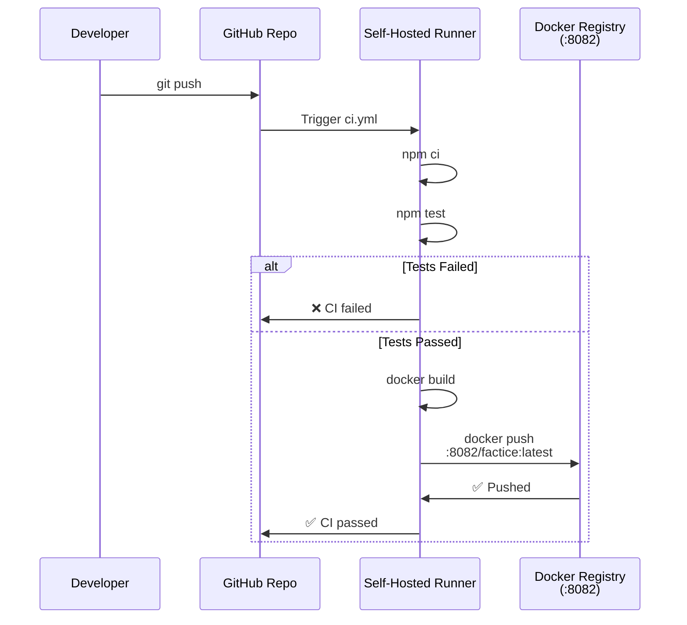

# CI/CD Flow — Code to Registry

## Sequence Diagram



## Detailed Steps

### 1. Developer Pushes Code

```bash
cd factice
git add app/src/index.js package.json
git commit -m "feat: add GET /items endpoint"
git push origin main
```

Triggers `.github/workflows/ci.yml`

### 2. GitHub Actions Prepares the Job

- Event: `push` on `main` or `develop`
- Runner: `runs-on: self-hosted` (runner installed on the Mac Mini)
- Environment variables loaded (Nexus credentials from vault)

### 3. Runner Executes Workflow

```yaml
# .github/workflows/ci.yml
name: CI

on:
  push:
    branches: [main, develop]
  pull_request:
    branches: [main, develop]

jobs:
  build:
    runs-on: self-hosted
    
    steps:
      - uses: actions/checkout@v4
      - uses: actions/setup-node@v4
        with:
          node-version: '20'
          cache: 'npm'
      
      - run: npm ci
      - run: npm test
      
      - uses: docker/build-push-action@v5
        with:
          context: ./app
          push: true
          registry: localhost:8082
          username: ${{ secrets.REGISTRY_USERNAME }}
          password: ${{ secrets.REGISTRY_PASSWORD }}
          tags: localhost:8082/factice:latest
```

### 4. npm test

```bash
$ npm test
✓ test suite 1
✓ test suite 2
Tests passed!
```

If tests fail, workflow fails and push is canceled.

### 5. Docker Build

```bash
$ docker build -f app/Dockerfile -t factice:latest ./app
Successfully built <SHA>
```

### 6. Push to Registry

```bash
$ docker push localhost:8082/factice:latest
Pushed successfully
```

### 7. Workflow Success

GitHub marks workflow ✅ passed. Developer receives notification.

## Registry Access

The self-hosted runner accesses the registry via:
- **Localhost** : http://localhost:8082 (local Docker registry on Mac Mini)
- **Tailscale/VPN** : accessible via internal network

Credentials stored in GitHub Secrets:
- `REGISTRY_USERNAME` = technical account
- `REGISTRY_PASSWORD` = password from vault

## Verify Image in Registry

After successful push, the image is available:

### Via Registry UI

```
http://localhost:8081  (registry UI)
→ Browse Repositories → factice (Docker hosted)
→ See factice:latest listed
```

### Via API

```bash
curl -u admin:password http://localhost:8081/service/rest/v1/search?repository=factice
```

```json
{
  "items": [
    {
      "name": "factice",
      "format": "docker",
      "tags": ["latest"]
    }
  ]
}
```

## Error Scenarios

| Scenario | Detection | Action |
|---|---|---|
| Tests fail | `npm test` exit 1 | Workflow fails, push canceled |
| Build fails | Docker build error | Workflow fails, push canceled |
| Push fails | docker push error (auth, space, etc.) | Workflow fails |
| Runner offline | Workflow waiting (3h timeout) | Retry after runner up |

## Performance

Typical workflow time (CI → push):
- npm ci : ~30s
- npm test : ~20s
- docker build : ~60s (first), ~10s (cached)
- docker push : ~30s
- **Total : ~2-3 minutes**

---

**Note:** Self-hosted runner on Mac Mini allows local registry access without exposing public IP.
