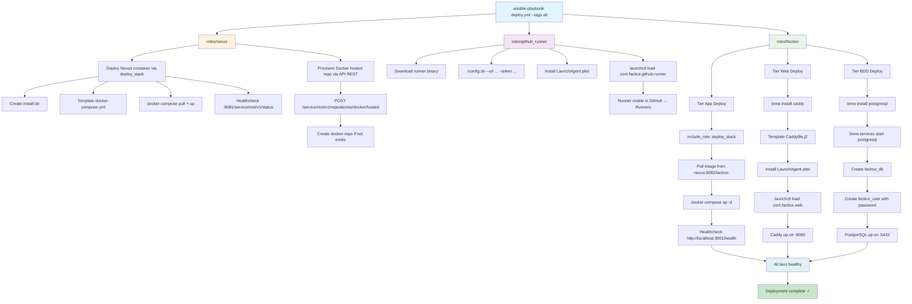

# Flux de déploiement Ansible

## Diagramme d'orchestration



## Séquence d'exécution

```bash
# 1. Deploy Nexus (must be first — other components depend on it)
ansible-playbook -i inventory/hosts deploy.yml --tags nexus --check --diff
ansible-playbook -i inventory/hosts deploy.yml --tags nexus

# 2. Install runner (needs to exist before pushing images)
ansible-playbook -i inventory/hosts deploy.yml --tags github_runner

# 3. At this point, runner can push to Nexus
#    Manually trigger a push to factice repo → CI/CD runs → image in Nexus

# 4. Deploy app (pulls image from Nexus)
ansible-playbook -i inventory/hosts deploy.yml --tags factice
```

## Détails par rôle

### roles/nexus

**Dependencies:** None

**Steps:**
1. `include_role: deploy_stack` with Nexus docker-compose
2. Wait for Nexus health on `:8081/service/rest/v1/status`
3. Provision Docker hosted repo via API REST (idempotent)

**Output:** Nexus running, docker-hosted repo ready on `:8082`

**Redeploy:** Idempotent — second run = no changes if image unchanged

---

### roles/github_runner

**Dependencies:** None (but should run before factice images are pushed)

**Steps:**
1. Download runner binary from GitHub
2. Extract to `/opt/actions-runner` (or ~/actions-runner)
3. Template LaunchAgent plist
4. Load plist into launchd
5. Run `./config.sh` with GitHub URL and token (from vault)

**Output:** Runner visible in GitHub UI as "Idle"

**Redeploy:** Idempotent — second run checks runner status, restarts if needed

---

### roles/factice

**Dependencies:** 
- Nexus must be up (tier App pulls from :8082/factice)
- PostgreSQL must be installable (Homebrew)

**Substeps:**

#### Tier App
1. `include_role: deploy_stack`
   - Template docker-compose.app.yml
   - Template .env.app (Nexus URL, DB credentials)
   - Pull image from `nexus:8082/factice:<latest>`
   - Start container
   - Healthcheck on `http://localhost:3001/health`

#### Tier Web
1. `brew install caddy`
2. Template Caddyfile.j2 (reverse proxy to localhost:3001)
3. Template LaunchAgent plist
4. Load plist
5. Start Caddy via launchctl

#### Tier BDD
1. `brew install postgresql`
2. `brew services start postgresql`
3. Create database `factice_db`
4. Create user `factice_user` with password (from vault)
5. Create schema (table `items`)

**Output:** All 3 tiers up, curl http://localhost:8080/health → 200 OK

**Redeploy:** Idempotent — second run = no changes

---

## Healthchecks

| Tier | Endpoint | Timeout | Retries |
|---|---|---|---|
| Nexus | http://localhost:8081/service/rest/v1/status | 10s | 30 |
| App | http://localhost:3001/health | 10s | 30 |
| Web | n/a (checked via App healthcheck) | - | - |
| BDD | n/a (Ansible `postgresql_db` validates connection) | - | - |

---

## Variables Ansible

Required in `inventory/group_vars/all/vars.yml` or `vault.yml`:

```yaml
# Non-secret
factice_app_install_dir: "{{ ansible_env.HOME }}/factice-app"
factice_nexus_url: "100.113.214.55:8082"

# Secrets (vault.yml, encrypted)
vault_factice_db_password: "secure-password"
vault_github_runner_token: "<token-from-github-settings>"
vault_nexus_admin_password: "secure-password"
```

---

## Troubleshooting

| Issue | Symptom | Fix |
|---|---|---|
| Nexus healthcheck fails | docker ps shows `unhealthy` | Check `docker logs factice-nexus` |
| App can't pull from Nexus | docker-compose logs show 401 | Verify Nexus credentials in .env |
| Web reverse proxy 502 | curl localhost:8080 → 502 | Check Caddyfile, verify App on :3001 |
| BDD connection refused | psql connects fails | `brew services restart postgresql` |
| Runner offline | GitHub UI shows "Offline" | `launchctl start com.factice.github-runner` |

---

## Full redeploy (idempotent)

```bash
# Safe to run multiple times
ansible-playbook -i inventory/hosts deploy.yml

# Check changes (dry run)
ansible-playbook -i inventory/hosts deploy.yml --check --diff
```

Expected output on clean run:
```
TASK [Summarize changes] ****
ok: [localhost] => msg: "Deployed: nexus, github_runner, factice (3 tiers)"

Second run:
TASK [Summarize changes] ****
ok: [localhost] => msg: "No changes (all tiers healthy)"
```
