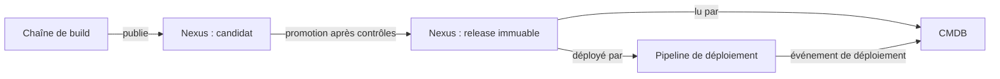
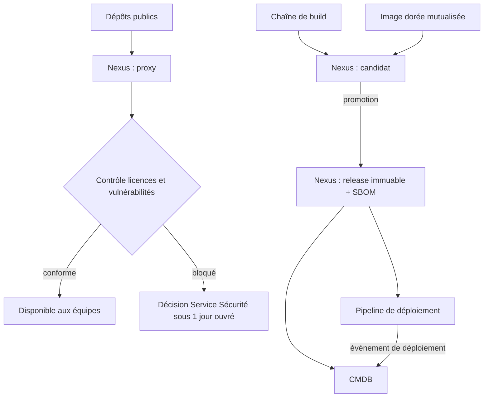
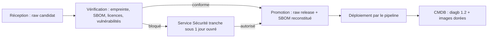
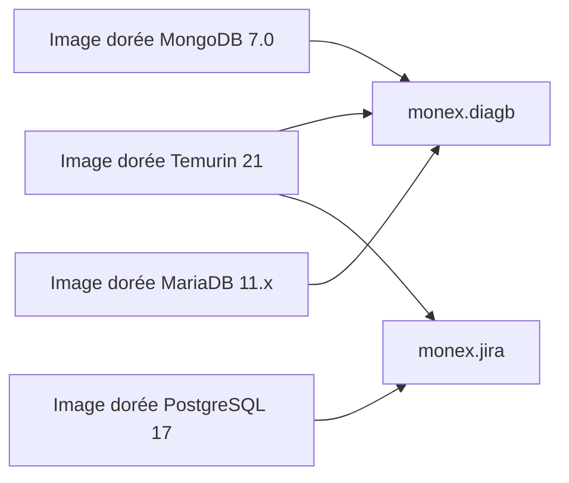

# Dossier d'architecture : gouvernance des artefacts avec Nexus Repository

Version 5 (enrichie), 2026-09-30

| Rubrique | Contenu |
|---|---|
| Statut | Proposé |
| Périmètre | Gouvernance des artefacts logiciels, de la publication à la CMDB, pour environ 60 applications |
| Décision recommandée | Option A : Nexus Repository Pro au centre, politiques natives |
| Alternative étudiée | Option B : Nexus comme stockage, gouvernance découplée |
| Points ouverts | Aucun à ce stade, voir section 9 |
| Documents liés | [Présentation directeur](presentation-nexus-directeur.md), [Spécification d'implémentation](spec-implementation-nexus.md) |

## Sommaire

1. [Synthèse et décision](#1-synthèse-et-décision)
2. [Contexte](#2-contexte)
3. [Postulats et hypothèses](#3-postulats-et-hypothèses)
4. [Décisions de conception](#4-décisions-de-conception)
5. [Architecture cible](#5-architecture-cible)
6. [Options étudiées](#6-options-étudiées)
7. [Décision recommandée, conséquences et risques](#7-décision-recommandée-conséquences-et-risques)
8. [Points ouverts](#8-points-ouverts)
- [Annexe A. Exemple : applications monex.diagb et monex.jira](#annexe-a-exemple--applications-monexdiagb-et-monexjira)
- [Annexe B. Glossaire](#annexe-b-glossaire)

## 1. Synthèse et décision

Nexus devient le catalogue unique de ce qui est publié. L'immutabilité, la promotion et le contrôle des composants tiers sont des réglages de la plateforme et non des conventions de chemin. La CMDB reflète le publié (source Nexus) et le déployé (source pipeline).



## 2. Contexte

### 2.1 Situation

La stratégie d'origine fait de Nexus la source immuable des artefacts, réconciliée avec une CMDB. Elle s'appuie sur le versionnement sémantique, un SBOM au format CycloneDX par application et une approbation par catégorie d'artefact. Environ 60 applications sont concernées.

### 2.2 Objectifs

1. Tout artefact promu est traçable jusqu'au commit source, par le hash porté en métadonnée et repris dans le SBOM, et non modifiable.
2. Un SBOM CycloneDX existe pour chaque application, sans action manuelle.
3. La CMDB reflète les versions publiées et déployées, sans double saisie.
4. Un composant tiers courant est disponible en minutes, et non en 1 à 3 jours ouvrés.
5. Les artefacts d'une application se retrouvent par son identifiant, parmi environ 60.

### 2.3 Périmètre

- **Inclus** : dépôts, promotion, composants tiers, images dorées mutualisées, SBOM, lien avec la CMDB, données nécessaires à la mesure de la livraison (DORA).
- **Exclus** : outillage et automatisation de la mise en œuvre, trajectoire de migration, tableau de bord des indicateurs de livraison.

### 2.4 Usages par profil

| Profil | Usage de Nexus | Réf. |
|---|---|---|
| Développeur | Récupère ses dépendances (Maven, npm, images Docker) par une seule adresse, sans passer par les dépôts publics. Publie ses composants en candidat. Retrouve un composant par ses coordonnées et sa version sémantique. Demande un composant tiers et l'obtient en minutes s'il est courant. | D3, D6 |
| Intégrateur (build et livraison) | Publie les artefacts du build dans le dépôt candidat, avec le hash et la date du commit en métadonnées. Déclenche la promotion vers la release. Range le SBOM CycloneDX à côté de l'artefact. Déploie uniquement des releases immuables et émet l'événement de déploiement. | 4.3, D1, D5 |
| Service sécurité | Bloque à l'entrée les composants tiers qui violent les règles de licence ou de vulnérabilité (option A), ou les détecte après coup (option B). Tranche seule les cas bloqués. Vérifie que chaque release remonte à un commit sur une branche ou une étiquette protégée. Exploite les SBOM pour localiser un composant vulnérable. Définit les droits par rôle et par sélecteur de contenu, sur le préfixe de chaque application. Arbitre le niveau de preuve du hash. | D3, D6, D7, 8.3 |
| Exploitant | Sait ce qui est déployé, où et depuis quelle release, y compris la version des images dorées. S'appuie sur la haute disponibilité et la sauvegarde d'un composant critique. Applique les règles de rétention pour maîtriser le stockage. | D5, 8.3 |
| CMDB, ITSM et gouvernance | Lit le publié dans Nexus et reçoit le déployé par le pipeline, sans saisie manuelle. Rattache les incidents aux releases. Dispose d'un catalogue unique, arbitre entre l'option A et l'option B et dispose des données des indicateurs de livraison. | D5, 4.4, 7 |
| Audit, achats et juridique | Suit un artefact du binaire au commit source et à l'événement de déploiement. Contrôle l'immutabilité des releases et l'existence des SBOM. Exploite les licences des composants tiers issues des SBOM et des règles de licence. | 4.3, 2.2, D6 |

## 3. Postulats et hypothèses

### 3.1 Postulats

- La CMDB reflète ce qui est publié dans Nexus.
- La CMDB reçoit auService Sécurité les événements de déploiement du pipeline (release, versions des images dorées, environnement, date, résultat), qui référencent les releases Nexus.
- Le CI/CD dispose d'une intégration Nexus native.
- La CMDB (ITSM) dispose d'un connecteur ou d'une API d'intégration avec Nexus et avec le pipeline.

### 3.2 Hypothèses

Ces points restent à confirmer avant de figer l'architecture.

| Sujet | Hypothèse | Si l'hypothèse est fausse |
|---|---|---|
| Formats | Maven, npm, Docker, plus un dépôt raw pour binaires, documents et images de machine | Un format de plus = un dépôt de plus, sans changer l'architecture |
| Composants éditeur (COTS) | Pas de commit source : stockés en raw avec nom, version et empreinte fournisseur ; SBOM reconstitué par analyse, l'éditeur n'en fournissant pas | Le hash Git n'a alors aucun sens pour eux, et le SBOM peut être incomplet |
| Images dorées | Mutualisées, construites en interne, stockées dans Nexus (raw pour une image de machine, Docker pour un conteneur), avec SBOM et commit de construction | Les composants embarqués (JDK, bases de données) ne sont pas traçables |
| Déploiement | Tout déploiement passe par le pipeline, qui émet un événement | Un déploiement manuel échappe à la CMDB, et le déployé affiché peut différer du réel |
| Incidents | L'ITSM peut rattacher un incident à une release Nexus | Le taux d'échec des changements et le délai de rétablissement ne sont pas mesurables (voir 4.4) |
| Identifiant d'application | Chaque application a un identifiant stable et unique, de la forme service.projet | Le préfixe de chemin et les droits par préfixe (D3) ne s'appliquent pas |

## 4. Décisions de conception

Les principes d'origine tiennent : immutabilité, versionnement sémantique, SBOM CycloneDX, Nexus comme référentiel de ce qui est publié. Six mécanismes retenus pour les appliquer sont remplacés (D1 à D6), car ils reposaient sur des conventions fragiles. Une septième décision (D7) fixe le niveau de preuve du hash de commit.

### 4.1 Décisions et alternatives écartées

| Réf. | Décision retenue | Alternative écartée | Justification |
|---|---|---|---|
| D1 | L'immutabilité est un réglage de plateforme ; le hash Git est une métadonnée | Hash Git dans le chemin de chaque artefact | Maven, npm et Docker résolvent par coordonnées ou par empreinte ; un chemin sur mesure casse clients et proxys. Le redéploiement interdit sur les releases et l'empreinte des images suffisent. Le hash reste porté en métadonnée, voir 4.3. |
| D2 | Le nom d'origine est conservé ; la normalisation se fait dans la CMDB | Normalisation en kebab-case à l'ingestion | Réécrire un nom modifie les coordonnées et invalide signatures et sommes de contrôle. |
| D3 | Un dépôt par format et par cycle de vie. L'identifiant d'application (service.projet) ouvre le chemin des dépôts hébergés ; ce qui est partagé va sous « mutualise ». Le domaine métier, l'équipe et le propriétaire passent par des étiquettes | Chemins par domaine métier ou par organigramme, avec double structure pendant la migration | Un domaine ou une équipe change ; l'identifiant d'application est stable et unique. Il permet de retrouver les artefacts d'une application parmi environ 60, et de régler les droits par préfixe avec un sélecteur de contenu. Deux structures en parallèle doublent la maintenance. |
| D4 | La documentation reste dans le wiki d'entreprise, liée depuis la CMDB | Wiki versionné avec empreinte de document dans le périmètre Nexus | Nexus n'est pas un outil documentaire ; une empreinte obligatoire ajoute de la friction sans gain d'audit. |
| D5 | Un seul flux par nature de donnée : le publié vient de Nexus, le déployé vient du pipeline (release, versions des images dorées, environnement, date, résultat). Aucune saisie manuelle | Temps réel plus lot quotidien à 02:00 | Deux mécanismes pour une même donnée créent des écarts ; ici chaque donnée a une source unique. Le résultat du déploiement rend poService Sécuritéble la mesure de la livraison (4.4). La version des images dorées permet de savoir quelles applications une mise à jour concerne. |
| D6 | Contrôle automatique des composants tiers ; la Service Sécurité tranche seule les cas bloqués, sous 1 jour ouvré | Approbation manuelle par catégorie, délai de 1 à 3 jours ouvrés, voie d'exception de 4 h ; comité restreint pour les cas bloqués | Un comité pousse à télécharger hors circuit ; le délai n'est pas mesuré et l'exception devient la norme. Un décideur unique et un délai court évitent de recréer le goulot. |
| D7 | Le hash de commit est déclaré par la chaîne de build, vérifié à la promotion (commit présent sur une branche ou une étiquette protégée) | Provenance attestée et signée pour chaque artefact | Cette attestation apporte une preuve vérifiable mais ajoute des identités de signature, une vérification à la consommation et un outillage encore inégal selon les formats. À réévaluer sur exigence d'audit externe ou de preuve à un tiers ; Docker serait le premier format concerné. |
| D8 | Option B : Nexus comme stockage, gouvernance découplée (Nexus Pro + Dependency-Track + Backstage + CMDB) | Option A : Nexus Pro au centre avec pare-feu propriétaire et analyse Sonatype | Option B offre indépendance vis-à-vis d'un éditeur, réversibilité brique par brique, coûts maîtrisés, détection continue des vulnérabilités, catalogue au service des équipes. Chaque choix (acceptation de composants tiers) est tracé dans Git et auditable. Compromis : détection après coup (nécessite discipline d'équipe et suivi actif des alertes) plutôt que blocage à l'entrée. |

### 4.2 Traçabilité au commit (hash Git)

Pour auditer une release en production, deux identifiants complémentaires sont nécessaires :

#### Hash de commit
- **Question** : D'où vient cet artefact ?
- **Réponse** : Code source en Git, révision exacte
- **Limite** : Ne garantit pas la reproductibilité (même code → builds différents possible)

#### Empreinte de contenu
- **Question** : C'est bien cet artefact ?
- **Réponse** : Checksum, digest d'image (preuve d'intégrité)
- **Limite** : Ne dit rien de l'origine du code

**Règle** : Les deux sont obligatoires. L'un sans l'autre ne suffit pas.

#### Où vivent ces données

| Format | Hash de commit | Empreinte |
|---|---|---|
| **Maven** | Manifeste + attributs Nexus | Checksum asset |
| **npm** | package.json + attributs Nexus | Digest sha256 |
| **Docker** | Tag image (révision source) | Digest image |
| **Raw** (binaires, docs) | Attributs Nexus | Checksum asset |

#### Chaîne d'audit complète

```
Binaire en production
    ↓ (empreinte)
Nexus / Registry
    ↓ (hash commit)
Git (code source)
    ↓ (SBOM CycloneDX)
CMDB (traçabilité métier)
```

**Règle** : Nexus, SBOM et CMDB parlent du **même commit**. Cela permet de remonter de n'importe quel binaire en prod à son code source.

#### Stockage du hash

- **Format** : Hash complet, jamais abrégé
- **Localisation** : SBOM CycloneDX (référence Git + révision)
- **Durée** : Immuable (écrit une fois, jamais modifié)
- **Contexte** : Date du commit incluse (utile pour délai de mise en production)

#### Cycle de vie

1. **Build** : chaîne de build pose hash + date du commit
2. **Promotion** : vérification du commit sur branche/étiquette protégée, étiquette de promotion figée
3. **Release** : dépôt immuable, artefact et métadonnées fixes
4. **CMDB** : lecture du publié depuis Nexus (jamais de ressaisie manuelle)

#### Cas sans hash

- **Composants éditeur (COTS)** : pas de commit source → identité = nom + version + empreinte fournisseur
- **Composants tiers (proxy)** : pas de commit interne → identité = coordonnées amont + empreinte
- **Images dorées** : construites en interne → portent un hash de commit

#### Alternatives écartées

- Hash dans le chemin/version : casse la résolution clients et les proxys
- Hash en CMDB/wiki seulement : trace se détache et dérive
- Provenance signée : voir D7

### 4.4 Mesure de la livraison (indicateurs DORA)

Nexus ne mesure pas à lui seul la performance de livraison. Il fournit la clé de jointure (release et commit) qui rend les quatre indicateurs DORA calculables à partir des sources déjà prévues. Cette section décrit les données à produire ; elle n'impose ni tableau de bord ni objectif chiffré.

| Indicateur | Définition | Sources | Prérequis |
|---|---|---|---|
| Fréquence de déploiement | Nombre de déploiements réuService Sécurités en production, par application et par période | Événements du pipeline | Résultat du déploiement dans l'événement |
| Délai de mise en production | Durée entre le commit et son déploiement en production, mesurable en deux segments (commit vers promotion, promotion vers déploiement) | Date du commit (chaîne de build), date de promotion (Nexus), date de déploiement (pipeline) | Date du commit en métadonnée |
| Taux d'échec des changements | Part des déploiements suivis d'un incident ou d'un retour arrière | Résultat du déploiement (pipeline), incidents (ITSM) | Lien incident vers release |
| Délai de rétablissement | Durée entre l'ouverture d'un incident lié à une release et son rétablissement | ITSM | Lien incident vers release |


**Trois prérequis**

1. **Résultat du déploiement** : l'événement du pipeline porte, en plus de la release, des versions des images dorées, de l'environnement et de la date, un résultat (réuService Sécurité, échoué, retour arrière). Sans lui, le taux d'échec est incalculable (D5).
2. **Date du commit** : la chaîne de build l'écrit en métadonnée avec le hash (4.3). Nexus reste autonome, sans interrogation de Git à la lecture.
3. **Lien incident vers release** : l'ITSM rattache chaque incident à la release Nexus concernée. Ce lien relève de l'ITSM, pas de Nexus, et conditionne le taux d'échec et le délai de rétablissement.

**Limites**

- Un déploiement hors pipeline fausse la fréquence et le délai (voir le risque « Écart de déploiement », 8.3).
- La date du commit est déclarée par la chaîne de build, comme le hash (D7).
- Un composant éditeur n'a pas de commit : son délai se mesure depuis la date de réception dans le dépôt candidat.
- Le taux d'échec et le délai de rétablissement dépendent de l'ITSM : le doService Sécuritéer les rend poService Sécuritébles, il ne les couvre pas.
- Ces indicateurs servent à améliorer la chaîne de livraison, pas à classer des équipes.

## 5. Architecture cible

Architecture cible commune aux options A et B.

| Composant | Rôle | Flux |
|---|---|---|
| Dépôts publics | Source des composants tiers | Alimentent uniquement le proxy Nexus |
| Proxy des dépôts publics (Nexus) | Contrôle des composants tiers, options A ou B | Seul point d'entrée des composants tiers |
| Chaîne de build | Construit les artefacts, pose le hash et la date du commit et produit le SBOM CycloneDX | Publie dans le dépôt candidat |
| Image dorée mutualisée | Socle partagé (JDK, bases de données), construit en interne avec son SBOM | Publiée en candidat puis en release ; référencée par la CMDB |
| Dépôt candidat (Nexus) | Artefacts de build et composants reçus, avant validation | Promotion vers le dépôt release, après vérification |
| Dépôt release (Nexus) | Immuable, commit en métadonnée quand il existe | Lu par la CMDB |
| SBOM CycloneDX | Un par release, rangé à côté de l'artefact, avec le commit source ; reconstitué par analyse pour un composant éditeur | Produit par la chaîne de build ou par analyse |
| Pipeline de déploiement | Déploie les releases | Émet un événement vers la CMDB (release, versions des images dorées, environnement, date, résultat) |
| CMDB | Reflète le publié et le déployé, et rattache les incidents aux releases | Lit le catalogue Nexus et reçoit les événements de déploiement |



Les artefacts de build entrent par le dépôt candidat, sont promus en release, et leur SBOM est rangé à côté. Les composants tiers ne passent que par le proxy ou par le dépôt candidat, selon leur format. Le pipeline déploie les releases et informe la CMDB de chaque déploiement et de son résultat. La CMDB lit le catalogue et reçoit ces événements. Les options A et B (section 6) diffèrent par le contrôle appliqué au proxy et par l'outil de suivi des SBOM.

## 6. Options étudiées

Les deux options appliquent les décisions D1 à D7. Elles diffèrent par l'endroit où vivent le contrôle des composants tiers, le suivi des SBOM et la connaissance des applications.

### 6.1 Option A : Nexus Pro au centre, politiques natives

Nexus porte seul la gouvernance : l'immutabilité, la promotion et le contrôle des composants tiers sont des réglages de la plateforme.

- **Dépôts** : un dépôt par format et par cycle de vie (candidat, release, proxy des dépôts publics), regroupés derrière une seule adresse. Le redéploiement est interdit sur les releases.
- **Promotion** : un artefact naît candidat, puis passe en release après validation qualité. L'étiquette de promotion porte le numéro de build et le commit source.
- **Composants tiers** : un pare-feu de dépôt (produit Sonatype complémentaire) met en quarantaine ce qui viole les règles de licence ou de vulnérabilité. La Service Sécurité tranche les cas bloqués (D6).
- **Droits** : rôles par sélecteur de contenu sur le préfixe de l'application, liés à l'annuaire d'entreprise. Le domaine métier et l'équipe s'expriment par des étiquettes.
- **SBOM** : produit par la chaîne de build à chaque release, rangé à côté de l'artefact, agrégé par application par l'outil d'analyse de Sonatype.
- **CMDB** : chaque élément de configuration applicatif référence les coordonnées Nexus ; la CMDB lit le catalogue pour le publié et reçoit les événements du pipeline pour le déployé.

**Forces** : une seule plateforme à exploiter, blocage à l'entrée, peu de pièces mobiles.

**Limites** : dépendance forte à un éditeur, coût cumulé des licences (Nexus Pro, pare-feu, analyse), sortie difficile si la politique du fournisseur change.

### 6.2 Option B : Nexus comme stockage, gouvernance découplée

Nexus garde un rôle étroit : stocker, servir, rendre immuable. La connaissance des applications et le suivi des risques vivent dans des briques spécialisées, remplaçables une à une.

- **Nexus** (Pro) : dépôts hébergés et proxys, redéploiement interdit, règles de rétention.
- **Dependency-Track** (open source, OWASP) : reçoit un SBOM CycloneDX par release, l'agrège par application, surveille en continu vulnérabilités et licences.
- **Catalogue d'ingénierie** (Backstage ou équivalent) : une fiche par application avec propriétaire, domaine, documentation, liens vers Nexus et Dependency-Track.
- **CMDB** : conservée pour les processus ITIL (incidents, changements), reliée au catalogue sans dupliquer ses données.
- **Autorisation d'un composant tiers** : une demande de changement dans un dépôt Git, revue par des pairs et tracée ; la Service Sécurité tranche les cas bloqués (D6).

**Forces** : chaque brique est remplaçable, moins de dépendance à un éditeur, le catalogue sert auService Sécurité aux équipes de développement.

**Limites** : Dependency-Track détecte après coup et ne bloque pas un téléchargement ; on passe de la prévention à la détection, avec quatre briques à exploiter au lieu d'une.

## 7. Décision recommandée, conséquences et risques

### 7.1 Décision

Retenir l'option A : son blocage à l'entrée et sa simplicité d'exploitation prennent le dessus.

L'option B reste la réponse adaptée si le découplage des briques prime.

### 7.2 Conséquences

- Les équipes publient et consomment via une seule adresse ; le téléchargement direct depuis les postes de build n'a plus lieu d'être.
- La CMDB est alimentée uniquement par Nexus (publié) et par le pipeline (déployé) : toute correction se fait à la source, jamais dans la CMDB.
- Les indicateurs de livraison (DORA) deviennent calculables à partir du hash et de la date du commit, des événements du pipeline et du lien incident vers release (4.4).
- Les artefacts d'une application se retrouvent par son identifiant ; ce qui est partagé se retrouve par la CMDB (annexe A).
- Nexus devient un composant critique de la chaîne de livraison.

### 7.3 Risques

| Risque | Description | Parade |
|---|---|---|
| Contournement | Si l'accès à Nexus est plus lent que le téléchargement direct, les équipes sortent du circuit | Le proxy doit être plus rapide que l'alternative |
| Faux sentiment de couverture | Un SBOM sans surveillance continue ne protège de rien | Nommer qui réagit à une alerte |
| Adoption | Environ 60 applications ne migrent pas en un bloc ; sans propriétaire par application, la migration s'arrête à mi-chemin | Un propriétaire par application |
| Stockage | Nexus groService Sécuritét vite (images Docker, images de machine, snapshots) | Règles de rétention dès le départ |
| Point unique de défaillance | Si Nexus tombe, plus aucune construction ne passe | Haute disponibilité et sauvegarde dans l'architecture |
| Écart de déploiement | Un déploiement hors pipeline n'est pas vu par la CMDB et fausse les indicateurs de livraison | L'interdire ou le détecter |
| Hash déclaré, non prouvé | La chaîne de build écrit le hash et la date du commit ; sans attestation signée (D7), leur sincérité repose sur la protection de cette chaîne | Protéger la chaîne de build ; réévaluer D7 sur exigence d'audit |
| Lien incident vers release absent | Sans ce lien dans l'ITSM, le taux d'échec et le délai de rétablissement ne sont pas mesurables (4.4) | Mettre en place le lien dans l'ITSM |
| SBOM reconstitué | Pour un composant éditeur, le SBOM est reconstitué par analyse et peut être incomplet (bibliothèques embarquées dans un binaire) | Le marquer comme tel |
| Contrôle moindre en raw | Le contrôle automatique s'applique moins bien au format raw (composants éditeur, images de machine) qu'aux formats à écosystème ; la vérification par la Service Sécurité y est plus manuelle | Confirmer l'étendue exacte avec l'éditeur de l'outil |
| Image dorée partagée | Une mise à jour touche toutes les applications qui l'utilisent ; sans SBOM par image et sans la version de l'image dans l'événement de déploiement, on ne sait pas lesquelles | SBOM par image et version d'image dans l'événement |

## 8. Points ouverts

Aucun à ce stade. La décision sur les composants tiers bloqués est tranchée en D6 : la Service Sécurité décide seule, sous 1 jour ouvré.

## Annexe A. Exemple : applications monex.diagb et monex.jira

Cet exemple illustre D3, le traitement des composants éditeur et des images dorées, et la manière de retrouver les éléments d'une application parmi environ 60.

### A.1 Composition des applications

| Application | Composant | Serveur | Origine | Format dans Nexus | Identité |
|---|---|---|---|---|---|
| monex.diagb | diagb 1.2 | Application | Éditeur (COTS) | Raw | Nom d'origine, version, empreinte éditeur |
| monex.diagb | Temurin 21 | Application | Image dorée mutualisée | Raw | Version de l'image, commit de construction |
| monex.diagb | MongoDB 7.0 | Base de données | Image dorée mutualisée | Raw | Version de l'image, commit de construction |
| monex.diagb | MariaDB 11.x | Base de données | Image dorée mutualisée | Raw | Version de l'image, commit de construction |
| monex.jira | Jira Data Center 11.3 | Application | Éditeur (COTS) | Raw | Nom d'origine, version, empreinte éditeur |
| monex.jira | Temurin 21 | Application | Image dorée mutualisée (la même que monex.diagb) | Raw | Version de l'image, commit de construction |
| monex.jira | PostgreSQL 17 | Base de données | Image dorée mutualisée (conteneur) | Docker | Digest, version, commit de construction |

### A.2 Arborescence Nexus

```text
Nexus
|
+-- raw-candidat            (hébergé, raw)
|   +-- monex.diagb/
|   |   +-- diagb/1.2/                          paquet éditeur
|   +-- monex.jira/
|   |   +-- jira-datacenter/11.3/               installeur éditeur
|   +-- mutualise/
|       +-- image-doree-temurin-21/<version>-<n° de build>/
|       +-- image-doree-mongodb-7.0/<version>-<n° de build>/
|       +-- image-doree-mariadb-11/<version>-<n° de build>/
|
+-- raw-release             (hébergé, raw, immuable)
|   +-- monex.diagb/
|   |   +-- diagb/1.2/                          paquet + SBOM (reconstitué)
|   +-- monex.jira/
|   |   +-- jira-datacenter/11.3/               installeur + SBOM (reconstitué)
|   +-- mutualise/
|       +-- image-doree-temurin-21/<version>/   image + SBOM + commit
|       +-- image-doree-mongodb-7.0/<version>/  image + SBOM + commit
|       +-- image-doree-mariadb-11/<version>/   image + SBOM + commit
|
+-- docker-candidat         (hébergé, Docker)
|   +-- mutualise/image-doree-postgresql-17:<version>-<n° de build>
|
+-- docker-release          (hébergé, Docker, immuable)
|   +-- mutualise/image-doree-postgresql-17:<version>   digest + SBOM + commit
|
+-- docker-proxy            (proxy du dépôt Docker public)
    +-- postgres 17         entrée de la construction de l'image dorée
```

### A.3 Retrouver les éléments d'une application parmi environ 60

| Besoin | Chemin d'accès | Fiabilité |
|---|---|---|
| Parcourir tout ce qui est propre à une application | Le préfixe de l'application (monex.diagb) dans chaque dépôt hébergé | Directe |
| Retrouver toutes les applications d'un service | Le préfixe du service (monex.) dans chaque dépôt hébergé | Directe |
| Chercher par propriétaire, domaine ou équipe | Les étiquettes et la recherche Nexus | Bonne pour ce qui est hébergé |
| Voir tout ce qu'utilise une application, y compris le mutualisé | La CMDB : l'élément de l'application référence ses releases et les versions des images dorées | Référence de vérité |
| Savoir qui utilise une image dorée donnée | La CMDB : relations application vers version d'image | Référence de vérité |

### A.4 Cycle de vie d'un composant éditeur (diagb 1.2)

1. **Réception** : le paquet est déposé dans le raw candidat sous son nom d'origine (D2), avec l'empreinte fournie par l'éditeur.
2. **Vérification** : l'empreinte calculée par Nexus est comparée à celle de l'éditeur. Le contenu du paquet est analysé pour produire le SBOM CycloneDX. Licences et vulnérabilités sont contrôlées. La Service Sécurité tranche seule un cas bloqué, sous 1 jour ouvré (D6).
3. **Promotion** : le paquet passe en raw release, immuable, avec son SBOM rangé à côté, marqué « reconstitué par analyse ».
4. **Déploiement** : le pipeline installe diagb 1.2 et émet l'événement vers la CMDB, avec les versions des images dorées.
5. **CMDB** : l'élément monex.diagb référence la release diagb 1.2 et les versions des images dorées Temurin 21, MongoDB 7.0 et MariaDB 11.x.



### A.5 Ce que la CMDB référence

| Application | Composants référencés |
|---|---|
| monex.diagb | diagb 1.2 ; image dorée Temurin 21 ; image dorée MongoDB 7.0 ; image dorée MariaDB 11.x |
| monex.jira | Jira Data Center 11.3 ; image dorée Temurin 21 ; image dorée PostgreSQL 17 |

Une mise à jour de l'image dorée Temurin 21 concerne les deux applications. La CMDB le montre par la relation entre l'image et les applications qui l'utilisent.



## Annexe B. Glossaire

| Terme | Définition |
|---|---|
| Artefact | Fichier ou image produit par un build ou reçu d'un éditeur, et stocké dans Nexus |
| Candidat | Dépôt de réception : l'artefact y attend ses vérifications avant promotion |
| Release | Dépôt immuable de ce qui a été validé et promu |
| Promotion | Passage d'un artefact du candidat à la release, après contrôles |
| Immutabilité | Interdiction de remplacer un artefact publié en release (redéploiement interdit) |
| Hash de commit | Identifiant complet du commit source qui a produit l'artefact |
| Empreinte de contenu | Somme de contrôle du binaire, ou digest pour une image Docker |
| SBOM | Inventaire des composants d'un logiciel, ici au format CycloneDX |
| COTS | Composant éditeur sur étagère, livré sans code source ni commit |
| Image dorée | Socle partagé (JDK, base de données) construit en interne, avec SBOM et commit |
| Proxy | Dépôt Nexus qui relaie un dépôt public et sert de point d'entrée unique |
| Pare-feu de dépôt | Composant Sonatype qui met en quarantaine les composants non conformes |
| Sélecteur de contenu | Règle de droits appliquée à un préfixe de chemin |
| Étiquette | Métadonnée de recherche (domaine, équipe, propriétaire) |
| CMDB | Base des éléments de configuration, alimentée par Nexus et par le pipeline |
| ITSM | Outil de gestion des services, qui porte les incidents |
| DORA | Quatre indicateurs de performance de livraison : fréquence de déploiement, délai de mise en production, taux d'échec des changements, délai de rétablissement |
