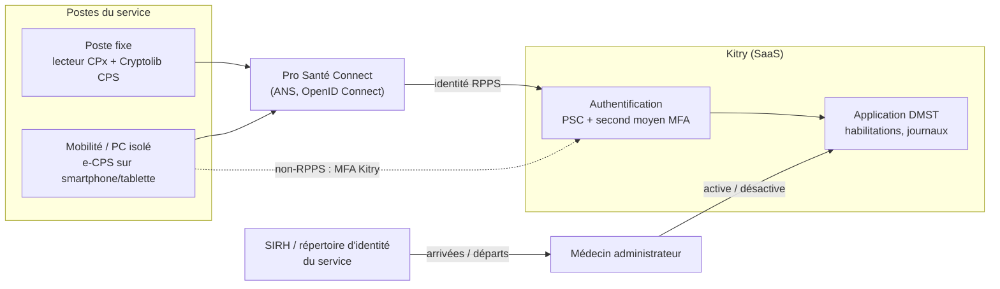

# SRE2 — Kitry : état de l'art réglementaire (accès au DMST et identification électronique)

**Objet.** Recherches servant à structurer la démarche d'implémentation de Kitry, le logiciel SaaS de santé au travail qui héberge le dossier médical en santé au travail (DMST), au regard des réglementations applicables : accès au dossier et départ des médecins, connexion des praticiens (Pro Santé Connect, cartes CPx, MFA), calendrier du référentiel d'identification électronique (version 1.0 en vigueur, version 2 en projet).

Mis à jour le 2026-10-09 (recherches des 8 et 9 octobre 2026).

- **Légende de vérification** (même convention que `sre1.md`) : **lu** = texte officiel ouvert et relu ; **recoupé** = confirmé par des sources secondaires, texte officiel non relu ; **non vérifié** = connu mais pas confirmé ici.
- **Extraits des textes sources** : [`sources.md`](sources.md).

---

## 0. Synthèse

### 0.1 Réponses courtes

| Question | Réponse | Détail |
|---|---|---|
| Un médecin parti garde-t-il l'accès aux dossiers qu'il a ouverts ? | **Non.** Le dossier appartient au service ; l'accès suit le suivi du salarié. Désactiver le compte (sans le supprimer) au départ du praticien | §3 |
| Qui désactive ? | La **direction du service** est responsable | §3.4 |
| Quelles règles pour la connexion des praticiens ? | Référentiel d'identification électronique PGSSI-S (arrêté du 28/03/2022) : Pro Santé Connect, carte CPx, ou second moyen conforme ; mot de passe seul exclu | §2 |
| Pro Santé Connect suffit-il ? | Il prouve l'identité, **pas le droit d'accès** : la désactivation au départ du praticien reste indispensable | §1.1 |
| Login + mot de passe ou MFA ? | **MFA au minimum** (accès à distance, deux facteurs) | §2.3 |
| Quel impact sur l'architecture ? | Kitry client OIDC de Pro Santé Connect et fournisseur d'identité de son MFA ; comptes liés au RPPS sans création à la volée ; SIRH source des départs ; sessions ≤ 4 h ; moyen de secours encadré | §4 |
| L'échéance du 1/1/2026 est-elle repoussée ? | **Pas encore en droit.** Projet de version 2 notifié à la Commission européenne (adoptable après le 15/12/2026) : attestation de conformité au 31/12/2026, réserves jusqu'au 31/12/2028 | §5 |

### 0.2 Textes applicables

| Texte | Objet pour Kitry | Statut | Vérif. |
|---|---|---|---|
| Code du travail L4624-8, R4624-45-3 à R4624-45-9 | DMST : responsabilité du service, accès des professionnels du suivi, traçabilité, conservation 40 ans, renvoi au référentiel d'identification électronique (R4624-45-5) | En vigueur | recoupé |
| Code de la santé publique L1110-4, D1110-3-3 | Secret partagé, sanctions, durée du consentement | En vigueur | recoupé |
| Code de la santé publique L1470-1 à L1470-5 (ordonnance 2021-581) | Base des référentiels d'identification électronique obligatoires | En vigueur | recoupé |
| Arrêté du 28/03/2022 + référentiel PGSSI-S « personnes physiques » **v1.0** | Moyens de connexion autorisés, Pro Santé Connect, homologation, arrivées/départs | **En vigueur** | lu |
| Projet d'arrêté modifiant l'arrêté du 28/03/2022 + référentiel **v2** (notification 2026/0498/FR) | Remplace l'annexe : attestation de conformité, réserves jusqu'en 2028, PSC pour tout service | **Projet**, adoptable après le 15/12/2026 | lu |
| RGPD + CNIL, guide pratique des SPST (2023) | Habilitations, revue annuelle, rôle du médecin administrateur | En vigueur (guide = recommandations) | lu |
| Code pénal 226-13 | Violation du secret professionnel | En vigueur | recoupé |

### 0.3 Démarche d'implémentation (résumé)

1. **Procédure d'habilitation et de sortie** écrite par la direction, validée par le médecin du travail ; médecin administrateur de Kitry désigné (§3, §6).
2. **Pro Santé Connect** activé pour tous les porteurs de CPS / e-CPS, rattachement des comptes au RPPS, pas de création de compte automatique (§1.1).
3. **Second moyen à deux facteurs** pour les autres (non-praticiens, postes sans lecteur) ; **mot de passe seul désactivé** partout (§2.3).
4. **PC isolés traités comme des accès en mobilité** (§2.4).
5. **Obtenir de Kitry** : date PSC, nature et conformité du second moyen (homologation v1.0 / attestation v2), engagement de sécurisation, gestion des départs, répartition contractuelle des responsabilités (§8.1).
6. **Interroger l'ANS** sur les cartes dématérialisées e-CPx pour les non-inscrits au RPPS et sur la période intermédiaire (§8.2).
7. **Suivre la publication de la v2** au Journal officiel (§5).

---

## 1. Pro Santé Connect

### 1.1 Ce que Pro Santé Connect apporte et ce qu'il ne règle pas

Kitry implémentera Pro Santé Connect → conformité aux exigences n°3 et 4 (v1.0), et à l'EXI RIE-PS 03 (v2 : tout service « DOIT permettre l'utilisation de Pro Santé Connect »). Mais **PSC prouve l'identité, pas le droit d'accès** :

- Il transmet une identité vérifiée (RPPS, nom, prénom, données du répertoire national — v1.0 §4.2.2).
- Un médecin qui quitte l'entreprise **garde sa CPS et son e-CPS valides**. Si son compte Kitry reste actif, il continuera à se connecter, avec une authentification forte. La désactivation dans Kitry reste indispensable.

**Moyens de connexion PSC : ni SMS ni TOTP** (v1.0 §4.2.3, ANS) :

- **Application e-CPS** sur smartphone **ou tablette**, validation dans l'appli protégée par code ; l'employeur peut fournir un appareil professionnel.
- **Carte CPS + lecteur** sur l'ordinateur + logiciel ANS (Cryptolib CPS) + PIN ; **aucun téléphone**. Adapté au poste fixe.

**Points à vérifier à la mise en place :**

1. Pas d'inscription automatique : une connexion PSC réussie ne crée jamais de compte d'office.
2. Compte rattaché au **RPPS**, pas à l'e-mail (exigence n°1).
3. Niveau « substantiel » exigé dès que PSC l'indique (exigence n°5).
4. Non-praticiens sans RPPS (assistants, IPRP, secrétariat) : voir §2.5.
5. Engagement de sécurisation de l'éditeur mis à jour (exigence n°32).
6. Une fois PSC en place, **désactiver l'identifiant + mot de passe** des praticiens.
7. v2 : prévoir une alternative en cas d'indisponibilité de PSC (coupure internet), selon la criticité du service (EXI RIE-PS 03).

### 1.2 La carte CPx (moyen de connexion PSC sur poste fixe)

- Carte à puce contenant des certificats (authentification, signature) ; lecteur + PIN ; échange cryptographique, le secret ne quitte pas la carte → deux facteurs (possession + connaissance).
- **Ne fournit pas de code à usage unique.**
- Sur chaque poste : lecteur de carte (USB, clavier, portable) + Cryptolib CPS.
- Pas d'usage mobile (→ e-CPS) ; puce sans contact = accès physiques, un seul facteur, insuffisante pour se connecter (exigence n°7).
- Cartes renouvelées automatiquement tous les 3 ans (ANSM). — *lu*

### 1.3 Obligation d'implémenter Pro Santé Connect

| | v1.0 (en vigueur) | v2 (projet) |
|---|---|---|
| Qui doit proposer PSC | Services « sensibles », au plus tard le 1/1/2023 (n°4) | **Tout service** : « Le Fournisseur de Service DOIT permettre l'utilisation de Pro Santé Connect » (EXI RIE-PS 03) |
| Niveau accepté | Substantiel ou supérieur dès que PSC l'indique (n°5) | Idem, via les moyens compatibles PSC |
| Disponibilité | — | Prévoir une alternative en cas d'indisponibilité de PSC selon la criticité (EXI RIE-PS 03) ; moyen de secours strictement encadré (EXI RIE-PS 16, §4) |

---

## 2. Accès à Kitry

Texte applicable : **référentiel d'identification électronique de la PGSSI-S**, volet « acteurs des secteurs sanitaire, médico-social et social, personnes physiques », **v1.0**, rendu obligatoire par l'**arrêté du 28 mars 2022**, sur la base des articles **L1470-1 à L1470-5** CSP. Le Code du travail y renvoie pour le DMST : consultation « dans le respect des règles d'identification électronique […] définies par les référentiels mentionnés aux articles L1470-1 à L1470-5 » (**R4624-45-5**). Le projet de **v2** est décrit au §5 ; ses effets sont signalés ci-dessous.

### 2.1 Kitry est concerné

- **v1.0** : le référentiel vise tout logiciel traitant des données de santé, y compris « une application, même interne à une structure » (§2.2). Kitry est un service « sensible » (§4.1.2 ; un seul critère suffit : accès web depuis l'extérieur / mobilité / télétravail ; plus de 10 000 nouveaux patients par an ; plus de 1 000 professionnels distincts par an). Kitry, SaaS web, revendique plus de 5 000 utilisateurs et 4,5 millions de dossiers → presque certainement sensible. — *lu* (chiffres Kitry : site de l'éditeur, non vérifiés)
- **v2 (projet)** : plus de distinction « sensible » ; les exigences s'appliquent à tout service numérique en santé.

### 2.2 Moyens de connexion autorisés

**v1.0, exigence n°3 : quatre familles**

| Moyen | Pour qui | Conditions | Exigences |
|---|---|---|---|
| **1. Pro Santé Connect** (carte CPx ou application e-CPS) | Praticiens RPPS, porteurs de CPE/CPA | Niveau « substantiel » seulement dès que PSC l'indique | 4, 5 |
| **2. Carte CPx en direct** (CPS, CPF, CPE, CPA) | Poste fixe avec lecteur | PIN obligatoire ; sans contact seul insuffisant | 6, 7 |
| **3. Moyen homologué** (clé, badge… délivré par le fournisseur) | Personnes sans carte CPS | Audit eIDAS substantiel + analyse de risque + évaluation technique ; tous les 4 ans ; décision transmise à l'ANS (annexe A) | 8 à 13 |
| **4. Moyen certifié eIDAS** substantiel ou élevé | Cas non couverts par les moyens ANS | Attestation ANSSI ou notification par un État membre ; rattachement au RPPS | 15, 16 |

Moyens « de transition » (identifiant + mot de passe, avec ou sans TOTP, non homologués) : tolérés **jusqu'au 31/12/2025** pour les services sensibles. **Exclus** : identifiant + mot de passe seuls ; FranceConnect et identités citoyennes (sauf inscription initiale ou révocation d'urgence, n°15) ; badge sans contact sans PIN.

**v2 (projet), EXI RIE-PS 02** : (1) Pro Santé Connect (e-CPS, cartes compatibles, autres moyens compatibles) ; (2) moyens des fournisseurs d'identité habilités PSC ; (3) moyens couverts par une **attestation de conformité** du fournisseur d'identité au plus tard le 31/12/2026 ; (4) cartes CPx en direct, seulement pour les services historiques autorisés par l'ANS. Notion de « transition » supprimée pour les professionnels.

### 2.3 Second moyen de connexion (MFA propre à Kitry)

**Identifiant + mot de passe seuls ne suffisent pas ; MFA au minimum.**

- Mot de passe seul : accès **local** uniquement (exigence n°25). Kitry est un SaaS : tout accès est **à distance** (« depuis un poste connecté à Internet, en télétravail, en mobilité ou même sur le Wifi invité », §4.6.3.3).
- À distance : « impérativement reposer sur deux facteurs de types différents » (exigence n°22) — ex. mot de passe + TOTP, badge à puce + PIN, clé USB + PIN/empreinte.
- Même en transition : déconnexion après inactivité (n°26), révocation à tout moment (n°21).

**Selon la version du référentiel :**

| | v1.0 (en vigueur) | v2 (projet) |
|---|---|---|
| Mot de passe + TOTP non homologué | Moyen **de transition** (niveau eIDAS « faible », §4.6.1), autorisé jusqu'au 31/12/2025 → **plus couvert depuis le 1/1/2026** | Acceptable s'il est couvert par l'**attestation de conformité** du fournisseur d'identité (Kitry) au 31/12/2026, réserves possibles jusqu'au 31/12/2028 |
| Validation du moyen | Homologation (annexe A) | Attestation de conformité (§5.2) |
| TOTP | Exclu seulement s'il n'est pas homologué | « Application TOTP sur téléphone » citée comme moyen matériel recommandé (EXI RIE-PS 09) |

**Exigences techniques** (v1.0 n°13, v2 EXI RIE-PS 09) :

- Deux facteurs de catégories différentes (connaissance, possession, biométrie).
- Moyen présumé sous le contrôle exclusif de son titulaire.
- Authentification dynamique (pas de rejeu) ; résistance à l'hameçonnage classique.
- **Clé FIDO2 + PIN** : répond le plus nettement, et résiste à l'hameçonnage. **Mot de passe + TOTP** : deux facteurs, mais vulnérable à l'hameçonnage en temps réel (appréciation personnelle, pas une position ANS). **SMS** : à éviter.

**Enrôlement et gestion** (v1.0 n°11, 12 ; v2 EXI RIE-PS 07, 08) : identifiant RPPS si existant, sinon identifiant local fiable ; vérification d'identité fiable à la remise du moyen (PSC, moyen eIDAS, ou face-à-face avec pièce d'identité ; un e-mail d'invitation ne suffit pas) ; renouvellement au moins tous les 3 ans (v2) ; révocation à tout moment ; notifications à l'utilisateur.

**Sessions (v2, EXI RIE-PS 13)** : session du fournisseur d'identité ≤ 4 h, inactivité ≤ 30 min. Authentification à un seul facteur tolérée pour des cas d'usage listés, ≤ 4 h après une authentification complète (v1.0 n°14, v2 EXI RIE-PS 10).

**Recommandation** :

1. Pro Santé Connect pour tous les porteurs de CPS, e-CPS (et CPE/CPA le cas échéant, §2.5).
2. Pour les autres, MFA obligatoire sans exception (mot de passe + TOTP, mieux : clé FIDO2).
3. Faire porter la conformité du second moyen par Kitry, fournisseur d'identité, et le formaliser dans le contrat.
4. Désactiver la connexion par mot de passe seul pour tous les comptes.

### 2.4 Postes isolés et mobilité

**Décision : les PC isolés doivent être traités comme des accès en mobilité** (donc à distance, deux facteurs).

| Situation | Solution |
|---|---|
| Poste fixe | Carte CPx + lecteur, sans téléphone |
| Télétravail, mobilité, **PC isolés** | e-CPS sur smartphone ou tablette |
| Ni lecteur ni appareil mobile | Second moyen MFA de Kitry (§2.3) |

Confirmation technique demandée à Kitry (courriel §8.1, question 8).

### 2.5 Personnel sans RPPS (assistants, IPRP, secrétariat)

- Pas de CPS ni d'e-CPS possible. Options : carte **CPA / CPE** (via PSC ou en direct, v1.0), ou **second moyen** de Kitry.
- **v2 (projet)** : les cartes CPx « ne reposant pas sur un enregistrement dans le Répertoire sectoriel de référence (RPPS) ne devraient pas être utilisées » → la voie normale devient le MFA attesté de Kitry ou un fournisseur d'identité habilité PSC.
- **Indice** : l'ANSM mentionne une authentification « par carte CPx ou par **e-CPx** » → une version dématérialisée pourrait exister ; question posée à l'ANS (§8.2).
- Détail CPA / CPE : annexe B.

---

## 3. Gestion des droits et des accès

**Un médecin parti ne doit plus avoir accès aux dossiers, même ceux qu'il a ouverts.** Les textes ne disent pas explicitement « couper l'accès au départ » : la conclusion se déduit de leur combinaison.

### 3.1 Le dossier appartient au service, pas au médecin

- Le DMST est « placé sous la responsabilité du service » (Code du travail, **R4624-45-3**). Le service, et non le médecin, est responsable du traitement au sens du RGPD. — *recoupé*
- Note juridique Présanse (janvier 2024) : les données « n'appartiennent ni au médecin du travail, ni au Service » ; le médecin en est dépositaire, et « un praticien n'emporte pas les dossiers des salariés qu'il a suivis ». — *lu*
- Conservation par le service : 40 ans après la dernière visite (**R4624-45-9**). — *recoupé*

### 3.2 L'accès est lié au suivi, pas à la création du dossier

- Le DMST est accessible aux professionnels « chargés d'assurer, sous l'autorité du médecin du travail, le suivi » du salarié (**L4624-8**, **R4624-45-5**). — *recoupé*
- Secret partagé limité aux professionnels « qui participent tous à sa prise en charge », pour les informations « strictement nécessaires » (Code de la santé publique, **L1110-4**). — *recoupé*
- Un médecin parti ne suit plus personne : il sort de ce cercle.
- Accès sans droit : 1 an d'emprisonnement et 15 000 € d'amende (**L1110-4 IV**) ; violation du secret professionnel : Code pénal **226-13**. — *recoupé*
- Le consentement du salarié au partage ne vaut que « pour la durée de la prise en charge » (**D1110-3-3**). — *recoupé*

### 3.3 RGPD, CNIL et référentiel d'identification électronique

- La CNIL demande de supprimer les droits d'un utilisateur dès qu'il n'est plus habilité, au plus tard à la fin de son contrat (fiche « gérer les habilitations »). — *lu*
- Compte resté actif après un départ = défaut de sécurité, dont répond le responsable du traitement.
- Référentiel v1.0, **exigence n°27** : depuis le **1/1/2024**, répertoire d'identité local, processus d'**arrivée et de départ** « formalisés et appliqués », synchronisé avec le SI RH. Un compte actif après un départ est aussi un manquement au référentiel. — *lu*
- Projet v2 : répertoire d'identité, révocation possible à tout moment par l'utilisateur et le fournisseur d'identité (EXI RIE-PS 06, 08). — *lu*

### 3.4 Qui est habilité à désactiver l'accès

Deux acteurs : **la direction du service est responsable**, le **médecin du travail administrateur du logiciel met en œuvre**. Source principale : guide pratique CNIL des services de santé au travail (SPST), 2023. — *lu*

**La direction du service (responsable et redevable)**

- Le service est responsable du traitement du DMST, « que le SPST soit autonome ou interentreprises » (fiche 2, p. 15, s'appuyant sur R4624-45-3).
- Il revient « à sa direction » de garantir « la possibilité de restreindre les accès conformément aux compétences et missions exercées par chacun des professionnels » (fiche 2, p. 15).
- « La règle du secret médical impose à la direction du SPST de formaliser une procédure pour définir la gestion des habilitations et des accès, sous l'autorité du médecin du travail » (fiche 11, p. 55).
- « Supprimer les permissions d'accès obsolètes » et « réaliser une revue annuelle des habilitations » (fiche 8, p. 42).
- Service **autonome** : l'employeur « assume juridiquement les conséquences d'une non-conformité » (fiche 2, p. 18).

**Le médecin du travail administrateur**

- La HAS recommande « que la gestion des accès soit assurée par le médecin du travail, qui endosse le rôle d'"administrateur du logiciel" » (fiche 11, p. 56) ; « que le médecin du travail soit seul responsable de la gestion des habilitations et des accès au DMST » (fiche 8, p. 41).
- Deux montages proposés par la CNIL : administration des droits par le médecin du travail, ou accord du médecin rendu obligatoire pour toute décision d'habilitation (fiche 11, p. 56).
- Base déontologique : **R4127-72** CSP (le médecin veille au respect du secret par ceux qui l'assistent). — *recoupé*

**Qui ne peut pas le faire seul**

- Direction et personnel administratif, RH compris, « ne sont pas autorisés à prendre connaissance du contenu du DMST » (fiche 11, p. 57). Un administrateur RH ou informatique peut désactiver techniquement sur instruction, sans accès aux dossiers.
- L'employeur est exclu de tout accès au DMST (fiche 11, p. 58).

**Cas particulier** : si le médecin qui part était l'administrateur de Kitry, transférer d'abord le rôle à un autre médecin du travail du service, qui désactive alors le compte. La direction vérifie que c'est fait et que la procédure écrite le prévoit.

### 3.5 En pratique dans Kitry

- **Désactiver, ne pas supprimer** : toute action sur le DMST doit rester tracée (date, heure, auteur — R4624-45-5). Supprimer le compte risque de perdre l'attribution de ses saisies.
- **Le suivi continue avec le service** : les dossiers restent dans Kitry et sont repris par le successeur. La transmission de R4624-45-7 ne concerne que le changement de service, pas le remplacement d'un praticien.
- **Procédure de sortie formalisée** : la date de départ déclenche la désactivation ; vérifier aussi comptes partagés, accès à distance, exports.
- **Litige** (ex. contestation d'un avis) : accès au cas par cas, à la demande de l'ancien médecin, par l'intermédiaire du service ; pas de compte permanent.
- **Pro Santé Connect ne règle pas les départs** : un médecin qui quitte l'entreprise garde sa CPS et son e-CPS valides (§1.1).

---

## 4. Impact sur l'architecture

Ce que les exigences ci-dessus imposent techniquement, côté Kitry (éditeur) et côté service. Les points marqués *recommandation* sont des choix d'architecture proposés, pas des obligations textuelles.

### 4.1 Vue d'ensemble



### 4.2 Fédération d'identité (Pro Santé Connect)

- Kitry est **client OpenID Connect** de Pro Santé Connect ; le raccordement se fait côté éditeur auprès de l'ANS. Côté service : rien à héberger, seulement la configuration de l'instance.
- Le compte Kitry est rattaché à l'**identifiant RPPS** reçu de PSC, pas à l'adresse e-mail (v1.0 n°1, v2 RIE-PS 04).
- **Pas de création de compte à la volée** : un praticien authentifié par PSC n'entre que s'il a été habilité au préalable par l'administrateur (§3).

### 4.3 Kitry fournisseur d'identité de son second moyen

- Pour les comptes hors PSC, Kitry délivre et gère lui-même le moyen (mot de passe + TOTP, clé FIDO2…) : il est **fournisseur d'identité** au sens du référentiel.
- Conséquences : homologation (v1.0) ou **attestation de conformité** au 31/12/2026 (v2) ; enrôlement avec vérification d'identité, renouvellement au moins tous les 3 ans, révocation à tout moment, notifications à l'utilisateur (v2 RIE-PS 07, 08).
- *Recommandation* : préférer la **clé FIDO2** au TOTP pour résister à l'hameçonnage.

### 4.4 Répertoire d'identité et cycle de vie des comptes

- Exigé : répertoire d'identité local, processus d'arrivée et de départ formalisés, **synchronisé avec le SI RH** (v1.0 n°27, depuis le 1/1/2024 ; v2 RIE-PS 06, synchronisation avec le RPPS au moins tous les 3 ans).
- *Recommandation* : faire du **SIRH la source d'autorité** des arrivées et départs ; une sortie déclenche la désactivation dans Kitry (via une API ou SCIM si Kitry en propose — à demander —, sinon procédure manuelle de l'administrateur), contrôlée par la revue annuelle des habilitations et le rapport des comptes actifs (courriel §8.1, question 5).
- Désactiver sans supprimer, pour garder l'attribution des saisies (R4624-45-5).

### 4.5 Sessions, SSO et disponibilité

- **Sessions** (v2 RIE-PS 13) : session du fournisseur d'identité ≤ 4 h, inactivité ≤ 30 min ; session applicative de Kitry synchronisée autant que possible.
- **SSO** (v2 RIE-PS 11, 12) : obligatoire pour un fournisseur d'identité qui fournit des moyens sur plus d'un service à plus de 5 000 professionnels, compatible OpenID Connect. Concerne Kitry seulement s'il fournit ses moyens à plusieurs services.
- **Indisponibilité de PSC** (v2 RIE-PS 03, 16) : prévoir un moyen de secours strictement encadré — activation par un administrateur, durée ≤ 24 h préconisée, accès limités au strict nécessaire, au moins un facteur, traces de l'activation et des accès.

### 4.6 Postes de travail et réseau

- **Postes fixes** : lecteur de carte + Cryptolib CPS + PIN.
- **Mobilité, télétravail, PC isolés** : e-CPS sur appareil mobile (professionnel si besoin) ou second moyen MFA ; pas de lecteur nécessaire (§2.4).
- **Accès à distance** : Kitry étant un SaaS, tout accès est « à distance », même depuis le réseau du service (v1.0 §4.6.3.3). Un VPN ouvert avec deux facteurs dispense de la double authentification pour les services accédés derrière lui (v1.0 §4.6.3.3) — sans objet pour un SaaS public.

### 4.7 Traçabilité

- Toute action sur le DMST tracée : date, heure, auteur (R4624-45-5).
- Traces de l'usage des moyens de secours (v2 RIE-PS 16) et notifications de connexion à l'utilisateur recommandées (v2 RIE-PS 09).

---

## 5. Calendrier réglementaire

### 5.1 Dates clés

| Date | Événement | Source |
|---|---|---|
| 28/03/2022 | Arrêté approuvant le référentiel v1.0 | v1.0 |
| 01/06/2022 | Entrée en vigueur du référentiel | recoupé |
| 01/01/2023 | Pro Santé Connect obligatoire pour les services sensibles (n°4) | v1.0 |
| 01/01/2024 | Processus d'arrivée et de départ formalisés (n°27) | v1.0 |
| 31/12/2025 | Fin de la tolérance des moyens « de transition » (n°3) | v1.0 |
| Déc. 2025 | Concertation sur la v2 | recoupé |
| 14/09/2026 | Projet d'arrêté v2 notifié à la Commission européenne (2026/0498/FR) | lu |
| **15/12/2026** | Fin du statu quo : adoption possible de la v2 | lu |
| **31/12/2026** | v2 : attestation de conformité des moyens autres que PSC | lu (projet) |
| **31/12/2028** | v2 : levée de toutes les réserves | lu (projet) |

### 5.2 L'échéance du 1er janvier 2026 a-t-elle été repoussée ? (recherche du 2026-10-09)

**Pas encore en droit, mais un report est en cours d'adoption.** Au 9 octobre 2026, le texte opposable reste la v1.0, dont la tolérance des moyens « de transition » a expiré le 31/12/2025. Le projet de v2 **repousse en pratique l'échéance au 31/12/2026, avec des réserves tolérées jusqu'au 31/12/2028**.

**Le texte — *lu*** (texte intégral du projet) :

- **Projet d'arrêté** « modifiant l'arrêté du 28 mars 2022 portant approbation du référentiel relatif à l'identification électronique des acteurs des secteurs sanitaire, médico-social et social, personnes physiques et morales, et à l'identification électronique des usagers des services numériques en santé ». Article 1er : l'annexe est **remplacée** ; article 2 : entrée en vigueur **à sa publication**. Date et NOR en blanc (« XXX »).
- **Notifié à la Commission européenne** (procédure TRIS, directive 2015/1535) : notification **2026/0498/FR du 14 septembre 2026**, **fin du statu quo le 15 décembre 2026**. L'arrêté ne peut pas être adopté avant cette date. Aucune réaction d'État membre au jour de la recherche.
- Annexe « personnes physiques » : version **v2b.0.k du 17/08/2026**, statut « En cours ». Historique : concertation (déc. 2025) → version post-concertation 25/02/2026 → COMOP ISS 16/04/2026 → ajout eSSO aux réserves 29/06/2026 → remarques CNIL 16/07/2026 → remarques CNAM et CNIL 17/08/2026.
- Calendrier ANS initial : publication de la v2 au 2e trimestre 2026 → **en retard**.

### 5.3 Ce que change la v2 (projet, à confirmer à la publication)

| Sujet | v1.0 (en vigueur) | v2 (projet) |
|---|---|---|
| Moyens « de transition » pour les professionnels | Tolérés jusqu'au 31/12/2025 (n°3) | **Notion supprimée** pour les personnes physiques (elle subsiste pour les usagers/patients jusqu'au 31/12/2028) |
| Pro Santé Connect | Obligatoire pour les services « sensibles » depuis 1/1/2023 | **Tout service** « DOIT permettre l'utilisation de Pro Santé Connect » (EXI RIE-PS 03) ; plus de distinction « sensible » |
| Autre moyen que PSC (MFA propre à Kitry) | **Homologation** : audit eIDAS, analyse de risque, évaluation technique, transmission à l'ANS, tous les 4 ans (n°8 à 13) | **Attestation de conformité** signée par le responsable légal du fournisseur d'identité, après une commission de conformité ; conservée et tenue à disposition (CNIL, ANSSI, ANS) ; **au plus tard le 31/12/2026** (EXI RIE-PS 02 et 17) |
| Non-conformités | — | **Réserves** admises, avec plan d'action et acceptation formelle des risques, **levées au plus tard le 31/12/2028** (EXI RIE-PS 18) ; attestation renouvelée tous les ans tant qu'il reste des réserves, sinon tous les 3 ans (EXI RIE-PS 19) |
| Exigences du moyen | 2 facteurs, niveau eIDAS substantiel | 2 facteurs de catégories différentes ; « application TOTP sur téléphone » citée comme moyen matériel recommandé, avec carte à puce et clé FIDO (EXI RIE-PS 09) |
| Enrôlement | Vérification d'identité fiable | PSC, moyen eIDAS substantiel/élevé, ou face-à-face avec pièce d'identité ; renouvellement au moins tous les 3 ans ; révocation à tout moment ; notifications à l'utilisateur (EXI RIE-PS 07, 08) |
| Sessions | Déconnexion après inactivité | Session du fournisseur d'identité ≤ 4 h, inactivité ≤ 30 min (EXI RIE-PS 13) |
| Cartes CPx hors PSC | Moyen autorisé | Réservées aux services historiques autorisés par l'ANS ; les CPx « ne reposant pas sur un enregistrement dans le RPPS ne devraient pas être utilisées » |

**Réserves interdites même pendant le délai** (impact significatif, EXI RIE-PS 17) : mot de passe comme facteur unique sur un service exposé sur internet ; mot de passe faible (< 50 bits) ; pas de blocage après échecs ; pas de déconnexion automatique ; moyen non révocable ; moyen de secours activable par l'utilisateur seul.

### 5.4 Conséquences pour Kitry

1. **En droit aujourd'hui** (v1.0) : le mot de passe + TOTP non homologué de Kitry n'est plus couvert depuis le 1/1/2026. Aucun texte adopté ne repousse cette date.
2. **Dès la publication de la v2** (au plus tôt après le 15/12/2026) : Kitry, en tant que fournisseur d'identité de son propre MFA, devra avoir une **attestation de conformité** au 31/12/2026, avec réserves possibles jusqu'au 31/12/2028. L'homologation transmise à l'ANS disparaît.
3. **Le mot de passe seul reste exclu**, même avec réserves. Le MFA est le minimum.
4. **Pro Santé Connect devient obligatoire pour tout service**, ce qui conforte l'engagement de Kitry à l'implémenter.
5. **Les cartes CPA/CPE sans RPPS** sont découragées par la v2 : pour les non-praticiens, le MFA attesté de Kitry ou un fournisseur d'identité habilité PSC devient la voie normale.

---

## 6. Actions

| # | Action | Porteur | Réf. | État |
|---|---|---|---|---|
| 1 | Rédiger la procédure d'habilitation et de sortie (départ = désactivation, revue annuelle des habilitations) | Direction du service, validée par le médecin du travail | §3.4 | À faire |
| 2 | Désigner le médecin du travail administrateur de Kitry ; prévoir la reprise du rôle à son départ | Direction | §3.4 | À faire |
| 3 | Activer Pro Santé Connect, comptes rattachés au RPPS, sans création automatique | Kitry + administrateur | §1.1 | Annoncé par Kitry |
| 4 | Imposer le MFA pour les comptes hors PSC ; désactiver le mot de passe seul | Kitry + administrateur | §2.3 | À faire |
| 5 | Traiter les PC isolés comme des accès en mobilité (e-CPS ou MFA) | Service | §2.4 | Décidé |
| 6 | Envoyer le courriel à Kitry et obtenir la formalisation contractuelle des responsabilités | Service | §8.1 | Brouillon prêt |
| 7 | Envoyer le courriel à l'ANS (e-CPx, période intermédiaire) | Service | §8.2 | Brouillon prêt |
| 8 | Suivre la publication de la v2 au Journal officiel (après le 15/12/2026) | Service | §5 | À suivre |

---

## 7. Points ouverts

| Point | Statut |
|---|---|
| Publication de la v2 | Projet notifié (2026/0498/FR), adoptable après le 15/12/2026 ; suivre sa parution au Journal officiel |
| État réel de Kitry (Pro Santé Connect, MFA, attestation) | Aucune information publique ; dépend de la réponse au courriel §8.1 |
| Qui porte la conformité du second moyen (Kitry ou le service) | En v2, attestation du fournisseur d'identité (Kitry pour son MFA) ; confirmation et formalisation contractuelle demandées (§8.1, question 7) |
| PC isolés / mobilité | **Tranché** : traités comme des accès en mobilité ; confirmation technique demandée à Kitry (§8.1, question 8) |
| Existence d'une e-CPA / e-CPE | Indice ANSM (« e-CPx ») ; question posée à l'ANS (§8.2) |
| CPA ou CPE selon le statut du service | Moins prioritaire : la v2 déconseille les CPx sans RPPS ; question posée à l'ANS (§8.2) |
| Intitulé exact de l'arrêté du 28/03/2022 | Repris dans le projet d'arrêté (§5.2) ; à recouper sur Légifrance avant citation officielle |
| Guide pratique ANS d'homologation | Non lu ; moins utile si la v2 est adoptée |
| Courriels Kitry et ANS | Brouillons prêts (§8), non envoyés ; destinataires à vérifier |

---

## 8. Courriels

### 8.1 Demande à Kitry

Non envoyé, aucun brouillon créé dans la messagerie. Destinataire à vérifier.

> **Objet :** Identification électronique des utilisateurs Kitry : conformité au référentiel PGSSI-S
>
> Bonjour,
>
> Dans le cadre de la mise en conformité de notre service de santé au travail avec le référentiel d'identification électronique de la PGSSI-S (volet « acteurs personnes physiques », rendu opposable par l'arrêté du 28 mars 2022, articles L1470-1 à L1470-5 du Code de la santé publique), et de l'article R4624-45-5 du Code du travail, nous vous remercions de nous transmettre les éléments suivants :
>
> 1. **Pro Santé Connect** : date de mise à disposition sur notre instance, et confirmation que seuls les moyens de niveau « substantiel » seront acceptés dès que Pro Santé Connect l'indique (exigence n°5).
> 2. **Second moyen d'authentification**, pour les utilisateurs sans carte CPx ni e-CPS :
>    - sa nature (mot de passe + TOTP, clé FIDO2, autre) ;
>    - s'il s'agit d'un moyen **homologué** au sens des exigences n°8 à 13 (audit eIDAS « substantiel », décision transmise à l'ANS), ou d'un moyen **de transition**. Dans ce second cas, votre calendrier d'homologation.
> 3. **Votre engagement de sécurisation de l'identification électronique** (exigences n°30 à 32), document principal et annexes.
> 4. **Désactivation de l'authentification par mot de passe seul** pour l'ensemble de nos comptes : est-elle possible, et selon quel mode opératoire ?
> 5. **Gestion des départs** : procédure de désactivation d'un compte sans perte de la traçabilité des actions passées (R4624-45-5), et possibilité d'un rapport périodique des comptes actifs pour notre revue annuelle des habilitations.
> 6. **Projet de référentiel v2** (projet d'arrêté notifié à la Commission européenne sous le n° 2026/0498/FR) : en tant que fournisseur d'identité de votre second moyen d'authentification, avez-vous engagé l'**attestation de conformité** prévue au plus tard le 31/12/2026 (exigence RIE-PS 17) ? Le cas échéant, quelles réserves et quel plan d'action pour les lever avant le 31/12/2028 (exigence RIE-PS 18) ?
> 7. **Répartition des responsabilités** : confirmez-vous que la conformité de votre second moyen d'authentification (homologation selon la version actuelle du référentiel, attestation de conformité selon la v2) relève de Kitry en tant que fournisseur d'identité ? Nous souhaitons que ce point soit formalisé dans notre contrat.
> 8. **Postes isolés** : nous traitons nos PC isolés comme des accès en mobilité, donc à distance, avec deux facteurs (exigence n°22). Pouvez-vous confirmer que, depuis ces postes et sans lecteur de carte, la connexion à Kitry est possible par e-CPS via Pro Santé Connect, ou à défaut par votre second moyen à deux facteurs ?
>
> Nous vous remercions de votre retour.
>
> Cordialement,

Le point 4 correspond au « Désactiver » de la recommandation : couper la connexion par mot de passe seul une fois PSC et la MFA en place — réglage de l'instance (administrateur = médecin du travail) ou demande au support selon la réponse.

Nuance : le référentiel met l'homologation et l'engagement à la charge du « fournisseur du service numérique » (n°8, n°30). Si Kitry renvoie l'homologation vers le service, clarifier contractuellement qui porte quoi (question 7).

### 8.2 Demande à l'ANS (cartes e-CPx)

Non envoyé. Destinataire à choisir parmi les canaux officiels de l'ANS (service client des cartes CPx / formulaire de contact du site esante.gouv.fr) : adresse non vérifiée ici.

> **Objet :** Version dématérialisée des cartes CPA / CPE (e-CPx) et accès par Pro Santé Connect
>
> Bonjour,
>
> Notre service de santé au travail utilise un logiciel SaaS qui va proposer la connexion par Pro Santé Connect. Une partie de notre équipe n'est pas inscrite au RPPS (assistants, secrétariat, intervenants en prévention des risques professionnels) et ne peut donc pas disposer d'une carte CPS ni de l'application e-CPS.
>
> Le mode opératoire de l'ANSM sur l'obtention des cartes CPx (janvier 2025) indique que l'accès à l'application e-FIT « nécessite une authentification par carte CPx ou par e-CPx ». Nous souhaiterions savoir :
>
> 1. **Existence d'une version dématérialisée des cartes CPA et CPE** (« e-CPA », « e-CPE » ou plus largement « e-CPx ») : existe-t-elle, et pour quels porteurs ?
> 2. **Usage via Pro Santé Connect** : cette version dématérialisée, ou à défaut la carte CPA / CPE physique, permet-elle à un professionnel non inscrit au RPPS de se connecter par Pro Santé Connect à un service numérique en santé ?
> 3. **Modalités d'obtention** : comment une structure comme la nôtre commande-t-elle ces cartes ou leur version dématérialisée (contrat avec l'ANS, télé-service, formulaire 301), et laquelle de la CPA ou de la CPE correspond à un service de santé au travail [autonome / interentreprises] ?
> 4. **Projet de référentiel v2** : le projet de référentiel d'identification électronique « personnes physiques » indique que les cartes CPx ne reposant pas sur un enregistrement au RPPS « ne devraient pas être utilisées pour l'accès à des Services numériques en santé ». Quelle solution l'ANS recommande-t-elle pour les professionnels non inscrits au RPPS : CPA / CPE, moyen d'identification d'un fournisseur d'identité habilité Pro Santé Connect, ou moyen propre à l'éditeur couvert par une attestation de conformité ?
> 5. **Période intermédiaire** : entre l'échéance du 31/12/2025 prévue par la version 1.0 (exigence n°3) et la publication de la version 2, quelle position l'ANS retient-elle pour les moyens d'identification « de transition » encore utilisés ?
>
> Nous vous remercions par avance de votre réponse.
>
> Cordialement,

À compléter avant envoi : statut du service (autonome ou interentreprises), signataire.

---

## Annexe A. Homologation d'un moyen d'identification (v1.0, exigences n°8 à 14)

À lire comme l'état du droit en vigueur ; **remplacée par l'attestation de conformité dans le projet de v2** (§5.3). Sources : référentiel ANS + démarche d'homologation ANSSI. Le guide pratique d'homologation de l'ANS — *non lu* (lecture automatique bloquée).

**Qui homologue (n°8)**

- « L'entité responsable » du service sensible décide et signe.
- Kitry en SaaS : en principe Kitry (exploite le service, délivre le moyen), mais le SPST reste responsable du traitement (R4624-45-3) → **à trancher par écrit dans le contrat**.
- Une homologation faite par Kitry ne vaut que pour son service : « aucun autre fournisseur de service n'est tenu d'accepter ces dispositifs » (§4.4.1).

**Exigences techniques (niveau eIDAS substantiel, n°13)**

- Deux facteurs de catégories différentes (connaissance, possession, biométrie).
- Moyen présumé sous le contrôle exclusif de son titulaire.
- Authentification dynamique (défi nouveau à chaque connexion, pas de rejeu).
- Résistance à un attaquant « de potentiel modéré » (écoute, rejeu, manipulation).

**Identité et inscription (n°11, 12)**

- Identifiant : RPPS si existant, sinon identifiant privé fiable (sans doublon, autorité d'attribution définie).
- Attributs : au minimum nom et prénom d'exercice.
- Inscription : vérification d'identité fiable à la remise du moyen (pièce d'identité ou remise en main propre) ; un e-mail d'invitation ne suffit pas.
- Révocation possible (lien avec les départs).

**Dossier d'homologation (n°10)**

| Pièce | Contenu |
|---|---|
| Audit de conformité | eIDAS « substantiel » (règlement d'exécution 2015/1502) + exigences n°11 à 14 |
| Analyse de risque | Système de gestion du moyen (inscription, délivrance, révocation) ; EBIOS RM recommandée |
| Évaluation technique | Sécurité du dispositif et du mécanisme ; une CSPN ou qualification ANSSI peut servir |
| Décision d'homologation | Signée par l'autorité d'homologation, risques résiduels acceptés |

Décision et pièces **transmises à l'ANS**. Validité : **4 ans**, et au plus tard 2 ans après tout changement du référentiel eIDAS.

**Tolérance à un seul facteur (n°14)** : cas d'usage listés formellement, couverts par l'analyse de risque et la décision d'homologation, avec une 2FA complète faite peu avant.

**Recommandation (v1.0)** : ne pas porter ce chantier — le second moyen et son homologation relèvent de l'éditeur, qui la mutualise. Questions à Kitry : moyen homologué (date, transmission ANS) ? audit et évaluation technique (par qui) ? vérification d'identité à l'inscription ? clés FIDO2 en plus ou à la place du TOTP ?

---

## Annexe B. Cartes CPA et CPE

- **CPA** (carte de personnel autorisé) : personnes non professionnels de santé accédant à des SI de santé (secrétariat, assistants). Définition — *lu* (mode opératoire ANSM, janvier 2025).
- **CPE** (carte de personnel d'établissement) : personnel non soignant des établissements de santé, commandée par le directeur (carte CDE). **CPA** : structures qui ne sont pas des établissements de santé, commandée par le représentant légal (carte CDA). — *recoupé* (sources secondaires, pas de texte ANS trouvé).
- Obtention : contrat structure ↔ ANS ; commande via le télé-service TOM ou le formulaire 301. La CPS des médecins se demande à leur Ordre.
- Pour le service : CPA ou CPE selon son statut (autonome ou interentreprises) — à confirmer auprès de l'ANS (§8.2).
- Version dématérialisée (e-CPA / e-CPE) : indice ANSM (« e-CPx »), à confirmer (§8.2).
- **v2 (projet)** : CPx sans RPPS déconseillées (§2.5).

---

## Annexe C. Exigences clés du référentiel v1.0

| N° | Contenu |
|---|---|
| 1 | Identifiant des praticiens : **RPPS** en priorité |
| 3 | Moyens autorisés limités à 4 familles (§2.2) ; moyens « de transition » tolérés **jusqu'au 31/12/2025** pour les services sensibles |
| 4 | Pro Santé Connect implémenté au plus tard le **1/1/2023** pour les services sensibles |
| 5 | N'accepter que le niveau « substantiel » dès que Pro Santé Connect l'indique |
| 6, 7 | Carte CPx : code PIN obligatoire ; sans contact seul interdit (hors moyen homologué) |
| 8 à 13 | Homologation d'un moyen par le fournisseur (annexe A) |
| 14 | Tolérance à un seul facteur, cas d'usage listés + analyse de risque + 2FA complète peu avant |
| 15, 16 | Moyen certifié eIDAS ; FranceConnect et identités citoyennes proscrits (sauf inscription initiale ou révocation d'urgence) |
| 21 | Moyen révocable « à tout moment » |
| 22 | Accès à distance : **deux facteurs de types différents** obligatoires |
| 25 | Mot de passe seul : uniquement en accès **local** (réseau interne) |
| 26 | Déconnexion automatique après inactivité |
| 27 | Depuis le **1/1/2024** : répertoire d'identité local, processus d'**arrivée et de départ** « formalisés et appliqués », synchronisé avec le SI RH |
| 30 à 32 | Engagement de sécurisation de l'identification électronique par le fournisseur, communicable, renouvelé à chaque changement de moyens |

Texte intégral des exigences : [`sources.md`](sources.md) §1.

---

## Annexe D. Notes Word corrigées (version propre)

Rédigées le 2026-10-08, **avant** la recherche sur la v2 : les mentions d'homologation et de transition sont à relire avec le §5.

Réponses aux points en rouge des notes Word :

- **« Quel texte de loi ? »** : L1470-1 à L1470-5 CSP (ordonnance 2021-581) → arrêté du 28/03/2022 (référentiel PGSSI-S v1.0) → exigences n°3 et 22 → R4624-45-5 C. trav. pour le DMST.
- **« À clarifier »** : Pro Santé Connect = e-CPS **ou** carte CPx + lecteur + Cryptolib CPS, rien d'autre. Clé FIDO2 et badge + PIN ne passent pas par PSC : ce sont des seconds moyens propres à Kitry, à faire homologuer par l'éditeur.

Autres corrections : **ProConnect ≠ Pro Santé Connect** (ProConnect = fédération d'identité des agents publics) ; **CFA/CFE → CPA/CPE** ; TOTP exclu seulement s'il n'est pas homologué ; « pas d'e-CPA/e-CPE » à confirmer.

```
# Authentification Pro Santé Connect (professionnels de santé)
Prérequis : une carte CPx
 - praticiens : carte CPS (ou e-CPS)
 - non-praticiens (assistant, secrétaire, cadre…) : carte CPA ou CPE
2 moyens via Pro Santé Connect :
 - application e-CPS sur smartphone/tablette (mobilité, télétravail)
 - carte CPx + lecteur sur le PC + logiciel ANS (Cryptolib CPS) — sans téléphone
Mobilité : e-CPS (les PC isolés doivent être traités comme des accès en mobilité)
Non-praticiens (CPA/CPE) : lecteur de carte nécessaire
  (existence d'une e-CPA/e-CPE : à confirmer auprès de l'ANS)

## Authentification Kitry (second moyen, hors Pro Santé Connect)
À minima MFA (2 facteurs) en accès distant (exigence n°22).
Depuis le 1/1/2026, un MFA non homologué (identifiant + mot de passe + TOTP)
n'est plus conforme : moyen « de transition », autorisé jusqu'au 31/12/2025
(exigence n°3) — non mentionné par l'éditeur.
Base légale : art. L1470-1 à L1470-5 CSP ; arrêté du 28/03/2022 approuvant le
référentiel d'identification électronique PGSSI-S (personnes physiques, v1.0) ;
art. R4624-45-5 C. trav. (DMST).
Moyens conformes :
 - carte CPx (via Pro Santé Connect)
 - ou moyen homologué par l'éditeur, niveau eIDAS substantiel
   (ex. clé de sécurité USB FIDO2 + PIN, badge à puce + PIN, TOTP homologué)
   — homologation : audit, analyse de risque, éval. technique, envoi ANS, 4 ans
 - ou moyen certifié eIDAS substantiel/élevé
PS : la v2 du référentiel (en concertation depuis nov. 2025) pourrait repousser
l'échéance → à voir avec l'éditeur et l'ANS.
```

---

## Annexe E. Journal des questions et réponses

Toutes les questions posées sur Kitry, dans l'ordre, avec la réponse donnée et l'endroit où elle est détaillée.

| Date | Question | Réponse | Détail |
|---|---|---|---|
| 2026-10-08 | Un médecin qui a ouvert un dossier doit-il garder l'accès après son départ ? | Non : le dossier appartient au service, l'accès suit le suivi ; désactiver le compte (sans le supprimer) au départ | §3 |
| 2026-10-08 | Qui est habilité à désactiver l'accès du médecin ? Sources ? | La direction du service est responsable ; le médecin du travail administrateur du logiciel exécute ; RH/informatique seulement sur instruction, sans accès aux dossiers | §3.4 |
| 2026-10-08 | Quelle réglementation pour l'accès des praticiens au portail ? | Référentiel d'identification électronique PGSSI-S (arrêté du 28/03/2022, L1470-1 à -5 CSP, R4624-45-5 C. trav.) ; Kitry est un service « sensible » | §2, §2.1 |
| 2026-10-08 | Pro Santé Connect sera implémenté : est-ce suffisant ? | Il prouve l'identité, pas le droit d'accès : un médecin parti garde sa CPS ; la désactivation dans Kitry reste indispensable | §1.1 |
| 2026-10-08 | Détail de l'exigence n°3 (moyens autorisés) | Quatre familles : PSC, carte CPx, moyen homologué, moyen certifié eIDAS ; mot de passe seul et FranceConnect exclus | §2.2 |
| 2026-10-08 | CPA ? | Carte de personnel autorisé, pour les non-professionnels de santé ; différente de la CPE | Annexe B |
| 2026-10-08 | PSC demande-t-il un téléphone (TOTP/SMS) ? | Ni SMS ni TOTP : e-CPS sur smartphone/tablette, ou carte CPS + lecteur sans téléphone | §1.1 |
| 2026-10-08 | Au-delà de PSC, login/mot de passe ou MFA ? | MFA au minimum ; et en v1.0, un MFA non homologué n'est plus conforme depuis le 1/1/2026 | §2.3 |
| 2026-10-08 | Demander à Kitry l'homologation et l'engagement ; « Désactiver » | Brouillon de courriel ; « Désactiver » = couper le mot de passe seul sur tous les comptes | §8.1 |
| 2026-10-08 | La carte CPx nécessite-t-elle un lecteur ? Fournit-elle un code à usage unique ? | Lecteur + Cryptolib CPS + PIN ; pas de code à usage unique | §1.2 |
| 2026-10-08 | Détailler l'homologation du second moyen MFA | Qui homologue, exigences eIDAS substantiel, dossier (audit, analyse de risque, évaluation technique), 4 ans | Annexe A |
| 2026-10-08 | Corriger les notes Word (« Quel texte de loi ? », « à clarifier ») | Chaîne de textes, PSC ≠ clé FIDO2, ProConnect ≠ Pro Santé Connect, CFA/CFE → CPA/CPE | Annexe D |
| 2026-10-09 | L'échéance du 1er janvier 2026 a-t-elle été repoussée ? | Pas encore en droit ; projet d'arrêté v2 notifié (2026/0498/FR, adoptable après le 15/12/2026) : attestation de conformité au 31/12/2026, réserves jusqu'au 31/12/2028 | §5 |
| 2026-10-09 | Toutes les sources de sre2.md sont-elles dans sources.md ? | Complété : 30 liens sur 30 ; extraits ajoutés (§4.2.2, §4.2.3, §4.4.1, §4.6.1 v1.0) ; quelques éléments sans extrait signalés | [sources.md](sources.md) |
| 2026-10-09 | Quels sujets restent ouverts ? | Publication de la v2, courriels Kitry et ANS, état réel de Kitry, formalisation contractuelle, e-CPx ; CPA/CPE et guide d'homologation devenus secondaires | §7 |
| 2026-10-09 | Compléter le courriel Kitry ; PC isolés ; courriel ANS | Questions 6 (attestation v2), 7 (responsabilités, contrat) et 8 (postes isolés) ajoutées ; PC isolés traités comme des accès en mobilité ; courriel à l'ANS rédigé | §2.4, §8 |
| 2026-10-09 | Restructurer sre2.md | Synthèse, puis Pro Santé Connect, accès à Kitry, gestion des droits et des accès, impact sur l'architecture ; calendrier, actions, points ouverts ; courriels en fin de document ; contenu daté par la v2 en annexe | Ce document |

---

## Sources

Extraits : [`sources.md`](sources.md).

- [ANS, référentiel d'identification électronique PGSSI-S, personnes physiques, v1.0](https://cdn.hospimedia.fr/documents/220122/7801/Re%CC%81fe%CC%81rentiel_professionnels_de_sante%CC%81.pdf) — §2.2, §4.1 à §4.6, exigences n°1 à 32
- [Commission européenne, TRIS, notification 2026/0498/FR — texte du projet d'arrêté et des annexes v2](https://technical-regulation-information-system.ec.europa.eu/en/notification/28741/text/D/FR) — *lu*
- [Commission européenne, TRIS, fiche de la notification 28741](https://technical-regulation-information-system.ec.europa.eu/en/notification/28741)
- [ANS, cadre réglementaire de l'identification électronique](https://esante.gouv.fr/faq/exigences-ie-cadre-reglementaire-de-l-identification-electronique)
- [ANS, publication du référentiel](https://esante.gouv.fr/espace-presse/un-grand-pas-pour-la-securite-et-les-usages-du-numerique-en-sante-publication-du-referentiel-sur-lidentification-electronique)
- [ANS, concertation sur la version 2 du référentiel](https://esante.gouv.fr/actualites/participez-concertation-referentiel-identification-electronique-rie-v2-pgssis) — non lu (site protégé contre la lecture automatique)
- [ANS, Pro Santé Connect](https://esante.gouv.fr/produits-services/pro-sante-connect)
- [ANS, guide pratique d'homologation des moyens d'identification électronique](https://esante.gouv.fr/sites/default/files/media_entity/documents/PGSSI-S_Guide_Pratique-Homologation%20MIE-V1.pdf) (non lu)
- [ANS FAQ, homologation par un fournisseur de service](https://esante.gouv.fr/faq/quelles-sont-les-modalites-dhomologation-de-moyens-didentification-electronique-par-un-fournisseur-de-service-numerique)
- [ANS FAQ, méthodologie d'homologation](https://esante.gouv.fr/faq/quelle-methodologie-employer-pour-homologuer-un-moyen-didentification-electronique)
- [ANS, corpus documentaire PGSSI-S](https://esante.gouv.fr/produits-services/pgssi-s/corpus-documentaire)
- [ANS, formulaire 301 de commande de cartes](https://esante.gouv.fr/sites/default/files/media_entity/documents/F301.pdf)
- [ANSM, mode opératoire d'obtention des cartes CPx (CPS, CPA, CPE), janvier 2025](https://e-fit.ansm.sante.fr/rnhv/help/MODE_OPeRATOIRE_OBTENTION_DE_LA_CARTE_CPX_(CPS,CPA,CPE).pdf)
- [CNIL, guide pratique des services de santé au travail (2023)](https://www.cnil.fr/sites/cnil/files/2023-12/cnil_guide_spst_0.pdf) — fiches 2, 8, 11
- [CNIL, Sécurité : gérer les habilitations](https://www.cnil.fr/fr/securite-gerer-les-habilitations)
- [Présanse, note juridique sur le DMST (janvier 2024)](https://www.presanse.fr/wp-content/uploads/2024/02/NoteJur-Le-DMST.pdf)
- [Code du travail, R4624-45-3 à R4624-45-9](https://www.legifrance.gouv.fr/codes/section_lc/LEGITEXT000006072050/LEGISCTA000046562772/)
- [Code du travail, L4624-8](https://www.legifrance.gouv.fr/codes/article_lc/LEGIARTI000043908383)
- [Code de la santé publique, L1110-4](https://www.legifrance.gouv.fr/codes/article_lc/LEGIARTI000043895798)
- [Code de la santé publique, L1470-1 et suivants (ordonnance 2021-581)](https://www.legifrance.gouv.fr/jorf/id/JORFTEXT000043496464)
- [InterCAMSP, mise à jour de l'obligation Pro Santé Connect (11/12/2025)](https://intercamsp.fr/mise-a-jour-de-lobligation-prosante-connect/) — *recoupé*
- [SP Informatique, authentification forte et RIE v2](https://sp-informatique.servicespartages.fr/we-would-love-to-share-a-similar-experience/) — *recoupé*
- [Santé numérique Normandie, identification électronique des acteurs de santé](https://www.sante-numerique-normandie.fr/identification-electronique/identification-electronique-des-acteurs-de-sante/identification-electronique-des-acteurs-de-sante,7907,17507.html) — *recoupé*
- [Haas Avocats, ce qui change pour la e-santé](https://info.haas-avocats.com/droit-digital/referentiel-sur-lidentification-electronique-ce-qui-change-pour-la-e-sante)
- [Escaramozzino, référentiel en vigueur le 1er juin 2022](https://escaramozzino.legal/2022/04/20/referentiel-didentification-electronique-des-utilisateurs-des-services-numeriques-en-sante-en-vigueur-le-1er-juin-2022/)
- [Paymed, publication du référentiel opposable](https://www.paymed.pro/referentiel-identification-electronique-esante/)
- [ARS Grand Est, e-CPS, Pro Santé Connect et AIR simplifié](https://www.grand-est.ars.sante.fr/e-cps-pro-sante-connect)
- [Union dentaire, quelles cartes pour les personnels de votre cabinet](https://www.union-dentaire.com/actualite/quelles-cartes-pour-les-personnels-de-votre-cabinet-4786/)
- [Kitry](https://kitry.eu/fr)
